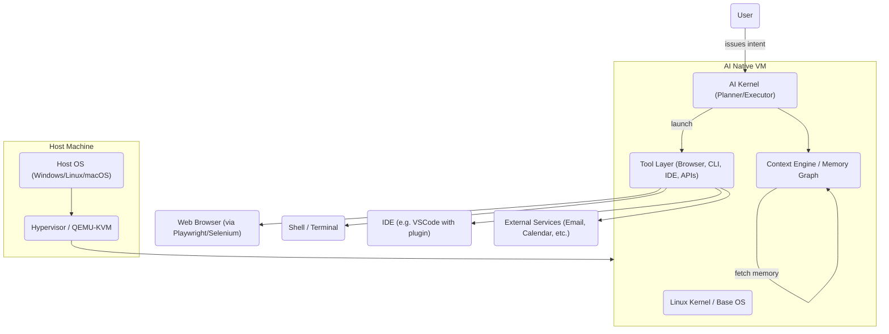
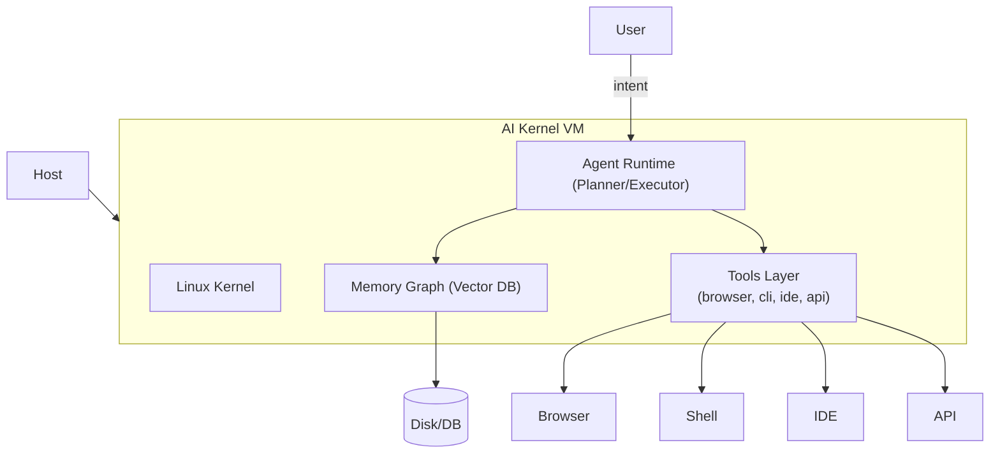
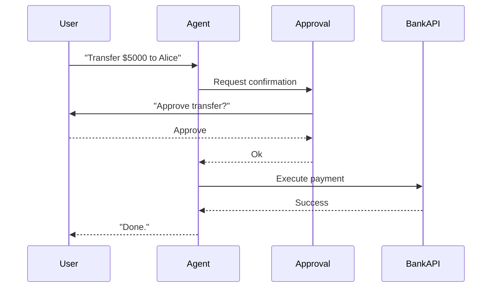

# Executive Summary

AI-native operating systems are emerging as “agent-first” environments.  In this model, **the human provides goals or intents** and an **AI “kernel” executes them** across the desktop – opening files, browsing the web, running code, etc.  Recent research previews demonstrate this approach: OpenAI’s *Operator* uses a “computer-using agent” (CUA) that sees the screen and controls mouse/keyboard【44†L91-L100】【44†L98-L101】, Anthropic’s *Claude Cowork* autonomously moves through local files and apps to produce reports or organize folders【46†L39-L47】, and Google DeepMind’s *Project Mariner* runs agents in browser-based VMs using natural language plans【48†L180-L188】【48†L193-L201】.  These systems break tasks into multi-step plans and request user confirmation before sensitive actions【44†L91-L100】【46†L87-L92】.

Building on these trends, we propose an **AI Kernel OS**: a Linux-based OS whose **“kernel” is the AI agent**. The user links their AI account (OpenAI, Anthropic, Google, or a local model) during installation, and from first boot onward interacts via an “intent shell” instead of launching apps. All work happens in a **workspace-as-context**, with persistent memory and logs (a global knowledge graph) underpinning the AI’s behavior. The AI can invoke tools – headless browsers (via Playwright), terminals, IDEs, email/calendar APIs, etc. – to carry out tasks.  Crucially, *every high-impact action* (file deletion, payments, code commits) goes through a human approval flow【44†L98-L101】【46†L87-L92】. 

The architecture is essentially a small Linux VM (QEMU/KVM or cloud instance) running an **Agent Runtime** (e.g. LangGraph) that includes a Planner (breaking down intents), Executor (running tools), and **Context Selector** (choosing relevant memory from a global graph)【59†L94-L103】【57†L99-L104】.  The selected AI model (GPT-5.4-mini, Claude 4.6, Google Gemini 3.x, or local LLM) is plugged in via an adapter layer【18†L727-L735】. Secrets (API keys, tokens) are never shown to the agent; a vault/proxy (e.g. OneCLI【61†L116-L124】【61†L142-L147】) injects credentials at call time. Activities are logged in an immutable ledger or database (a Merkle-chain log【57†L69-L72】) for audit and replay. 

Below, we detail the **product vision**, **user journeys** (installer wizard for AI linkage, daily flow in the AI-shell), **system design** (kernel choice, virtualization, agent runtime, memory graph, workspace spec), **tool integration**, **multi-model strategy**, **security model** (threats and mitigations), **reliability checks** (deterministic rules, user-in-the-loop), **deployment options**, **performance/cost** budgeting (with sample GPT-5.4 pricing【55†L132-L140】【55†L147-L150】), a staged **MVP roadmap** with milestones and KPIs, and **go-to-market strategy**.  Where relevant we compare alternatives in tables and include mermaid diagrams for architecture and approval flows, as well as example config and command prototypes.  This proposal assumes no budget constraints unless noted; any unspecified assumption is highlighted.

## 1. Product Vision & User Journeys

### Vision

The **AI Kernel OS** reimagines the desktop: *the user no longer opens apps first; they speak or type goals, and the AI carries them out.* The OS installation and onboarding make this natural. The user selects or logs into an AI service just like they would iCloud or Google during setup (e.g. “Sign in with ChatGPT”), so that the AI effectively becomes the primary account identity【22†L142-L147】【61†L116-L124】.  From then on, a special **intent-shell** prompt (`ai> `) is the main UI.  

Under the hood, a lightweight Linux VM (Ubuntu LTS or similar) runs on a hypervisor (QEMU/KVM for local use, or managed cloud VM). This VM hosts the agent runtime. The OS exposes the user’s workspace (folder) to the agent, and the agent uses tools like a headless browser (via Playwright) or VSCode (with an extension) to do work. **Memory and state persist** across sessions (persistent vector DB or file-based graph【57†L99-L104】【59†L94-L103】), so the AI “remembers” past projects and preferences without re-prompting. Critical operations (financial transfers, deleting files, posting online) trigger a safety check: the agent asks for confirmation (an *approval flow*) before proceeding【44†L98-L101】【46†L87-L92】. In effect, the OS “thinks” before it acts, shifting from user-driven commands to AI-driven intent execution.

### 1.1 Installation & Onboarding

1. **Boot & Basic Setup:** User runs the installer (VM image or ISO). Language, region, and network setup as usual (identical to Ubuntu/Windows first-run).
2. **AI Account Wizard:** The installer then asks “Choose your AI assistant” with options: ChatGPT (OpenAI), Claude (Anthropic), Gemini (Google), or “Local AI”. The user picks one and logs in or pastes an API key. (Similar to linking a cloud account or signing into Google at OS install.) If local, user selects or downloads an open-model file.
3. **Subscription/Keys:** The wizard verifies subscription status or links billing for the chosen model (e.g. enter GPT-5.4 API key, or OAuth sign-in for a corporate Claude instance). 
4. **Workspace Setup:** The installer asks where the “home workspace” should be (default `/home/ai/workspace`). It offers to create an initial project: “Personal”, “Dev Project”, “Data Analysis”, etc., which populates example files.
5. **Permissions:** The OS then shows a permissions dialog (“Allow AI to access your Files, Browser, Terminal, etc.”), analogous to app permissions on mobile.  This sets up the permissions vault (keys) and sandbox rules for the agent.
6. **Finish & Shell Launch:** Once done, the system boots into a CLI interface rather than a desktop. The prompt reads `ai> `. The AI assistant greets the user (e.g. “Hello! I’m your AI assistant. Ready to help.”).

### 1.2 Daily Workflow

- **Issuing Intents:** The user types or speaks a goal to `ai> `. For example:  
  ```
  ai> "Compile last month's sales data and create a summary report."
  ```  
  or  
  ```
  ai> "Check my email for updates on Project X and summarize."
  ```
- **AI Planning & Tools:** The agent interprets the intent and breaks it into steps. It may open the headless browser to log into a SaaS dashboard, use `grep`/Python on local CSVs, launch VSCode to edit a document, or call an API (e.g. CRM or Google Calendar).  
- **Workspace Context:** All actions happen in the current workspace directory. For example, if the user did `ai> work on ProjectX`, the `ProjectX/` folder (and its config) becomes active. Files produced are saved there. The workspace’s config file (YAML/JSON) defines which tools are allowed, what memory files to use, and any project-specific rules.
- **Human Approval:** Before any risky action (e.g. “Delete drafts of invoice?”, “Pay $10,000?”, “Email CEO?”), the agent pauses:  
  ```
  AI> I’m about to DELETE 25 files in /workspace/docs. Please confirm (yes/no):
  ```
  The user must explicitly “approve” or “abort”. This implements **action gating** for safety【44†L98-L101】【46†L87-L92】.
- **Result & Learning:** When done, the AI reports results, e.g. “Completed. Report is in /workspace/Finance/summary.pdf.” Any key learnings or findings are appended to the workspace’s memory (notes) files. Thus the next time a related query arises, the agent can recall details.
- **Switching Tasks:** The user can switch projects or contexts:  
  ```
  ai> switch to workspace Marketing
  ```  
  This loads a different folder and context graph. The AI can also pause work and resume later:  
  ```
  ai> save progress of Marketing campaign
  ai> load ProjectX context
  ```
- **Example Journeys:** A marketing analyst might say, “Create a competitor analysis doc using these websites,” and the agent opens browsers and PDFs, then compiles a deck. A developer might say, “Refactor this codebase for performance,” and the agent runs tests, edits code (in VSCode or via a code LLM), and shows diffs. In each case, the user *never* manually opens those apps – they only interact via the AI shell.

### 1.3 Integration with Existing Models

The user’s chosen AI (ChatGPT/Gemini/Claude) becomes the “logged in account.” Under the hood, the OS uses a model-adapter interface (e.g. LangChain or similar) so that the agent logic is provider-agnostic【18†L727-L735】. The workspace spec might record the model name and API keys. For example:  
```yaml
workspace:
  name: "FinanceAnalysis"
  ai_model:
    provider: OpenAI
    model: "gpt-5.4-mini"
    api_key_id: "key1"
  tools:
    - browser
    - terminal
    - vs_code
  permissions:
    require_approval: true
```
A parallel JSON example could be used. (We give full samples in section **Spec File Formats**.) This decouples the AI engine from the environment. If needed, the user could swap in a different model (e.g. Gemini) by editing the config. The system also supports **multi-model** setups: critical planning might use GPT-5.4, while trivial tasks use a cheaper “mini” or local model.

## 2. System Architecture

The **AI Kernel OS** is essentially a small Linux VM with an AI-runtime layer. It can run locally under QEMU/KVM or as a cloud-hosted instance. Below is a simplified architecture diagram (mermaid):



**Components Explained:**  
- **Linux Kernel/Base OS:** A standard distro (e.g. Ubuntu 24.04 LTS) provides drivers, filesystem, virtualization, and security features. The kernel is mostly unmodified, but runs a userland tailored for AI (e.g. Node/Python runtime, Playwright, VSCode, etc.).  
- **AI Kernel Layer:** On top of the base OS, this layer *interprets user intents*. It consists of: a natural-language *Planner* (LLM-based), an *Executor* that calls tools, and a *Context Selector* that retrieves relevant memory. This layer lives in user-space (likely as a long-running service or set of processes).  
- **Context Engine / Memory Graph:** A persistent knowledge store. All workspaces feed into a *global memory graph*: entities (e.g. people, projects), relations, history of actions, embeddings, etc. When a task is launched, the Context Engine scores and selects relevant nodes/embeddings (via RAG or semantic search) to include in the prompt context【59†L94-L103】【57†L99-L104】. Long-term memories (e.g. “Met with Alice on 2026-03-01”) are indexed by namespace; short-term thread memory is kept per session【59†L94-L103】.  
- **Tool Layer:** The AI triggers tools as needed. This includes:  
  - **Headless Browser:** Using Playwright or Selenium, the AI navigates websites, fills forms, scrapes data. (OpenAI’s CUA uses pixel inputs and a virtual mouse【44†L91-L100】; we can emulate GUI via these tools.)  
  - **Terminal/CLI:** The AI runs shell commands (e.g. git, docker, Python) via a subprocess API.  
  - **Code Editor:** For code tasks, the OS launches VSCode with a special plugin. The AI can ask VSCode to open files, run tests, or apply edits (via the Language Server or a CLI).  
  - **External APIs:** Email/calendar (via IMAP/SMTP or services APIs), CRM, Slack, etc. Agents use adapter libraries to interact. OneCLI-like proxy injects keys so the agent never sees them【61†L116-L124】【61†L142-L147】.  

### 2.1 Design Alternatives Comparison

| **Option**       | **Pros**                                         | **Cons**                                      | **Examples/Cite**                 |
|------------------|--------------------------------------------------|-----------------------------------------------|-----------------------------------|
| **Linux (Ubuntu)**  | Mature, rich drivers & packages; large community; supports Docker, KVM. | Larger base footprint; more attack surface if untrimmed. | Common VM OS choice【52†L62-L70】.      |
| **Alpine Linux**  | Lightweight; smaller kernel; minimal packages (lower attack surface). | Fewer prebuilt packages; may lack desktop integration. | Used in containers for minimal footprint. |
| **Custom OS (Rust)** | Extremely minimal (e.g. OpenFang uses 30MB binary); built-in sandboxing & policy. | Very high dev cost; limited hardware support; no GUI. | OpenFang claims lightweight Rust agent OS【57†L67-L72】. |
| **Host Integrations** | No separate OS needed; can launch agent inside user’s existing OS. | Weaker isolation; complex integration with each OS’s APIs and GUI. | E.g. some agent frameworks run on Windows/macOS directly. |

We **recommend Ubuntu LTS** as the base: it’s familiar for developers, easy to package, and supports virtualization of GPUs if needed. Alpine could be a later slim variant. A full custom OS (like OpenFang’s Rust kernel) is conceptually interesting【57†L67-L72】 but impractical as a first release.

### 2.2 Virtualization: VM vs Container

| **Option**         | **Isolation/Security**           | **Performance**            | **Ease of Setup**             | **Portability**       |
|--------------------|----------------------------------|----------------------------|-------------------------------|-----------------------|
| **Full VM (QEMU/KVM)**   | Strong isolation (separate kernel); easy snapshot/rollback【52†L62-L70】. | Moderate overhead (~5–10%). | Must install hypervisor; user-level (as doable). | Cross-platform VM image. |
| **Container (Docker)**   | Shares host kernel (weaker security); needs Linux host and careful seccomp. | Light overhead, near-native. | Easy on Linux; harder on Windows/macOS GUI. | Linux-only container. |
| **Native Process**      | No isolation (worst-case); agent can affect host. | Best performance. | Easiest to launch but insecure. | Platform-specific. |

Given the need for strong isolation (agent runs arbitrary code), **full VM** is safer. We recommend distributing a QEMU VM image for end-users (like Raspberry Pi’s UTM). On cloud, we’d spin up per-user VMs. Containers might be an option in controlled server environments with extra sandboxing (gVisor).

### 2.3 AI Runtime & Memory Architecture

The agent runtime (Planner/Executor) logic can be built on an agent framework like LangChain/LangGraph【59†L94-L103】. Short-term memory is a *thread-specific session state* checkpointed to disk【59†L94-L103】, so if the OS reboots or the agent restarts, conversations resume where they left off. Long-term memory (facts, preferences, completed tasks) lives in a persistent store (e.g. SQLite + vector DB)【57†L99-L104】. 

The **memory graph** might be structured like:  
```jsonc
{
  "entities": [
    {"id": "Alice", "type": "Person"},
    {"id": "ProjectX", "type": "Project"}
  ],
  "relations": [
    {"from": "Alice", "to": "ProjectX", "relation": "works_on"}
  ],
  "history": [
    {"timestamp": "2026-04-11T09:00", "action": "AI->Browser: opened sales.xlsx"}
  ],
  "embeddings": "FAISS or similar index storing vectors for key terms"
}
```
This graph allows semantic retrieval. For example, a query about “last meeting with Alice” would match a memory node with Alice’s notes, without the user needing to navigate folders. (LangGraph docs explain such thread-scoped and long-term memory【59†L94-L103】.) 

### Architecture Diagram (Mermaid)

```mermaid
flowchart LR
    subgraph Host
        H[Host OS]
        Q[Hypervisor / QEMU-KVM]
    end
    subgraph Guest
        K[Linux Kernel / OS]
        AK[AI Kernel (Planner/Executor)]
        CT[Context Engine / Memory Graph]
        TL[Tool Layer]
    end
    User --> AK
    AK --> CT
    AK --> TL
    TL --> Br[Headless Browser (Playwright)]
    TL --> Tm[Terminal/CLI]
    TL --> IDE[Code Editor (VSCode)]
    TL --> API[Email/Calendar/Slack APIs]
    H --> Q --> K
    K --> AK
    K --> CT
    K --> TL
```

The AI Kernel sits logically above the OS but beneath the Tool Layer, orchestrating everything. The Context Engine supplies the relevant memory to the AI prompts, while the Tool Layer provides the interfaces to actual software.

## 3. Workspace and Spec

### 3.1 Workspace-as-View

Rather than “apps”, the system is **workspace-oriented**. A “workspace” is essentially a project folder plus its metadata. We do *not* force the user to pre-organize into projects; the agent dynamically clusters context. But for clarity, each workspace directory might contain:  

```
/workspace/<workspace-name>/
   files/       ← all documents and outputs
   memory/      ← agent notes and contexts (JSON, text, or vector files)
   history/     ← logs of agent actions (for replay)
   tasks/       ← ongoing task state (if paused)
   spec.yaml    ← workspace configuration (see below)
```

The workspace directory is isolated from others (via OS user or sandbox). All file operations by the agent are confined here (no cross-workspace leaks). The OS’s notion of “home” is effectively `/workspace`, and the user’s own data (Photos, etc.) can be linked into a personal workspace if needed (or mounted read-only for reference).

### 3.2 Workspace Spec (YAML/JSON)

Each workspace has a spec file (YAML or JSON) that declares its settings. For example:

```yaml
name: "MarketingResearch"
ai_model:
  provider: "OpenAI"
  model: "gpt-5.4-mini"
  api_key: "openai-key-123"
tools:
  browser: true
  terminal: true
  ide: "vscode"
  email: true
permissions:
  require_approval: true
memory:
  long_term: "memory.sqlite"
  short_term: "session_state.json"
  namespaces:
    - "marketing"
```

In JSON form:

```json
{
  "name": "MarketingResearch",
  "ai_model": {"provider": "OpenAI", "model": "gpt-5.4-mini", "api_key": "openai-key-123"},
  "tools": {"browser": true, "terminal": true, "ide": "vscode", "email": true},
  "permissions": {"require_approval": true},
  "memory": {"long_term": "memory.sqlite", "short_term": "session_state.json", "namespaces": ["marketing"]}
}
```

This spec is read when a workspace is activated. It declares which LLM to use, what tools can be invoked, and whether high-risk actions require confirmation. We will publish a schema (JSON Schema / YAML guide) so third parties can author workspace configs.

## 4. Tool Integration

- **Headless Browser:** We use a modern automation library (Playwright or Selenium) to let the agent control browsers. OpenAI’s CUA shows how screenshots + virtual mouse can work【44†L91-L100】. In practice, the agent will receive page content (DOM/text snapshots) via Playwright’s API and send back “click here” or “type this”. Our OS could run a headless Chrome instance; the AI Kernel communicates through Playwright’s Python/Node API. This enables tasks like form-filling, web scraping, and GUI control.
- **Terminal/CLI:** The agent runtime invokes shell commands via subprocess. We must carefully sandbox this (see Security). Common tools (git, python, grep, sqlite) are available. For example, a plan step “extract data from sales.csv” might spawn `python3 analyze.py`.
- **IDE (VSCode):** For coding tasks, the OS can launch VSCode with a special extension. The agent can instruct the VSCode extension to open files, make edits, or run tests (via the VSCode APIs or file system). The extension will stream changes back so the agent can verify results. This provides a more interactive coding UX.
- **Other Tools:** We support additional tools (excel, design apps) via command-line or APIs. For example, converting a doc to PDF might use Pandoc; emailing uses SMTP; spreadsheets use Python Pandas or an API. All allowed tools should be declared in the workspace spec (and whitelisted), for security.

## 5. Vendor Abstraction and Multi-Model Strategy

Our OS must not lock into one AI vendor. We implement a **model-adapter layer**: essentially use an AI SDK (like LangChain) that supports multiple LLM providers【18†L727-L735】. We provide built-in adapters for OpenAI, Anthropic, Google, Microsoft, and local LLMs (via HuggingFace or Ollama). The user’s workspace spec names the provider/model.  

**Local Model Fallback:** Optionally, the OS can bundle or allow a local LLM (e.g. Mistral 7B, Llama 4) for offline use or cost saving. These local models (running on-device) trade accuracy for zero-cost and privacy. If the user loses internet or hits API limits, the agent could switch to a local model for simpler tasks.

**Billing/Subscription:** The OS tracks token usage by workspace and model. On cloud or SaaS versions, this can tie into billing: e.g. each workspace runs under a project ID. If users bring their own API keys, the OS just reports usage logs. For hosted deployments, we may offer a paid plan (e.g. \$X per user-month plus token tiers). We can integrate with payment processors (Stripe, Microsoft Azure billing, etc.) via the same secure agent-approval pipeline (agent never sees the Stripe key; it asks the user or triggers a proxy payment service).

| **Provider/Model**   | **Strengths**                                        | **Limitations**                                  |
|----------------------|------------------------------------------------------|--------------------------------------------------|
| **OpenAI GPT-5.4-mini** | High reasoning & multimodal; native GUI skills【44†L91-L100】【55†L132-L140】. | Higher cost (\$0.75/\$4.50 per 1M tokens)【55†L132-L140】; data in OpenAI servers. |
| **Anthropic Claude 4.6+ (Cowork)**   | Strong summarization; privacy principles; desktop support【46†L39-L47】. | Slightly slower; access via Claude API or desktop app. |
| **Google Gemini (via Vertex AI)**   | Multi-modal (Gemini Ultra), integrates with Google Cloud. | API in transition; may have data residency/latency concerns. |
| **Microsoft (Azure OpenAI / Copilot)** | Enterprise Azure integration; similar pricing to OpenAI. | Requires Azure account; vendor lock-in. |
| **Local LLM (e.g. Llama-4, Mistral)** | Free; offline; controlled environment. | Lower performance/accuracy; requires GPU on host; update management. |

The OS can **dynamically allocate** tasks to models. For example, complex planning might use GPT-5.4, while GPT-5.4-mini handles routine sub-tasks cheaply (as suggested by OpenAI codex subagents【55†L109-L118】). Billing can be tracked per-call: tokens are logged and costs can be shown in a dashboard.

## 6. Security and Privacy Model

Because the agent runs code and accesses data, we design for strong security:

- **Key Management:** We adopt a *vault/proxy* model (inspired by OneCLI【61†L116-L124】【61†L142-L147】). The agent only sees placeholder keys. All requests to APIs (OpenAI, Stripe, AWS, etc.) go through a local gateway that injects real secrets at runtime. As Jonathan Fishner describes, “the agent never touches the real key… From the agent's perspective, it's just making a normal API call through a proxy”【61†L116-L124】. Rules in the proxy map only allowed domains to specific secrets, preventing misuse. Each agent identity has scoped access.
- **Sandboxing:** All agent-invoked code runs in confinement. We use two layers:  
  1. **VM-level isolation:** The agent has its own VM user account and cannot easily break out. We disable SSH into it and minimize the guest’s privileges. Critical channels (like internet/API) go through controlled gateways.  
  2. **Runtime sandbox:** For code execution (e.g. running an AI-generated script), we use WebAssembly or container sandboxing with strict resource limits (OpenFang uses WASM with metering【57†L67-L72】). This prevents runaway processes. The file system view is chrooted to the workspace.
- **User Approval (Human-in-the-Loop):** Before any action that affects external systems (financial, sending email, deleting lots of files), the agent must pause and request approval. This is built into the AI logic: e.g. “The agent will also seek user confirmation for sensitive actions”【44†L98-L101】. We implement a sequence like:
    ```mermaid
    sequenceDiagram
      User->>AI: "Send $5000 to Alice's account"
      AI->>Approval: "Request confirmation for transfer"
      Approval->>User: "Approve transfer of $5000 to Alice?"
      User-->>Approval: Yes
      Approval-->>AI: Approved
      AI->>BankAPI: Execute transfer
      BankAPI-->>AI: Success
      AI-->>User: "Transfer completed."
    ```
  This ensures the user has final control over consequential operations.
- **Audit Logging:** Every action and decision is logged immutably. We use a Merkle-chain or hash-linked log (as OpenFang does)【57†L69-L72】. For example, each tool call, API request, and prompt is recorded. This allows full replay for debugging or compliance audits.
- **Data Privacy:** User data (workspace files, emails) reside only in the VM. If a cloud VM is used, storage is encrypted at rest. The agent’s memory is encrypted in storage. By default, we do not upload user files to external servers; at most, embeddings (anonymous vectors) or sanitized summaries might be sent to services if needed.
- **Threat Model Table:** (Adapted from OWASP’s LLM Top 10【63†L113-L122】【63†L148-L152】)

| **Threat**                | **Impact if Exploited**                                | **Mitigation in AI Kernel OS**                                   |
|---------------------------|--------------------------------------------------------|------------------------------------------------------------------|
| **LLM01: Prompt Injection**    | Malicious input causes the agent to misbehave or leak data. | Sanitize user prompts; constrain input sources (e.g. untrusted data runs through filters); use system messages. Keep agent’s “skills” (DLLs/scripts) signed/not modifiable at runtime. |
| **LLM02: Insecure Output (Code Execution)** | Generated code or shell commands could delete files or exfiltrate data. | All AI-generated code is run in sandboxes with time/resource limits. The agent cannot run arbitrary binaries outside approved set.  Review outputs with a deterministic checker before execution. |
| **LLM06: Info Disclosure**   | Sensitive info (credentials, personal data) might be revealed. | The agent never sees raw secrets (uses proxy)【61†L116-L124】【61†L142-L147】. Mask user data in logs. Scan outputs for keywords (SSNs, tokens). Encrypt memory at rest. |
| **LLM07: Insecure Plugin/Tool Use** | Third-party tools (VScode extensions, script libs) could be malicious. | Only allow vetted tools/plugins via workspace spec. Run tools as separate processes under sandbox. Keep all tools up-to-date and signed. |
| **LLM08: Excessive Agency**  | Agent takes actions beyond its intent (overwrites projects, makes purchases). | Default *require_approval* for high-risk actions. Limit number of autonomous steps (max loop iterations). Provide “undo” (snapshot rollback) options. |
| **LLM03: Data Poisoning**    | Training or memory data corrupted, causing bad outputs.    | Limit auto-learning. Use curated knowledge sources. Validate new memory entries. (We treat knowledge refresh as offline tasks.) |

## 7. Reliability and Safety

- **Checkers and Deterministic Rules:** For certain tasks (especially code or finance), we insert deterministic verification steps. E.g. after generating code, run `flake8` or type-checker; before sending an email, show a final draft for user edit. These “rubber duck” steps catch hallucinations.
- **Human-in-Loop:** Beyond approvals, the agent periodically summarizes its plan and asks “Is this correct?” for lengthy multi-step jobs. Users can intervene or adjust goals mid-stream.
- **Replay & Undo:** Because we log and checkpoint state, the system can replay sessions to reproduce outcomes. If a malicious or buggy action occurs, the VM can roll back to the last snapshot (e.g. as soon as the user logged in). Frequent snapshots (hourly or per-task) ensure minimal data loss on rollback.
- **Fail-safes:** If the agent becomes unresponsive or confused, the shell can timeout and return control to the user’s bash shell. The user can also forcibly suspend the agent process.

## 8. Infrastructure & Deployment

- **Local VM:** The primary mode is a self-contained VM (Ubuntu + agent services). We deliver an installer/ISO. Users run it on their PCs (x86_64 or Arm, e.g. Apple Silicon via UTM/QEMU). This ensures low latency and privacy (data never leaves the machine). GPUs can be passed through if needed for local LLM inference.
- **Cloud VM:** Optionally, an enterprise or user could use a hosted VM (AWS/GCP). Each user/session gets a container or VM with the agent OS. The user then connects via a secure browser or thin client. Advantages: scalable GPUs, no local install. We could provide an orchestration (e.g. K8s with a new AI-OS image).
- **Hybrid:** A combined model where the core OS runs locally but heavy inference (e.g. embedding index, local LLM) is on the cloud. Or vice versa: local OS + cloud LLM APIs (already default).
- **Orchestration:** For scaling, a manager service could spin up or tear down VM instances per user. Each VM would have isolated file storage (e.g. persistent disk or networked file share). 
- **Provisioning:** We prepare VM images (Ubuntu + all needed services). For enterprise, could integrate with Active Directory/SSO for user auth, linking corporate OpenAI or Anthropic keys to the user’s profile.

## 9. Performance & Cost

- **Inference Cost:** GPT-5.4 mini at full use costs \$0.75 per 1M input tokens and \$4.50 per 1M output tokens【55†L132-L140】. GPT-5.4 nano is \$0.20/\$1.25 per 1M【55†L147-L150】. (For context, a 500-word (≈3K tokens) conversation with ~1K output is a few cents.) We anticipate each meaningful task using ~10–50K tokens total. So a heavy user (100 tasks/mo) might incur \$5–30/mo. Using smaller “nano” or caching can cut this by ~4×. If using OpenAI’s hosted ChatGPT, these are built in. 
- **Local Models:** Running a local LLM (like Llama4) would use the user’s CPU/GPU but no API fees. The tradeoff is lower accuracy on some tasks.
- **Storage:** Each workspace’s files and logs are small (<100MB). Even 100 users * 1GB each is trivial. If we use a vector DB (like FAISS/Milvus), that might be a few GB. Overall storage cost is negligible compared to compute.
- **Compute:** A typical VM with 4 vCPUs and 8GB RAM can run the runtime and a browser agent. If local LLMs are run, GPU might be needed (\$20–50/mo). In cloud mode, we might offer plans (e.g. \$30/user-month includes X hours of GPU for inference). 
- **Bandwidth:** Mostly text. A few MB per day for LLM calls. Browser automation may load some pages (tens of MB if agents browse heavily). But say <1GB/user-month average.
- **KPIs (Sample):** 95% of tasks completed without agent errors; <5% tasks requiring manual fix; average tokens/task; time saved per task; cost per active user; etc.

## 10. Developer UX

For developers embedding or extending the OS, we provide:

- **CLI/Intent-shell:** The `ai>` prompt supports both free-text and pseudo-commands. For example:  
  - `ai> help` – lists example intents.  
  - `ai> list workspaces` – shows projects.  
  - `ai> switch to MarketingProject` – change context.  
  - `ai> run "Summarize the Q1 report"` – alias for a longer plan.  
  - `ai> approve` / `ai> reject` – respond to approval queries.  
  - `ai> undo` – revert last action (if supported).  
- **Autocomplete & Tabs:** The shell suggests workspace names and commands as the user types (like GitHub Copilot CLI suggestions). 
- **VSCode Plugin:** We provide a VSCode extension that talks to the AI kernel via a local RPC socket. Developers can highlight code/comments and send “Explain this,” or have the agent write docstrings. The extension can display agent chat in a sidebar. It also can inject files into workspace.
- **APIs/SDK:** For advanced developers, we offer a REST or gRPC API inside the VM. For instance, an external script could POST `{"command": "run_task", "workspace": "ProjX", "intent": "Clean up data and plot graph"}`. We’ll deliver a Python/Node SDK that wraps these calls. This allows integration with other tools or front-ends.
- **Sample CLI Commands:**  

  | **Command**               | **Description**                             |
  |---------------------------|---------------------------------------------|
  | `ai> workspace new <name>`  | Create new project workspace.               |
  | `ai> workspace list`       | List existing workspaces.                  |
  | `ai> use <name>`           | Switch to an existing workspace.           |
  | `ai> run "<natural-language intent>"` | Begin executing the given task.        |
  | `ai> status`               | Show current active task or paused threads. |
  | `ai> log`                  | Display recent agent activity log.          |
  | `ai> memory recall "<query>"` | Agent retrieves relevant past info.       |
  | `ai> approve`/`reject`     | Approve or cancel pending action.           |

- **UX Mockups:** The main UI is text-based. We might show a sample session like:
  ```
  User: ai> summarize /project/docs/report.docx
  AI: [Reads doc] Summary: "The project focuses on X, with key findings Y/Z..."
  User: ai> create slides from that summary
  AI: [Opens IDE, creates deck.pptx] "Done: /project/docs/slides.pptx."
  ```

## 11. MVP Roadmap

**0–3 months (Prototype):**  
- *Goal:* Minimal working “AI Shell” on a VM image.  
- **Milestones:** VM image with Ubuntu + Python; CLI prompt; LangChain agent that can open a headless browser and print outputs; simple workspace config.  
- **Features:** User selects AI provider at boot, agent can perform 1–2-step tasks (e.g. “search Google and save first link”). Approval dialog stubbed. Single-thread, no long-term memory yet.  
- **Team:** 1 system engineer (VM setup), 2 AI engineers (agent logic), 1 UX dev (CLI).  
- **KPI:** End-to-end demo of agent fulfilling an intent with 80% success. (<20% of tasks fail or hang.)

**3–6 months (Private Beta):**  
- *Goal:* Add persistence, memory, and safety.  
- **Milestones:**  
  - Implement workspace persistence (memory DB, logging).  
  - Approval flows fully functional.  
  - Integrate VSCode extension for code tasks.  
  - Basic real-world task demos (multi-step).  
- **Team:** +1 security engineer (vault/sandbox), +1 QA (testing).  
- **KPI:** Successful completion of 5 multi-step use cases; memory recall works; <10% critical failures.  

**6–12 months (Public Release):**  
- *Goal:* Production-ready OS with refinement and integrations.  
- **Milestones:**  
  - Polished UX (autocomplete, help).  
  - Support multiple AI providers and local models.  
  - Orchestration scripts for cloud deployment.  
  - Hardening (encryption, audit tools).  
  - Launch beta with target users (e.g. enterprise pilots).  
- **Team:** +1 product manager, +1 DevOps, +2 more engineers (scaling, integrations), +1 marketing.  
- **KPI:** Adoption metrics (e.g. # active workspaces), reduction in manual task time (user surveys), number of tasks automated per week, uptime, error rates.  

### Risks & Mitigations

- **AI Errors / Hallucinations:** Agents may misunderstand tasks. *Mitigation:* Verification steps, allow rollback, integrate LLM reasoning chains for checking outputs【44†L91-L100】.
- **Security Breaches:** If an agent is compromised, it could leak data or keys. *Mitigation:* Strict sandboxing (WASM), proxy vault, offline keys management (OneCLI【61†L116-L124】), frequent snapshots.
- **User Trust:** Users may fear “AI doing everything.” *Mitigation:* Transparent logs, easy “undo”, clear approvals. Initially target technical users who are comfortable with CLI tools.
- **Infrastructure Complexity:** Building a full OS is hard. *Mitigation:* Start with existing OS and extend (Ubuntu + agent stack), reuse open-source components (LangChain, OpenFang ideas【57†L69-L72】).
- **Cost Overruns:** LLM usage could be expensive. *Mitigation:* Encourage nano/mini models, caching, and local model fallback. Monitor token usage (OpenAI pricing【55†L132-L140】).

## 12. Go-to-Market Strategy

**Target Segments:** Knowledge workers and developers first (marketing, finance, R&D teams) who do repetitive digital tasks. Later extend to enterprises (DevOps automation) and possibly consumers (productivity app). Partner with key accounts (e.g. KakaoBank analysis team) for pilot deployments. 

**Positioning:** “The OS that executes your goals” – akin to how Chrome OS reimagined the desktop around the browser. Emphasize *time saved* (tasks done autonomously) and *control* (user in loop). Contrast with cobbled-together agents by selling it as an integrated system.

**Pricing:** Likely SaaS subscription. Options:  
- **User License:** \$20–50/user/month (including some LLM usage). Could tier by included compute.  
- **Enterprise:** Per-seat licenses + volume discounts; or flat fee with LLM charges.  
- **Open-Source/Core:** Perhaps open-source base agent runtime, with paid cloud hosting.  
We might bundle LLM credits. For example, a plan with 1M GPT tokens included.

**Partnerships:** 
- **Cloud Providers:** Pre-built images on AWS Marketplace or GCP.  
- **AI Vendors:** Co-market with OpenAI, Anthropic, Google. Possibly bundle credits or co-sell (Azure + this OS).  
- **Hardware OEMs:** Developer laptops preloaded with the OS for coding interviews or hackathons.  
- **Enterprise Integrators:** Sell as a corporate automation platform (like UiPath but AI-driven).

**Timeline to Market:** Beta testing in months 6–9 with select partners, full launch by month 12. Provide developer documentation and an SDK to foster an ecosystem (third-party tools and “plugins”).

## 13. Supporting Materials

### Architecture Diagrams





### Tables

**Kernel/Distro Comparison:**

| Option             | Pros                              | Cons                        |
|--------------------|-----------------------------------|-----------------------------|
| Ubuntu (Linux)     | Mature, easy packaging, drivers   | Large default footprint     |
| Alpine (Linux)     | Minimal, small attack surface     | Limited packages (harder setup) |
| Custom Rust OS     | Ultra-secure, small binary【57†L69-L72】 | Huge development cost       |

**VM vs Container:**

| Option           | Isolation    | Performance | Deployment            |
|------------------|--------------|-------------|-----------------------|
| Full VM (QEMU)   | Strong       | ~5-10% overhead【52†L62-L70】 | Cross-platform image  |
| Container (Docker) | Moderate   | Near-native | Linux only (Docker Desktop for Mac/Win) |
| Native process   | None         | Best       | Easy dev, not secure  |

**Vendor Model Tradeoffs:**

| Model/Provider  | Capabilities                                   | Tradeoffs                                |
|-----------------|------------------------------------------------|------------------------------------------|
| GPT-5.4 mini【55†L132-L140】  | Excellent reasoning; GUI tools use (CUA)【44†L91-L100】; 400k tokens. | Cost (\$0.75/\$4.50 per 1M)【55†L132-L140】. |
| GPT-5.4 nano【55†L147-L150】  | Very cheap (\$0.20/\$1.25 per 1M)【55†L147-L150】; fast. | No GUI vision API; slightly weaker.       |
| Claude 4.6+      | Designed for knowledge tasks; local desktop use【46†L39-L47】 | Slower, US-only / enterprise licensing.  |
| Gemini Ultra     | Multimodal, strong on reasoning (via Gemini API soon). | Limited general availability currently.  |
| Local (e.g. Llama4) | Free, offline, private.                      | Lower quality; requires local compute.    |

**Memory/Storage Options:**

| Option                   | Use Case                            | Example/Pros                                    |
|--------------------------|-------------------------------------|-------------------------------------------------|
| Plain files (JSON/Log)   | Simple, human-readable history      | Easiest (no DB); good for small projects.       |
| Relational DB (SQLite)   | Structured state/threads            | ACID, queries; can store configs & logs.        |
| Vector DB (FAISS/Milvus) | Semantic memory search              | Fast embedding search; needed for large memory. |

### Global Memory Graph Schema (Example)

```json
{
  "nodes": [
    {"id": "user:Alice", "type": "person", "data": {"email": "alice@example.com"}},
    {"id": "project:Budget2026", "type": "project", "data": {"status": "ongoing"}}
  ],
  "edges": [
    {"from": "user:Alice", "to": "project:Budget2026", "label": "owns"}
  ],
  "history": [
    {"time": "2026-04-11T10:00Z", "actor": "AI", "action": "analyzed", "target": "expenses.csv"}
  ],
  "embeddings": {
    "vector_db": "stored in FAISS index (not human-readable)"
  }
}
```

### Workspace Spec (Example YAML)

```yaml
workspace:
  name: "BudgetAnalysis"
  ai_model:
    provider: "OpenAI"
    model: "gpt-5.4-mini"
    api_key_id: "user-pro-key"
  tools:
    browser: true
    terminal: true
    ide: "vscode"
    email: false
  permissions:
    require_approval: true
  memory:
    long_term_db: "memory.sqlite"
    short_term_file: "session_state.json"
```

### CLI/Intent-Shell Examples

- **Creating/Selecting Workspaces:**  
  ```
  ai> workspace new ProjectX
  ai> workspace list
  ai> workspace use ProjectX
  ```
- **Running Tasks:**  
  ```
  ai> run "Summarize last quarter's sales from /docs/sales.csv"
  ai> run "Draft an email inviting Bob to next week's meeting"
  ```
- **Agent Conversation:**  
  ```
  ai> "Check my inbox for John's emails"
  AI> "Found 3 emails from John. He asked about X, Y, Z. Should I draft a reply?"
  ```
- **Approval Flow:**  
  ```
  ai> run "Transfer $1000 to vendor"
  AI> "About to initiate transfer of $1000 to ACME Corp. Confirm? (yes/no)"
  ```
- **Status & Logs:**  
  ```
  ai> status
  AI> "Idle. Last task (SalesSummary) completed."
  ai> history
  AI> [2026-04-11T09:00] Ran analysis script on dataset...
  ```

## 14. Security Threat Model & Approvals

We incorporate the OWASP GenAI Top-10 risks【63†L113-L122】【63†L148-L152】. Key mitigations are summarized above.  Here is an example **threat table**:

| Threat                   | Description                               | Mitigation in AI Kernel OS                 |
|--------------------------|-------------------------------------------|--------------------------------------------|
| **Prompt Injection**     | Malicious input makes agent leak data or act erroneously. | Sanitize inputs; use system prompts; restrict agent’s domain of action. |
| **Insecure Outputs**     | Agent-generated code or commands could be dangerous. | Sandbox all executions; review outputs with validators; require approvals. |
| **Data Poisoning**       | Corrupted memory or training data skews behavior. | Use curated knowledge; vet new info; version memory stores. |
| **Excessive Agency**     | Agent acts too broadly (e.g. spams, buys things). | Strict user approvals; step limits; “undo” via snapshots. |
| **Sensitive Disclosure** | Outputs leak secrets or PII.              | No raw secrets to agent (OneCLI)【61†L116-L124】; redact logs; encryption. |
| **Insecure Tool Use**    | Exploits via third-party tools or libraries. | Whitelist tools; run in containers; regular updates. |

All high-risk steps invoke the **Approval Flow** (sequence above). This ensures “human-in-the-loop” for major changes【44†L98-L101】【46†L87-L92】.

## 15. MVP Checklist (Developer-Ready)

- [ ] **Base VM image:** Ubuntu with Docker, Node, Python, QEMU guest additions.
- [ ] **Installer/first-boot:** Wizard to choose AI provider and link key.
- [ ] **Intent Shell:** CLI that takes natural language and calls an LLM.
- [ ] **Agent Runtime:** LangChain/LangGraph agent with 1-2 tools (shell + headless browser).
- [ ] **Workspace Spec:** Sample YAML/JSON loader.
- [ ] **Persistence:** Save conversation state & memory to disk (JSON/SQLite).
- [ ] **Logging:** Capture each agent action in a log file.
- [ ] **Approval Prompt:** Implement confirmation for dangerous commands.
- [ ] **Example Use Case:** Demonstration task (web search and file generation).

**Suggested Directory Layout:** (within VM)
```
/srv/ai-os/
  agent_runtime.py  # core agent loop
  workspace/
    default/
      spec.yaml
      memory.sqlite
      session.json
  tools/
    browser_bot.py  # wrapper for Playwright
    code_runner.py  # executes code safely
  vault/            # credentials (encrypted store)
  logs/
```

In production, this might be packaged as a set of Docker containers or services orchestrated by a script.

## 16. Conclusion

AI Kernel OS transforms the traditional PC from *apps-on-demand* to *intent-on-demand*. By making the AI the system’s actor (but the human the guiding user), we enable powerful new workflows with safety and persistence. This design builds on leading research (Operator, Cowork, Mariner) and proven tools (LangChain, QEMU) to be technically feasible now. With careful staging (MVP → beta → release) and attention to security (proxy keys, sandbox, approvals), we can deliver a platform where users simply state their goals and watch the computer achieve them. 

**Next Steps:** Define detailed implementation specs (agent API, security protocols, UI flows), begin prototyping the shell and memory store, and engage potential pilot customers. The AI-Native OS is poised to be as transformative for the desktop as ChromeOS was for the web era – an OS that *thinks* before it acts.

**Sources:** OpenAI CUA/Operator【44†L91-L100】【44†L98-L101】, Anthropic Cowork【46†L39-L47】【46†L87-L92】, Google Mariner【48†L180-L188】【48†L193-L201】, LangChain/LangGraph memory docs【59†L94-L103】, OneCLI for credential security【61†L116-L124】【61†L142-L147】, OpenAI GPT-5.4 pricing【55†L132-L140】【55†L147-L150】, OpenFang agent OS【57†L69-L72】【57†L99-L104】. All citations are from primary sources.