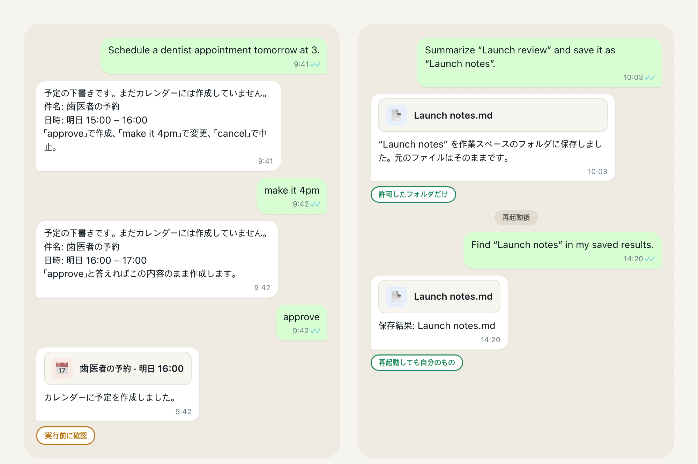
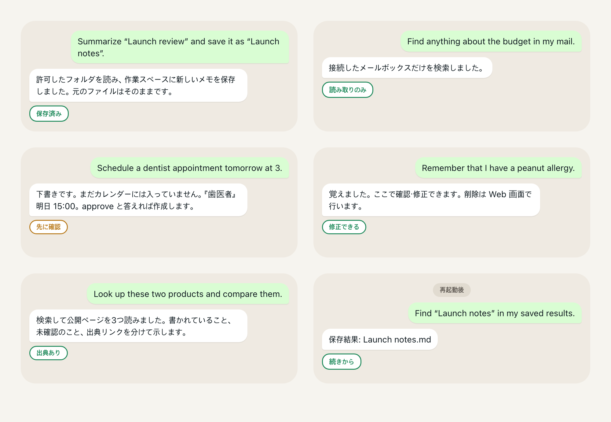

# Personal AgentOS

[English](README.md) | [한국어](README.ko.md) | [简体中文](README.zh-CN.md) | [日本語](README.ja.md)

<!-- readme-parity:v1 -->
<!-- readme-section:hero -->

## 自分のマシンで動く、自分だけの AI アシスタント。

**モデルは自分で選ぶ。ファイル・メール・予定・記憶は自分のもの。ルールは自分が決める。**



上の2つの会話は製品の実際の挙動を、返答を短くして韓国語から訳したものです。依頼は英語のまま示しています（日本語の依頼は今日は理解されません）。「approve」と言うまで何も作成されず、保存したメモは再起動後もそこにあります。自分のコンピュータ（macOS または Linux、Python 3.12 以上）で動き、モデルは自分で用意します。ローカルの Ollama モデル、OpenAI 互換エンドポイント、Anthropic のいずれかです。ローカルファースト（local-first）はローカル限定（local-only）ではありません。ホスト型モデルを使うと、承認したコンテキストはそのプロバイダに送信されます。

<!-- readme-section:try-today -->

## インストール

```sh
brew install jongtae/agentos/agentos
agentos start
```

次のように表示されます。

```text
AgentOS: http://127.0.0.1:8787/
초기 설정 링크: /Users/you/.local/share/agentos/private/setup-link.txt (개인 파일)
```

ブラウザがそのアドレスで開きます。**바로 시작하기**（今すぐ始める）を押し、モデルを接続すれば、もう話しかけられます。画面は現在韓国語で、依頼は韓国語か英語で理解されます。

**Homebrew は最新の公開リリース `v1.1.0`（2026-09-23）をインストールし、このページの内容はすべてそこに含まれています。** その後 `main` にマージされた作業はそのビルドにないため、次のリリースまで Homebrew ビルドは `main` より遅れています。最新のコードを使うにはソースチェックアウトから実行してください（`git clone https://github.com/Jongtae/agentos.git` のあと Python 3.12 以上で `python3 -m pip install -e .`）。すべての手順は [QUICKSTART](QUICKSTART.md) にあります。

<!-- capability:current-supported-slice -->
<!-- readme-section:scenes-today -->

## 次はこんなことも



下の依頼の流れはすべて、このプロジェクトの自動化された初回ユーザー検証で、実際のアカウントではなく、ローカルフォルダと模擬のメール・予定・Web サービスで最後まで実行されました。文言は今日実際にルーティングされる文言です。

- **ファイル。** *Summarize “Launch review” and save it as “Launch notes”.* 許可したフォルダを読み、自分が選んだ作業スペースのフォルダに新しいメモを書き、元のファイルには触れません。
- **メール。** *Find anything about the budget in my mail.* 接続したメールボックスだけを検索し、見つけたものを示します。
- **予定。** *Schedule a dentist appointment tomorrow at 3.* 正確な下書きを示し、「approve」と言った後にだけ予定を作成します。「make it 4pm」「cancel」も同じ下書きで通ります。
- **記憶。** *Remember that I have a peanut allergy.* 会話から確認・修正でき、削除は Web 画面から行える場所に保管します。モデルが自発的に提案した記憶は、受け入れるまで確認待ちのままです。
- **調査。** *Look up these two products and compare them.* 検索して公開ページを最大3つ読み、書かれていること、未確認のこと、リンクを分けて返します。

そのあとアプリを再起動して、こう言ってみてください: *Find “Launch notes” in my saved results.* 保存した結果、許可したフォルダ、記憶、Telegram のペアリングは再起動後も残ります。

<!-- readme-section:settings -->

## 必要な設定

- **モデル。** ローカルの Ollama サーバー、OpenAI 互換エンドポイント、Anthropic のいずれかを、自分のアクセス権で接続します。ファイルの場面にはこの直接接続のどれかが必要です。
- **フォルダ2つ。** **내 에이전트 관리 → 내 자료**（マイエージェント管理 → マイ資料）で、読んでよい参照フォルダを1つ、書いてよい作業スペースフォルダを1つ。その外には触れません。ホスト型モデルなら、ファイルの場面の前にドキュメント共有を1回承認します。
- **メールと予定、任意。** 自分で作成した Google Cloud OAuth クライアントで自分の Google アカウントに接続し、それぞれ1回の設定コマンド（`agentos gmail-config`、`agentos calendar-config`）を実行してから、読み取りと書き込みを別々に接続します。正確な手順は QUICKSTART にあります。
- **Telegram、任意。** BotFather で作った自分のボットトークンを設定に貼り、ペアリングリンクを開きます。ペアリングした自分のアカウントだけが話しかけられます。

これで全部です。

<!-- readme-section:more -->

## さらに詳しく

[今できること、まだ摩擦があること](docs/product-status.en.md)（英語） · [この先に向かう場所](docs/product-status.en.md#where-this-is-going) · [何が違うのか](docs/product-status.en.md#why-this-is-different) · [内部の仕組み](docs/product-status.en.md#under-the-hood-briefly) · ライセンス [AGPL-3.0-only](LICENSE) と[商標に関する注記](TRADEMARKS.md) · [どう作られているか](AGENTS.md)
