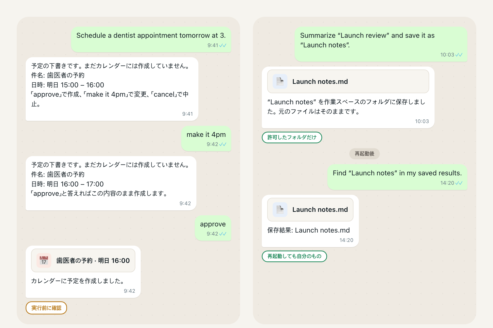
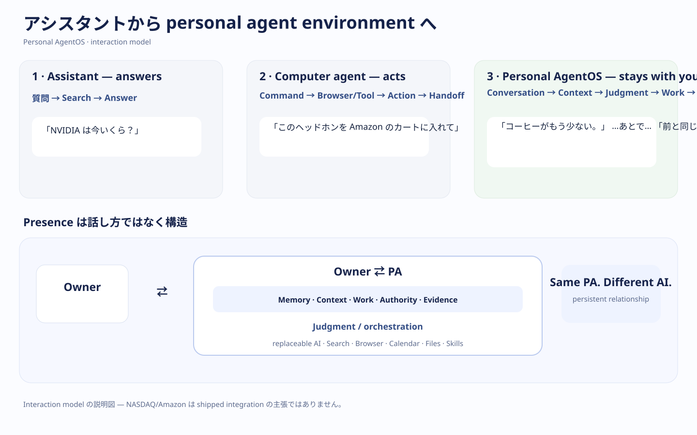
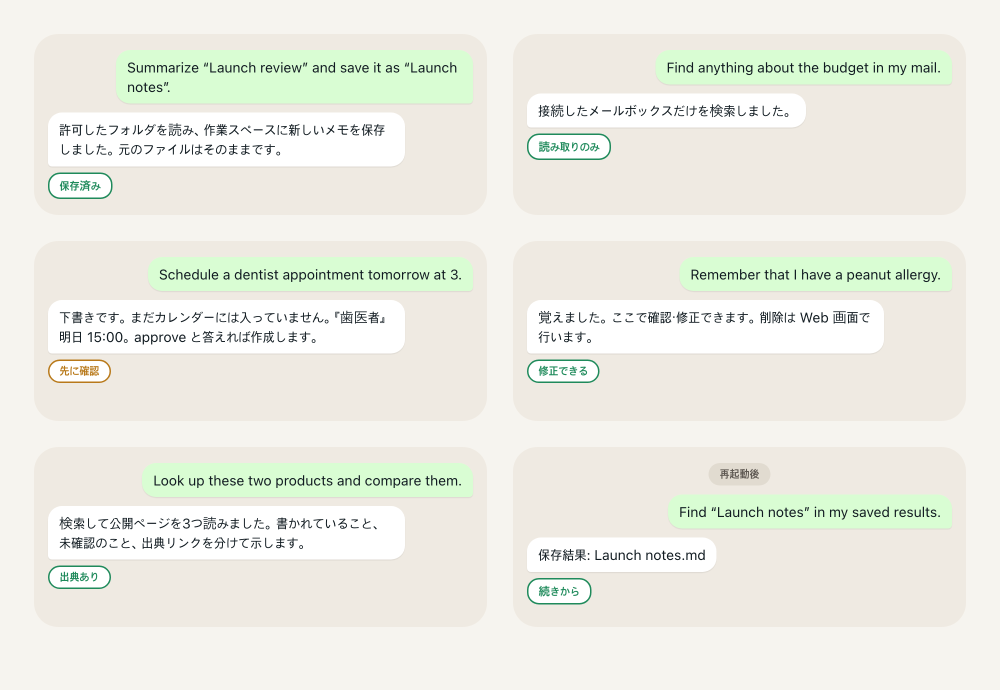

# Personal AgentOS

[English](README.md) | [한국어](README.ko.md) | [简体中文](README.zh-CN.md) | [日本語](README.ja.md)

<!-- readme-parity:v1 -->
<!-- readme-section:hero -->

## 自分の手元に残る、個人のための AI 環境。

**ひとりのアシスタント。交換可能な AI。自分で管理する記憶・コンテキスト・ツール・権限。**



上の2つの会話は製品の実際の挙動を、返答を短くして韓国語から訳したものです。依頼は英語のまま示しています（日本語の依頼は今日は理解されません）。「approve」と言うまで何も作成されず、保存したメモは再起動後もそこにあります。自分のコンピュータ（macOS または Linux、Python 3.12 以上）で動き、モデルは自分で用意します。ローカルの Ollama モデル、OpenAI 互換エンドポイント、Anthropic のいずれかです。ローカルファースト（local-first）はローカル限定（local-only）ではありません。ホスト型モデルを使うと、承認したコンテキストはそのプロバイダに送信されます。

<!-- readme-section:concept -->

## ひとことで言うと

> 내가 설치하고 통제하는 개인 AI 환경에서, 좋은 기본 기능으로 실제 일을 끝내고, 더 좋은 에이전트를 앱처럼 설치·교체해도 내 기억과 결과는 나에게 남는다.
>
> *自分でインストールして管理する個人 AI 環境で、よくできた基本機能が実際の仕事を終わらせ、より良いエージェントをアプリのように入れ替えても、自分の記憶と成果は自分の手元に残る。*

作者の言葉を韓国語の原文のまま引用しています。このプロジェクトがなぜあるのか、そしてコンセプトを定める文書は 1 ページにまとめています: [VISION.md](VISION.md)（英語）

<!-- readme-section:interaction-model -->

## アシスタントから personal agent environment へ



違いは、AI が株価を検索できるか、**カートに追加**できるかではありません。アシスタントはすでに質問に答え、computer-use agent は命令を実行できます。Personal AgentOS は、**継続する関係、owner context、authority、work state** を AI provider の外に置き、owner が管理する環境に保持します。

| Interaction model | Owner がすること | 主にシステムに残るもの |
| --- | --- | --- |
| **Assistant — answers** | “NVIDIA の現在価格は？”のように質問する | 現在の会話と回答 |
| **Computer agent — acts** | “このヘッドホンを Amazon のカートに入れて”のように命令する | task、browser/tool state、action/handoff |
| **Personal AgentOS — stays with you** | “コーヒーがもう少ない。”→後で“前と同じものを買っておいて。”のように時間をまたいで話す | 特定 AI から独立して続く Memory、Context、Work、Authority、Evidence |

NASDAQ/Amazon は **interaction model の説明例**であり、そのサービスが現在 shipped integration であるという主張ではありません。

### Presence は話し方ではなく architecture です

Owner は変化する model・tool・workflow と個別に会話せず、一つの **PA** と話します。

```text
Owner  ⇄  PA (continuous presence)
             │
     Personal AgentOS
  ┌──────────┼───────────┐
Memory    Context      Work
Authority  Evidence     Events
  └──────────┼───────────┘
       Judgment / orchestration
             │
   replaceable AI + tools/services
```

そのため、未完成な事実をそのまま話し、数時間後に続きを話し、必要になった時だけ写真や位置を共有し、外部 action に account/computer authority が必要な瞬間だけ handoff できます。日常の intent を tool・model・workflow・memory command に翻訳する必要はありません。

Owner-pilot で繰り返し現れた interaction pattern を一般化すると、たとえば次のようになります。

> **朝:** 「コーヒーがもう少ない。」  
> **午後:** 「今日は仕事が少し遅くなりそう。」  
> **夕方:** 「今から出る。途中で買えるところある？」  
> **あとで:** 「時間ないな。前と同じものを買っておいて。」

この普通の会話の下で AgentOS は prior context、calendar/time、location、search、継続中の Work を必要に応じて解決し、実際の action に authority が必要な時だけ handoff できます。この会話は説明用に一般化・短縮したもので、現在の implementation evidence は下で別に分類します。

**Same PA. Different AI.** 下の model が変わっても、owner が関係を最初から作り直さないことが目標です。

<!-- readme-section:working-software -->

## コンセプトだけのプロジェクトではありません

現在の `main` には、公開リリースよりかなり新しい実装があります。交換可能な Main AI / Judgment AI、永続 Memory、Telegram 会話、コンテキストに応じた権限ハンドオフ、検索・ブラウザ仲介、準備処理、Evidence に基づく回復を、ひとつの継続的なアシスタント体験として実装・検証しています。

証拠の種類は混ぜません。

- **公開リリース:** 公開リリース には release manifest に記録された installed-smoke と synthetic journey の証拠があります。現在の `main` 全体を含むものではありません。
- **現在の `main`:** 新しい Secretary / Presence / Decision / execution 契約を支えるマージ済みコードと deterministic / fixture 証拠があります。契約やテストだけで live-service 動作を主張しません。
- **Owner pilot evidence:** public owner-live claims are intentionally pending until exact Telegram/desktop observations are selected, redacted and tied to a revision/evidence record.
- **方向性:** shopping / booking などは、実装と証拠が揃うまでは製品方向です。

詳しくは [product status](docs/product-status.en.md)、[release manifest](docs/release-manifest.json)、[documentation map](docs/README.md) を参照してください。

<!-- readme-section:try-today -->

## インストール

```sh
brew install jongtae/agentos/agentos
agentos start
```

次のように表示されます。

```text
AgentOS: http://127.0.0.1:8787/
초기 설정 링크: /Users/you/.local/share/agentos/private/setup-link.txt (개인 파일)
```

ブラウザがそのアドレスで開きます。**바로 시작하기**（今すぐ始める）を押し、モデルを接続すれば、もう話しかけられます。画面は現在韓国語で、依頼は韓国語か英語で理解されます。

**Homebrew は最新の公開リリース `v1.1.0`（2026-09-23）をインストールします。** 以下の release シーンは、そのビルドに含まれる範囲に限定しています。 その後 `main` にマージされた作業はそのビルドにないため、次のリリースまで Homebrew ビルドは `main` より遅れています。最新のコードを使うにはソースチェックアウトから実行してください（`git clone https://github.com/Jongtae/agentos.git` のあと Python 3.12 以上で `python3 -m pip install -e '.[mcp-host]'`）。すべての手順は [QUICKSTART](QUICKSTART.md) にあります。

<!-- capability:current-supported-slice -->
<!-- readme-section:scenes-today -->

## 次はこんなことも



下の依頼の流れはすべて、このプロジェクトの自動化された初回ユーザー検証で、実際のアカウントではなく、ローカルフォルダと模擬のメール・予定・Web サービスで最後まで実行されました。文言は今日実際にルーティングされる文言です。

- **ファイル。** *Summarize “Launch review” and save it as “Launch notes”.* 許可したフォルダを読み、自分が選んだ作業スペースのフォルダに新しいメモを書き、元のファイルには触れません。
- **メール。** *Find anything about the budget in my mail.* 接続したメールボックスだけを検索し、見つけたものを示します。
- **予定。** *Schedule a dentist appointment tomorrow at 3.* 正確な下書きを示し、「approve」と言った後にだけ予定を作成します。「make it 4pm」「cancel」も同じ下書きで通ります。
- **公開リリース の記憶。** *Remember that I have a peanut allergy.* 公開ビルドには永続 Memory と candidate review があります。**現在の `main` はさらに進んでいます:** owner 自身の AI は保存可能な非 secret の事実を直接記憶し、何を記憶したかを伝え、期限付きの undo を提供します。第三者/委任 writer は引き続き candidate/approval 経路を使います。
- **調査。** *Look up these two products and compare them.* 検索して公開ページを最大3つ読み、書かれていること、未確認のこと、リンクを分けて返します。

そのあとアプリを再起動して、こう言ってみてください: *Find “Launch notes” in my saved results.* 保存した結果、許可したフォルダ、記憶、Telegram のペアリングは再起動後も残ります。

<!-- readme-section:settings -->

## 必要な設定

- **モデル。** ローカルの Ollama サーバー、OpenAI 互換エンドポイント、Anthropic のいずれかを、自分のアクセス権で接続します。ファイルの場面にはこの直接接続のどれかが必要です。
- **フォルダ2つ。** **내 에이전트 관리 → 내 자료**（マイエージェント管理 → マイ資料）で、読んでよい参照フォルダを1つ、書いてよい作業スペースフォルダを1つ。その外には触れません。ホスト型モデルなら、ファイルの場面の前にドキュメント共有を1回承認します。
- **メールと予定、任意。** 自分で作成した Google Cloud OAuth クライアントで自分の Google アカウントに接続し、それぞれ1回の設定コマンド（`agentos gmail-config`、`agentos calendar-config`）を実行してから、読み取りと書き込みを別々に接続します。正確な手順は QUICKSTART にあります。
- **Telegram、任意。** BotFather で作った自分のボットトークンを設定に貼り、ペアリングリンクを開きます。ペアリングした自分のアカウントだけが話しかけられます。

これで全部です。

<!-- readme-section:more -->

## さらに詳しく

[今できること、まだ摩擦があること](docs/product-status.en.md)（英語） · [この先に向かう場所](docs/product-status.en.md#where-this-is-going) · [何が違うのか](docs/product-status.en.md#why-this-is-different) · [内部の仕組み](docs/product-status.en.md#under-the-hood-briefly) · ライセンス [AGPL-3.0-only](LICENSE) と[商標に関する注記](TRADEMARKS.md) · [どう作られているか](AGENTS.md) · [謝辞と参考資料](docs/acknowledgements.en.md)（英語）
