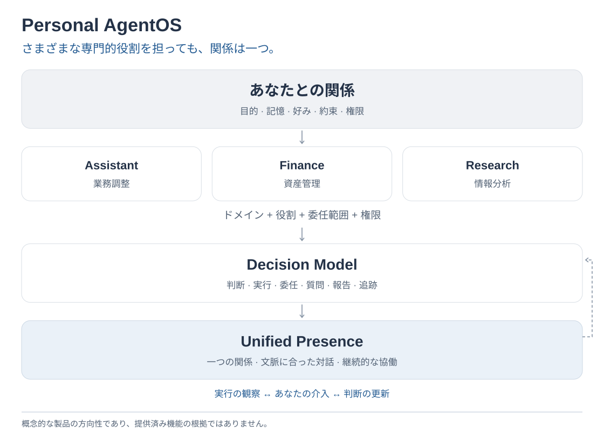
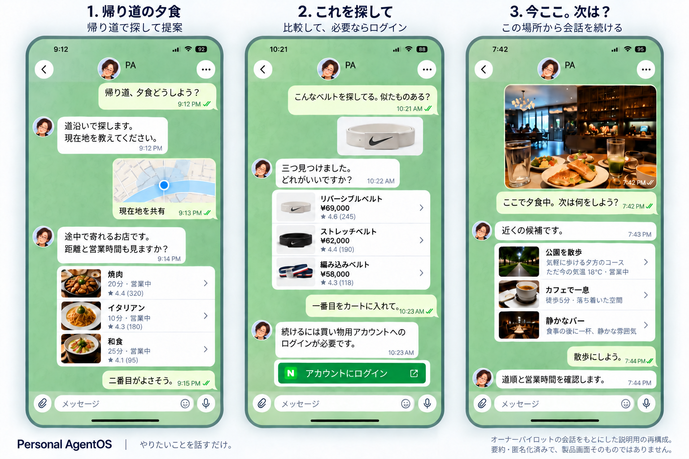

<div align="center">

<pre>
             P E R S O N A L              
                                          
    ___                    __  ____  _____
   /   | ____ ____  ____  / /_/ __ \/ ___/
  / /| |/ __ `/ _ \/ __ \/ __/ / / /\__ \ 
 / ___ / /_/ /  __/ / / / /_/ /_/ /___/ / 
/_/  |_\__, /\___/_/ /_/\__/\____//____/  
      /____/                              
</pre>

**自分のコンピューターで動く、自分のパーソナルエージェント。<br>下で働く AI を替えても、記憶と進行中の仕事と権限はそのまま残ります。**

[](https://github.com/Jongtae/agentos/actions/workflows/validate.yml) [](https://github.com/Jongtae/agentos/actions/workflows/full-validate.yml) [](https://github.com/Jongtae/agentos/releases) [](pyproject.toml) [](QUICKSTART.md) [](LICENSE)

[English](README.md) | [한국어](README.ko.md) | [简体中文](README.zh-CN.md) | [日本語](README.ja.md)

[クイックスタート](#クイックスタート) · [自分に残るもの](#自分に残るもの) · [仕組み](#仕組み) · [ドキュメント](#ドキュメント)

</div>

<!-- readme-parity:v1 -->
<!-- readme-section:hero -->

## 同じ PA、違う AI。

もしジャーヴィスが別の会社のサービスだったら、トニーはより良い AI を使うために、ジャーヴィスが知っている自分の文脈、まだ終わっていない仕事、任せた権限まで手放さなければならないのでしょうか。

Personal AgentOS は *いいえ* という答えから始まります。自分でインストールし管理するオープンソース環境で、一つのパーソナルエージェント（PA）が文脈・進行中の仕事・権限を保ち、実際に働く AI は替えられるようにします。

<p align="center">
  
</p>
<p align="center"><sub>デモ · Telegram（韓国語画面）。待ち時間は短縮し、個人情報はぼかしています。</sub></p>

**主な特長**

- **好きな AI を接続。** ローカルの Ollama モデル、OpenAI 互換・Anthropic API、Codex や Claude Code のサブスクリプションが実際の仕事をします。
- **会話が変わっても同じ PA。** 記憶、保存した結果、進行中の仕事が次の会話に引き継がれ、再起動後も残ります。
- **境界は自分で決める。** 接続したフォルダー・アカウント・ツールだけを使います。支払いは必ず先に確認し、秘密情報はプロンプト・ログ・記録に入りません。
- **隠さずに知らせる。** AI が何かを記憶するとそれを知らせ、正確に取り消せるようにします。任せた仕事ごとに、どの情報を使いどこへ送ったかを記録します。
- **いつもの場所で会話。** スマートフォンの Telegram、または自分の Mac・Linux のブラウザーで話せます。

<!-- readme-section:try-today -->

## クイックスタート

macOS では [Homebrew](https://brew.sh) でインストールします。

```sh
brew install jongtae/agentos/agentos
agentos start
```

1. 設定画面が [http://127.0.0.1:8787](http://127.0.0.1:8787/) で開きます。**바로 시작하기**（今すぐ始める）を押してください。設定画面は現在韓国語です。
2. AI を接続します。ツール呼び出しに対応した Ollama モデル、OpenAI・OpenAI 互換・Anthropic の API キー、または Codex や Claude Code のサブスクリプションを使えます。
3. 任意：**설정 → 외부 연결**（設定 → 外部接続）で自分の Telegram ボットのトークンを入力し、ペアリングリンクを開きます。
4. こう話しかけてみてください。**「今週中に提案書を仕上げたい。次にやることをいくつかのステップに分けて。」**

Linux、ソースからの実行、すべての設定は [QUICKSTART](QUICKSTART.md) にあります。会話中は `agentos start` を起動したままにしてください。

**リリース状況：** Homebrew からは、タグを付けた main コミットの **v1.1.1**（2026-10-07）が入ります。デモは実際の利用セッションを編集したもので、この版の一連の動作を検証したものではありません。説明図は製品の方向性を示す例です。[release manifest](docs/release-manifest.json) は各リリースの範囲を記録し、[製品の状況](docs/product-status.en.md) は提供中の機能・テストの根拠・方向性を区別しています。

<!-- readme-section:ownership -->

## 自分に残るもの

| 替えられるもの | 自分に残るもの |
| --- | --- |
| モデルと提供元 | 自分についての記憶と文脈 |
| 仕事をする CLI エージェントや API | 進行中の仕事と次の一歩 |
| ツールとコネクター | 権限と承認 |
| | 実際に実行されたことの記録 |

より良い AI が現れたら、替えるのはエージェントではなく働く AI です。[誰のエージェントか](docs/whitepapers/whose-agent.ko.md)（韓国語の白書）がこの問いをさらに掘り下げます。

ローカルファースト（local-first）はローカル限定（local-only）ではありません。ローカルモデルと外部モデルを選べ、外部モデルを使う場合はリクエストに使う文脈がその提供元へ送られます。

<!-- readme-section:presence -->

## 仕組み

<picture>
  <source media="(max-width: 600px)" srcset="docs/assets/readme/presence-overview.ja.narrow.svg">
  
</picture>

- **PA** は自分が話すエージェント、**AgentOS** はその文脈・残る仕事・権限・根拠を保つ環境です。
- **判断層** がリクエストごとに AI とツールを選び、指示を書き、結果を確かめ、足りなければ任せ直します。
- **オントロジー** は出典のある対象（会議や口座残高など）を、その周りの仕事・役割・権限と結び付けます。下書きを送信と、招待を承諾と取り違えません。

図は設計の方向性であり、観測された実行ではありません。詳しくは [アーキテクチャとオントロジー](docs/personal-agentos-architecture.en.md) · [Presence](docs/presence-experience-contract.en.md)。

<!-- readme-section:conversation -->

## これからの方向

*実際の会話を要約して再構成した説明図です。図中の地図・ショッピング連携は提供済みの機能ではなく製品の方向性です。*

<picture>
  <source media="(max-width: 600px)" srcset="docs/assets/readme/owner-pilot-conversation.ja.png">
  
</picture>

帰り道の夕食、写真のベルトに似た商品、夕食の後にすること。どれも同じ流れです。**話したことや見せたもの → 出典と時刻のある許可された文脈 → 必要な質問やツール → 行動の境界 → 確認された結果。** カートへの追加と支払いは別の行動です。

> 「コーヒーがほとんどない。」 · *数時間後* · 「出かけるついでに買える所ある？」 · *その後* · 「時間ない。前と同じので。」

目指すのは「それ」や「同じの」が何を指すかを追える PA です。ワークフローを組み立てるのではなく、会話を続けるだけで済むようにします。

<!-- readme-section:more -->

## ドキュメント

| ドキュメント | 内容 |
| --- | --- |
| [QUICKSTART](QUICKSTART.md) | インストール、モデル接続、ファイル、Telegram、ソースからの実行 |
| [製品の状況](docs/product-status.en.md) | できること、まだ不便なこと、領域ごとの根拠 |
| [なぜ作るのか](VISION.md) | プロジェクトの動機 |
| [アーキテクチャとオントロジー](docs/personal-agentos-architecture.en.md) | カーネルの基本概念、パッケージ、ランタイム、オーナーによる管理 |
| [ドキュメントマップ](docs/README.md) | 現在の契約とガイドの一覧 |
| [謝辞と参考文献](docs/acknowledgements.en.md) | 設計に影響を与えた研究とプロジェクト |

**コントリビュート。** Issue と Pull Request を歓迎します。まず [CONTRIBUTING](CONTRIBUTING.md) を、開発の流れは [AGENTS.md](AGENTS.md) をご覧ください。

<!-- readme-section:license -->

## ライセンス

[AGPL-3.0-only](LICENSE)。Personal AgentOS の名称とロゴは [商標について](TRADEMARKS.md) に従います。
