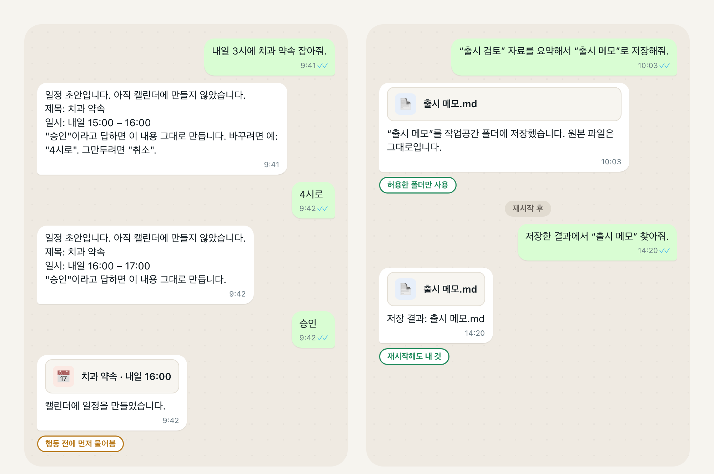
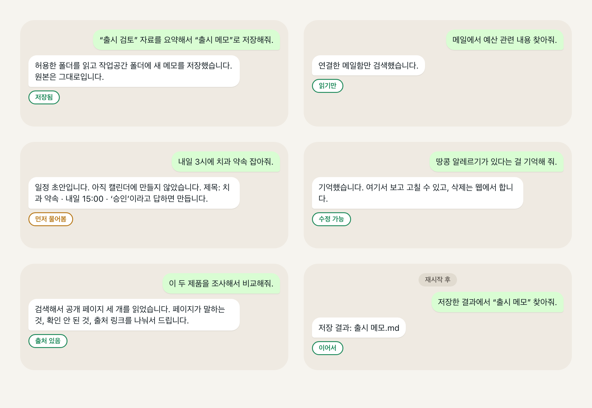

# Personal AgentOS

[English](README.md) | [한국어](README.ko.md) | [简体中文](README.zh-CN.md) | [日本語](README.ja.md)

<!-- readme-parity:v1 -->
<!-- readme-section:hero -->

## 내 컴퓨터에서 도는, 나만의 AI 비서.

**모델은 내가 고르고, 내 파일·메일·일정·기억을 쓰되, 규칙은 내가 정합니다.**



위 두 대화는 제품의 실제 동작을 답변 문구만 줄여서 옮긴 것입니다. 내가 승인이라고 말하기 전에는 아무것도 만들어지지 않고, 저장한 메모는 재시작 후에도 그 자리에 있습니다. 내 컴퓨터(macOS 또는 Linux, Python 3.12 이상)에서 돌고, 모델은 직접 가져옵니다. 로컬 Ollama 모델, OpenAI 호환 엔드포인트, Anthropic 중 하나입니다. 로컬 우선(local-first)은 로컬 전용(local-only)이 아닙니다. 외부 호스팅 모델을 쓰면 내가 승인한 맥락은 그 제공자로 전송됩니다.

<!-- readme-section:try-today -->

## 설치

```sh
brew install jongtae/agentos/agentos
agentos start
```

이렇게 출력됩니다.

```text
AgentOS: http://127.0.0.1:8787/
초기 설정 링크: /Users/you/.local/share/agentos/private/setup-link.txt (개인 파일)
```

브라우저가 그 주소로 열립니다. **바로 시작하기**를 누르고 모델을 연결하면 바로 대화가 됩니다. 화면은 현재 한국어이고, 요청은 한국어나 영어로 이해합니다.

**Homebrew는 최신 공개 배포본 `v1.1.0`(2026-09-23)을 설치하며, 이 페이지의 내용은 모두 그 안에 들어 있습니다.** 그 이후 `main`에 병합된 작업은 그 빌드에 없으므로, 다음 배포 전까지 Homebrew 빌드는 `main`보다 뒤입니다. 최신 코드를 쓰려면 소스 체크아웃으로 실행하세요(`git clone https://github.com/Jongtae/personal-agentos.git` 후 Python 3.12 이상에서 `python3 -m pip install -e .`). 모든 단계는 [QUICKSTART](QUICKSTART.md)에 있습니다.

<!-- capability:current-supported-slice -->
<!-- readme-section:scenes-today -->

## 그다음엔 이런 것도



아래 요청의 흐름은 모두 이 프로젝트의 자동화된 첫 사용자 점검에서, 실제 계정 대신 로컬 폴더와 모의 메일·일정·웹 서비스로 끝까지 실행됐습니다. 문구는 지금 실제로 라우팅되는 문구입니다.

- **파일.** *“출시 검토” 자료를 요약해서 “출시 메모”로 저장해줘.* 허용한 폴더를 읽고, 내가 고른 작업공간 폴더에 새 메모를 쓰고, 원본은 건드리지 않습니다.
- **메일.** *메일에서 예산 관련 내용 찾아줘.* 연결한 메일함만 검색하고 찾은 것을 보여줍니다.
- **일정.** *내일 3시에 치과 약속 잡아줘.* 정확한 초안을 보여주고, 내가 승인이라고 말한 뒤에만 일정을 만듭니다. “4시로”와 “취소”도 같은 초안에서 됩니다.
- **기억.** *땅콩 알레르기가 있다는 걸 기억해 줘.* 대화에서 보고 고칠 수 있고, 삭제는 웹 화면에서 할 수 있는 곳에 보관합니다. 모델이 스스로 제안한 기억은 내가 받아들이기 전까지 검토 대기로 남습니다.
- **조사.** *이 두 제품을 조사해서 비교해줘.* 검색해서 공개 페이지를 최대 세 개 읽고, 페이지가 말하는 것, 확인되지 않은 것, 출처 링크를 나눠서 돌려줍니다.

그다음 앱을 재시작하고 이렇게 말해보세요. *저장한 결과에서 “출시 메모” 찾아줘.* 저장한 결과, 허용한 폴더, 기억, 텔레그램 페어링은 재시작 후에도 남아 있습니다.

<!-- readme-section:settings -->

## 필요한 설정

- **모델.** 로컬 Ollama 서버, OpenAI 호환 엔드포인트, Anthropic 중 하나를 내 접근 권한으로 연결합니다. 파일 장면은 이 직접 연결 중 하나가 필요합니다.
- **폴더 두 개.** **내 에이전트 관리 → 내 자료**에서 읽어도 되는 참고 폴더 하나, 써도 되는 작업공간 폴더 하나. 그 밖은 손대지 않습니다. 외부 호스팅 모델이면 파일 장면 전에 문서 공유를 한 번 승인합니다.
- **메일과 일정, 선택.** 내가 만든 Google Cloud OAuth 클라이언트로 내 Google 계정에 연결하고, 각각 한 번의 설정 명령(`agentos gmail-config`, `agentos calendar-config`)을 실행한 뒤 읽기와 쓰기를 따로 연결합니다. 정확한 단계는 QUICKSTART에 있습니다.
- **텔레그램, 선택.** BotFather에서 만든 내 봇 토큰을 설정에 붙여 넣고 페어링 링크를 엽니다. 페어링한 내 계정만 말을 걸 수 있습니다.

이게 전부입니다.

<!-- readme-section:more -->

## 더 보기

[지금 되는 것과 아직 마찰이 있는 것](docs/product-status.ko.md) · [앞으로 가려는 곳](docs/product-status.ko.md#앞으로-가려는-곳) · [무엇이 다른가](docs/product-status.ko.md#무엇이-다른가) · [내부는 짧게](docs/product-status.ko.md#내부는-짧게) · 라이선스 [AGPL-3.0-only](LICENSE)와 [상표 고지](TRADEMARKS.md) · [어떻게 만드는가](AGENTS.md)
