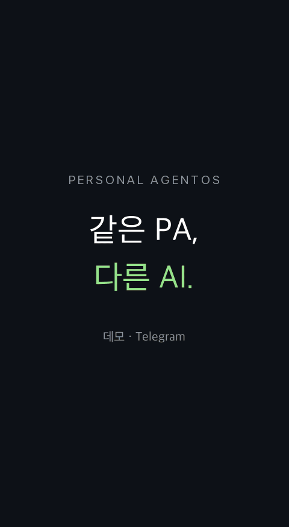
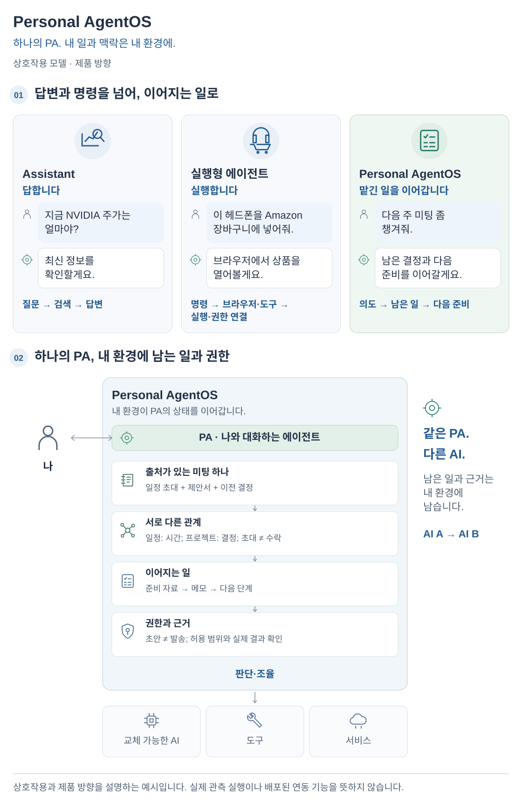
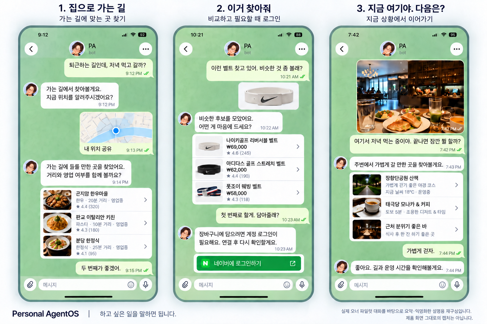

<div align="center">

<pre>
          P E R S O N A L           
                                    
   ___                __  ____  ____
  / _ |___ ____ ___  / /_/ __ \/ __/
 / __ / _ `/ -_) _ \/ __/ /_/ /\ \  
/_/ |_\_, /\__/_//_/\__/\____/___/  
     /___/                          
</pre>

**내 컴퓨터에서 돌아가는 나의 개인 에이전트.<br>아래의 AI는 바꿔도, 기억과 진행 중인 일과 권한은 그대로 남습니다.**

[](https://github.com/Jongtae/agentos/actions/workflows/validate.yml) [](https://github.com/Jongtae/agentos/actions/workflows/full-validate.yml) [](https://github.com/Jongtae/agentos/releases) [](pyproject.toml) [](QUICKSTART.md) [](LICENSE)

[English](README.md) | [한국어](README.ko.md) | [简体中文](README.zh-CN.md) | [日本語](README.ja.md)

[빠른 시작](#빠른-시작) · [나에게 남는 것](#나에게-남는-것) · [동작 방식](#동작-방식) · [문서](#문서)

</div>

<!-- readme-parity:v1 -->
<!-- readme-section:hero -->

## 같은 PA, 다른 AI.

자비스가 다른 회사의 서비스였다면, 토니는 더 좋은 AI를 쓰기 위해 자비스가 아는 자신의 맥락, 함께 끝내지 못한 일, 맡겨 둔 권한까지 포기해야 할까요?

Personal AgentOS는 *아니다*라는 답에서 출발합니다. 내가 설치하고 통제하는 오픈소스 환경에서, 하나의 개인 에이전트(PA)가 내 맥락과 진행 중인 일과 권한을 지키고, 실제 일을 하는 AI는 바꿀 수 있게 합니다.

<p align="center">
  
</p>
<p align="center"><sub>데모 · Telegram 한국어 화면, 한국어 자막. 대기 시간은 줄이고 개인 정보는 흐리게 처리했습니다.</sub></p>

**주요 기능**

- **원하는 AI를 연결.** 로컬 Ollama 모델, OpenAI 호환·Anthropic API, Codex나 Claude Code 구독이 실제 일을 합니다.
- **대화가 바뀌어도 같은 PA.** 기억, 저장한 결과, 진행 중인 일이 다음 대화로 이어지고 재시작 후에도 남습니다.
- **경계는 내가 정합니다.** 연결한 폴더·계정·도구에만 접근합니다. 결제는 항상 먼저 묻고, 비밀값은 프롬프트·로그·기록에 들어가지 않습니다.
- **숨기지 않고 알립니다.** AI가 무언가를 기억하면 그 사실을 알리고 정확히 되돌릴 수 있게 합니다. 맡긴 일마다 내 정보 중 무엇을 썼고 어디로 보냈는지 기록합니다.
- **늘 쓰는 곳에서 대화.** 휴대폰의 Telegram이나, 내 Mac·Linux 컴퓨터의 브라우저에서 대화합니다.

<!-- readme-section:try-today -->

## 빠른 시작

macOS에서 [Homebrew](https://brew.sh)로 설치합니다.

```sh
brew install jongtae/agentos/agentos
agentos start
```

1. 설정 화면이 [http://127.0.0.1:8787](http://127.0.0.1:8787/)에서 열립니다. **바로 시작하기**를 누르세요.
2. AI를 연결합니다. 도구 호출을 지원하는 Ollama 모델, OpenAI·OpenAI 호환·Anthropic API 키, 또는 Codex나 Claude Code 구독을 쓸 수 있습니다.
3. 선택: **설정 → 외부 연결**에서 내 Telegram 봇 토큰을 넣고 페어링 링크를 엽니다.
4. 이렇게 말해 보세요. **“이번 주에 제안서를 끝내야 해. 다음 할 일 몇 단계로 나눠 줘.”**

Linux, 소스 실행, 모든 설정은 [QUICKSTART](QUICKSTART.md)에 있습니다. 대화하는 동안 `agentos start`를 켜 두세요.

**배포 상태:** Homebrew는 태그가 붙은 main 커밋의 **v1.1.1**(2026-10-07)을 설치합니다. 데모는 실제 사용 세션을 편집한 것으로 이 배포본의 종단 간 검증은 아니며, 설명 그림은 제품 방향 예시입니다. [release manifest](docs/release-manifest.json)는 배포본마다 포함 범위를 기록하고, [현재 상태](docs/product-status.ko.md)는 제공 기능과 테스트 근거와 방향을 구분합니다.

<!-- readme-section:ownership -->

## 나에게 남는 것

| 바뀔 수 있는 것 | 나에게 남는 것 |
| --- | --- |
| 모델과 제공자 | 나에 대한 기억과 맥락 |
| 일을 맡은 CLI 에이전트나 API | 진행 중인 일과 다음 단계 |
| 도구와 커넥터 | 권한과 승인 |
| | 실제로 실행된 일의 기록 |

더 좋은 AI가 나오면 에이전트가 아니라 일하는 AI만 바꿉니다. [누구의 에이전트인가?](docs/whitepapers/whose-agent.ko.md) 백서가 이 질문을 더 깊게 다룹니다.

로컬 우선(local-first)은 로컬 전용(local-only)이 아닙니다. 로컬 모델과 외부 모델을 선택할 수 있고, 외부 모델을 쓰면 요청에 사용되는 맥락은 그 제공자로 전송됩니다.

<!-- readme-section:presence -->

## 동작 방식

<picture>
  <source media="(max-width: 600px)" srcset="docs/assets/readme/presence-overview.ko.narrow.svg">
  
</picture>

- **PA**는 내가 대화하는 에이전트이고, **AgentOS**는 그 PA의 맥락·남은 일·권한·근거를 지키는 환경입니다.
- **판단 계층**이 요청마다 AI와 도구를 고르고, 지시를 쓰고, 결과를 확인해 부족하면 다시 맡깁니다.
- **온톨로지**는 출처가 있는 대상(미팅, 계좌 잔액 등)을 그 주변의 일·역할·권한과 연결합니다. 초안을 발송으로, 초대를 수락으로 여기지 않습니다.

그림은 설계 방향이며 관찰된 실행이 아닙니다. 자세히: [아키텍처와 온톨로지](docs/personal-agentos-architecture.en.md) · [Presence](docs/presence-experience-contract.en.md)

<!-- readme-section:conversation -->

## 앞으로의 방향

*실제 대화를 압축해 재구성한 설명용 그림입니다. 그림 속 지도·쇼핑 연동은 배포된 기능이 아니라 제품 방향입니다.*

<picture>
  <source media="(max-width: 600px)" srcset="docs/assets/readme/owner-pilot-conversation.ko.png">
  
</picture>

귀갓길 저녁, 사진 속 벨트와 비슷한 상품, 저녁 뒤에 할 일. 모두 같은 흐름입니다. **내가 말하거나 보여 준 것 → 출처와 시각이 있는 허락된 맥락 → 필요한 질문이나 도구 → 행동의 경계 → 확인된 결과.** 장바구니에 담기와 결제는 서로 다른 행동입니다.

> “커피가 거의 떨어졌네.” · *몇 시간 뒤* · “나가는 길에 살 데 있어?” · *그 뒤* · “시간 없다. 지난번이랑 같은 걸로.”

목표는 “그거”와 “같은 걸로”가 무엇인지 따라오는 PA입니다. 나는 대화만 이어 가고, 워크플로를 조립하지 않습니다.

<!-- readme-section:more -->

## 문서

| 문서 | 내용 |
| --- | --- |
| [QUICKSTART](QUICKSTART.md) | 설치, 모델 연결, 파일, Telegram, 소스 실행 |
| [현재 상태](docs/product-status.ko.md) | 되는 것, 아직 불편한 것, 영역별 근거 |
| [왜 만드는가](VISION.md) | 프로젝트의 동기 |
| [아키텍처와 온톨로지](docs/personal-agentos-architecture.en.md) | 커널 기본 개념, 패키지, 런타임, 소유자 통제 |
| [문서 지도](docs/README.md) | 현재 계약과 가이드 전체 |
| [참고한 연구와 프로젝트](docs/acknowledgements.en.md) | 설계에 영향을 준 연구와 프로젝트 |

**기여하기.** 이슈와 PR을 환영합니다. [CONTRIBUTING](CONTRIBUTING.md)부터 읽어 주세요. 개발 흐름은 [AGENTS.md](AGENTS.md)에 있습니다. 써 보셨다면 [피드백 양식](https://github.com/Jongtae/agentos/issues/new?template=feedback.yml)이나 [Discussions](https://github.com/Jongtae/agentos/discussions)에 좋았던 점과 아쉬운 점을 남겨 주세요.

<!-- readme-section:license -->

## 라이선스

[AGPL-3.0-only](LICENSE). Personal AgentOS 이름과 로고는 [상표 안내](TRADEMARKS.md)를 따릅니다.
