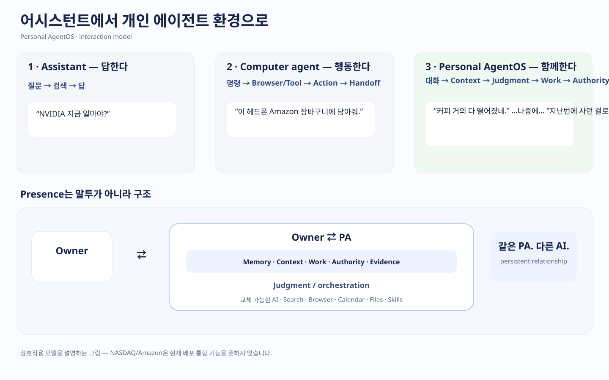
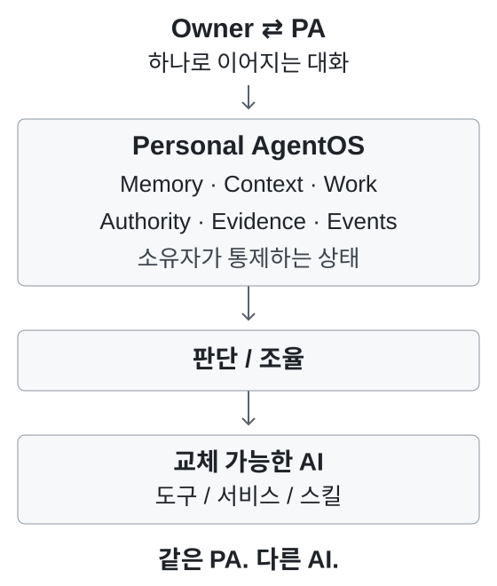
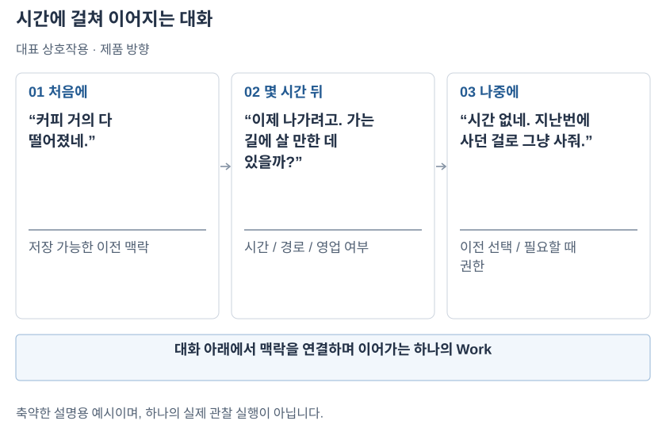

# Personal AgentOS

[English](README.md) | [한국어](README.ko.md) | [简体中文](README.zh-CN.md) | [日本語](README.ja.md)

<!-- readme-parity:v1 -->
<!-- readme-section:hero -->

## 나에게 남는 개인 AI 환경.

**하나의 비서. 교체 가능한 AI. 내가 통제하는 기억·맥락·도구·권한.**

로컬 우선(local-first)은 로컬 전용(local-only)이 아닙니다. Personal AgentOS는 로컬 또는 외부 모델을 사용할 수 있고, 외부 모델을 쓰면 허용된 맥락은 그 제공자로 전송됩니다.

<!-- readme-section:concept -->

## 한 문장으로

> 내가 설치하고 통제하는 개인 AI 환경에서, 좋은 기본 기능으로 실제 일을 끝내고, 더 좋은 에이전트를 앱처럼 설치·교체해도 내 기억과 결과는 나에게 남는다.

왜 이 프로젝트를 만드는지, 그리고 컨셉을 정의하는 문서들을 한 페이지에 모았습니다: [VISION.md](VISION.md) (영어)

<!-- readme-section:interaction-model -->

## 어시스턴트에서 개인 에이전트 환경으로

<picture>
  <source media="(max-width: 600px)" srcset="docs/assets/readme/interaction-model.ko.narrow.svg">
  
</picture>

차이는 AI가 주가를 검색하거나 **장바구니에 담기**를 할 수 있느냐가 아닙니다. 어시스턴트는 이미 질문에 답하고, computer-use agent는 명령을 실행할 수 있습니다. Personal AgentOS는 **지속되는 관계, 소유자의 맥락, 권한과 작업 상태**를 AI 제공자 밖으로 꺼내 소유자가 통제하는 환경에 둡니다.

| 상호작용 모델 | 사용자가 하는 일 | 시스템에 주로 남는 것 |
| --- | --- | --- |
| **Assistant — 답한다** | “NVIDIA 현재 주가가 얼마야?”처럼 질문 | 현재 대화와 답 |
| **Computer agent — 행동한다** | “이 헤드폰을 Amazon 장바구니에 담아줘.”처럼 명령 | 작업, 브라우저/도구 상태와 행동/인계 |
| **Personal AgentOS — 함께한다** | “커피 거의 다 떨어졌네.” → 나중에 “지난번에 사던 걸로 그냥 사줘.”처럼 시간에 걸쳐 대화 | 특정 AI와 독립적으로 지속되는 Memory, Context, Work, Authority, Evidence |

위 NASDAQ/Amazon 예시는 **상호작용 모델을 설명하기 위한 예시**이며 해당 서비스가 현재 배포된 통합 기능이라는 주장이 아닙니다.

### Presence는 말투가 아니라 구조입니다

소유자는 바뀌는 모델·도구·워크플로와 각각 대화하지 않고 하나의 **PA**와 대화합니다.

<picture>
  <source media="(max-width: 600px)" srcset="docs/assets/readme/presence.ko.narrow.svg">
  
</picture>

그래서 대화 방식도 달라집니다. 사람은 불완전한 사실을 그냥 말해둘 수 있고, 몇 시간 뒤 이어 말할 수 있으며, 필요해진 순간 사진이나 위치를 보내고, 실제 외부 행동에 계정/컴퓨터 권한이 필요할 때만 넘겨줄 수 있습니다. 일상의 의도를 tool·model·workflow·memory 명령으로 번역할 필요가 없습니다.

**대표 상호작용 — 제품 방향.** 소유자가 제공한 상호작용 패턴을 축약한 예시이며, 하나의 관찰된 실행을 재현한 것이 아닙니다.

<picture>
  <source media="(max-width: 600px)" srcset="docs/assets/readme/continuing-conversation.ko.narrow.svg">
  
</picture>

> **아침:** “커피 거의 다 떨어졌네.”  
> **오후:** “오늘 일이 좀 늦게 끝날 것 같아.”  
> **저녁:** “이제 나가려고. 가는 길에 살 만한 데 있을까?”  
> **나중:** “시간 없네. 지난번에 사던 걸로 그냥 사줘.”

이 평범한 대화 아래에서 AgentOS는 이전 맥락, 일정/시간, 위치, 검색, 이어지는 Work를 필요에 따라 해석하고 실제 행동에 권한이 필요한 순간에만 handoff할 수 있습니다. 위 대화는 설명을 위해 일반화·축약한 예시이며 현재 구현 증거는 아래에서 별도로 분류합니다.

**같은 PA, 다른 AI.** 뒤의 모델이 바뀌어도 사용자가 관계를 처음부터 다시 만들 필요가 없는 것이 목표입니다.

<!-- readme-section:working-software -->

## 컨셉만 있는 프로젝트가 아닙니다

현재 저장소에는 공개 배포본 이후의 구현이 들어 있습니다. 교체 가능한 기본 AI와 판단 AI, 지속되는 Memory, Telegram 대화, 맥락형 권한 연결, 검색/브라우저 중재, 준비 작업과 Evidence 기반 복구 경로를 병합 코드와 deterministic/fixture 점검으로 검증합니다. 이 증거가 여기서 설명하는 전체 경험을 실제 외부 서비스에서 관찰했다는 뜻은 아닙니다.

증거는 구분해서 봅니다.

- **공개 배포본:** release manifest에 설치 smoke와 synthetic journey 증거가 기록되어 있습니다. 현재 `main` 전체를 담고 있지는 않습니다.
- **현재 `main`:** Secretary, Presence, Decision, execution 계약을 뒷받침하는 병합 코드와 deterministic/fixture 증거가 있습니다. 계약이나 테스트만으로 실제 외부 서비스 동작을 주장하지는 않습니다.
- **소유자 파일럿 증거:** 정확한 Telegram/데스크톱 관찰을 선정하고 개인정보를 가린 뒤 revision/evidence 기록과 연결하기 전까지 공개 owner-live 주장은 보류합니다.
- **제품 방향:** 위 대표 대화와 쇼핑·예약 등은 구현과 증거가 더 강한 주장을 뒷받침하기 전까지 제품 방향입니다.

[현재 무엇이 되고 어떻게 아는지](docs/product-status.ko.md), [release manifest](docs/release-manifest.json), [문서 지도](docs/README.md)를 함께 보세요.

### 공개 배포본의 여정 설명

아래 두 장면은 v1 synthetic 일정·파일 여정을 재구성하고 축약한 설명용 그림이며, 실제 계정의 스크린샷이 아닙니다. 한국어 답변을 바탕으로 작성했습니다. 공개 배포본에는 로컬 설치 smoke 증거가 있지만 release manifest는 실제 Google·Telegram 운영을 주장하지 않습니다.


<!-- readme-section:try-today -->

## 설치

```sh
brew install jongtae/agentos/agentos
agentos start
```

이렇게 출력됩니다.

```text
AgentOS: http://127.0.0.1:8787/
초기 설정 링크: /Users/you/.local/share/agentos/private/setup-link.txt (개인 파일)
```

브라우저가 그 주소로 열립니다. **바로 시작하기**를 누르고 모델을 연결하면 바로 대화가 됩니다. 화면은 현재 한국어이고, 요청은 한국어나 영어로 이해합니다.

**Homebrew는 최신 공개 배포본 `v1.1.0`(2026-09-23)을 설치합니다.** [release manifest](docs/release-manifest.json)는 배포본의 내용과 한계를 기록합니다. 해당 빌드에서 일정 생성은 도달 불가(J4), 조사는 부분 지원(J5)입니다. 아래 synthetic 장면이 모든 여정을 그 빌드에서 실행할 수 있다는 뜻은 아닙니다. 이후 `main`에 병합된 Secretary/Presence/orchestration 작업은 그 배포본에 없으며, 다음 배포 전까지 Homebrew 빌드는 `main`보다 뒤입니다. 최신 코드를 쓰려면 소스 체크아웃으로 실행하세요(`git clone https://github.com/Jongtae/agentos.git` 후 Python 3.12 이상에서 `python3 -m pip install -e '.[mcp-host]'`). 모든 단계는 [QUICKSTART](QUICKSTART.md)에 있습니다.

<!-- capability:current-supported-slice -->
<!-- readme-section:scenes-today -->

## 그다음엔 이런 것도


아래 요청의 흐름은 모두 이 프로젝트의 자동화된 첫 사용자 점검에서, 실제 계정 대신 로컬 폴더와 모의 메일·일정·웹 서비스로 끝까지 실행됐습니다. 문구는 지금 실제로 라우팅되는 문구입니다.

- **파일.** *“출시 검토” 자료를 요약해서 “출시 메모”로 저장해줘.* 허용한 폴더를 읽고, 내가 고른 작업공간 폴더에 새 메모를 쓰고, 원본은 건드리지 않습니다.
- **메일.** *메일에서 예산 관련 내용 찾아줘.* 연결한 메일함만 검색하고 찾은 것을 보여줍니다.
- **일정.** *내일 3시에 치과 약속 잡아줘.* 정확한 초안을 보여주고, 내가 승인이라고 말한 뒤에만 일정을 만듭니다. “4시로”와 “취소”도 같은 초안에서 됩니다.
- **공개 배포본의 기억.** *땅콩 알레르기가 있다는 걸 기억해 줘.* 공개 배포본은 지속 Memory와 candidate 검토 경로를 제공합니다. **현재 `main`은 더 나아갔습니다:** 소유자 자신의 AI는 저장 가능한 비밀이 아닌 사실을 바로 기억하고 무엇을 기억했는지 알려주며 제한된 되돌리기를 제공합니다. 제3자/위임 writer는 여전히 candidate/승인 경로를 사용합니다.
- **조사.** *이 두 제품을 조사해서 비교해줘.* 검색해서 공개 페이지를 최대 세 개 읽고, 페이지가 말하는 것, 확인되지 않은 것, 출처 링크를 나눠서 돌려줍니다.

그다음 앱을 재시작하고 이렇게 말해보세요. *저장한 결과에서 “출시 메모” 찾아줘.* 저장한 결과, 허용한 폴더, 기억, 텔레그램 페어링은 재시작 후에도 남아 있습니다.

<!-- readme-section:settings -->

## 필요한 설정

- **모델.** 로컬 Ollama 서버, OpenAI 호환 엔드포인트, Anthropic 중 하나를 내 접근 권한으로 연결합니다. 파일 장면은 이 직접 연결 중 하나가 필요합니다.
- **폴더 두 개.** **내 에이전트 관리 → 내 자료**에서 읽어도 되는 참고 폴더 하나, 써도 되는 작업공간 폴더 하나. 그 밖은 손대지 않습니다. 외부 호스팅 모델이면 파일 장면 전에 문서 공유를 한 번 승인합니다.
- **메일과 일정, 선택.** 내가 만든 Google Cloud OAuth 클라이언트로 내 Google 계정에 연결하고, 각각 한 번의 설정 명령(`agentos gmail-config`, `agentos calendar-config`)을 실행한 뒤 읽기와 쓰기를 따로 연결합니다. 정확한 단계는 QUICKSTART에 있습니다.
- **텔레그램, 선택.** BotFather에서 만든 내 봇 토큰을 설정에 붙여 넣고 페어링 링크를 엽니다. 페어링한 내 계정만 말을 걸 수 있습니다.

이게 전부입니다.

<!-- readme-section:more -->

## 더 보기

[지금 되는 것과 아직 마찰이 있는 것](docs/product-status.ko.md) · [앞으로 가려는 곳](docs/product-status.ko.md#앞으로-가려는-곳) · [무엇이 다른가](docs/product-status.ko.md#무엇이-다른가) · [내부는 짧게](docs/product-status.ko.md#내부는-짧게) · 라이선스 [AGPL-3.0-only](LICENSE)와 [상표 고지](TRADEMARKS.md) · [어떻게 만드는가](AGENTS.md) · [감사의 말과 참고 자료](docs/acknowledgements.en.md) (영어)
