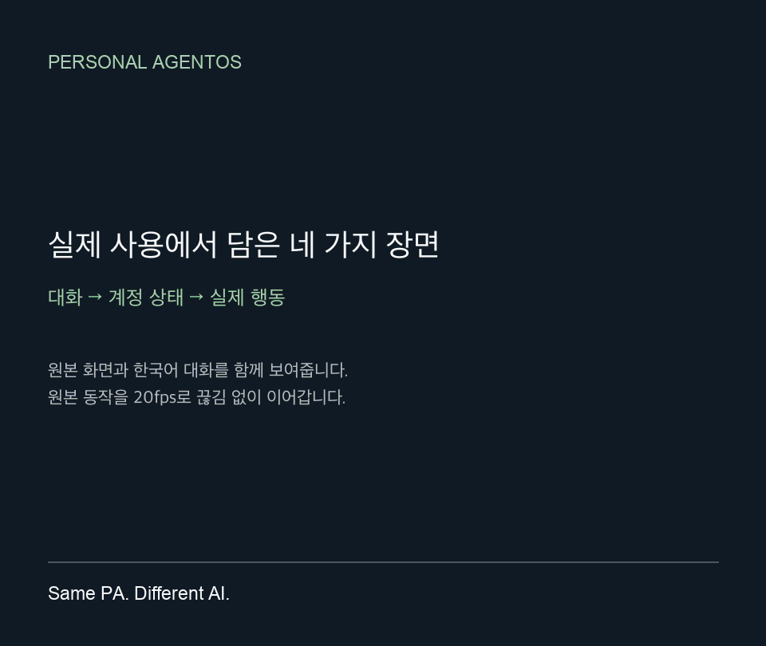

# Personal AgentOS

[English](README.md) | [한국어](README.ko.md) | [简体中文](README.zh-CN.md) | [日本語](README.ja.md)

<!-- readme-parity:v1 -->
<!-- readme-section:hero -->

## 자비스가 다른 회사의 서비스였다면?

토니 스타크가 오랫동안 자비스와 함께 일해 왔다고 생각해 봅시다. 자신의 맥락을 공유하고, 결정을 남겨 두고, 일을 맡기면서 서로 일하는 방식을 쌓아 왔습니다.

그런데 어느 날 더 좋은 AI가 등장합니다.

**토니는 더 좋은 AI를 쓰기 위해 자비스까지 잃어야 할까요?**

지능을 공급하는 회사가 바뀐다는 이유만으로, 자비스가 기억하는 토니에 대한 맥락, 아직 끝나지 않은 일, 맡겨 둔 권한, 함께 만들어 온 작업 방식까지 처음부터 다시 만들어야 할까요?

**AI는 바뀔 수 있어도, 나의 개인 에이전트는 나에게 남아야 합니다.**

Personal AgentOS는 이 생각을 내가 설치하고 통제하는 오픈소스 환경에서 탐구합니다. PA의 맥락·진행 중인 일·권한·실행 근거는 나에게 남기고, 그 아래에서 일하는 AI는 바꿀 수 있게 하려 합니다.

목표는 대화 기록이 더 긴 챗봇이 아닙니다. AI가 바뀌어도 이어지는 하나의 개인 에이전트입니다.

**같은 PA, 다른 AI.**

먼저 실행해 보고 싶다면 [가볍게 시작하기](#가볍게-시작하기)로 건너뛰세요. 이 페이지의 나머지는 프로젝트가 지향하는 바를 설명합니다.

<!-- readme-section:real-use -->

## 실제 사용에서 담은 네 가지 장면

소유자가 Personal AgentOS를 직접 사용하며 녹화한 화면을 서로 다른 네 장면으로 편집했습니다. 원본 화면 옆에 주요 한국어 대화를 읽기 쉽게 표시하고, 터치·스크롤·이모지 반응은 20fps로 이어집니다.

<details>
<summary>실제 사용 GIF 펼쳐 보기 · 다시 접으면 움직임이 숨겨집니다</summary>



[GIF 전체 크기로 보기](docs/assets/readme/owner-use/owner-use.ko.gif).

</details>

1. **동탄에서 친구 만나기:** 출발지와 GTX, 저녁 식사 취향을 같은 대화에서 이어갑니다. PA가 앞서 안내한 경로를 정정하는 장면도 있습니다.
2. **이마트 / SSG 장바구니 조회:** 로그인 후 PA가 장바구니에 상품 22개가 있고 스팸은 없다고 답합니다.
3. **“작은 거 하나만”:** 많이 사면 아내가 싫어하니 작은 스팸 한 개만 넣어 달라는 요청에, PA는 200g 한 개를 담았고 상품 수가 **22 → 23**이 되었다고 답합니다.
4. **별도의 교보문고 세션:** 실제 책 장바구니 화면을 보여주고, PA가 네 권의 내역을 정리합니다. 이어서 포인트·할인을 묻자 확인하지 못한 단계도 밝힙니다.

공통된 흐름은 **대화 → 내 맥락 → 계정 상태 → 요청한 행동 → 결과 응답**입니다. 하나로 이어지는 쇼핑 작업이 아니라 서로 다른 사용 장면입니다. 로그인, 대기 시간, 세션 유지에는 아직 불편함이 남아 있습니다.

이 소유자 파일럿 녹화에는 앱 리비전과 모델 정보가 없으며, AI 교체나 결제 완료 장면은 없습니다. [녹화 출처와 편집 기록](docs/assets/readme/owner-use/README.md)에서 화면에 보이는 사실, PA의 응답, 배포판별 검증을 구분합니다.

<!-- readme-section:ownership -->

## 무엇이 나에게 남아야 할까?

이 사고실험은 구체적인 설계 질문으로 이어집니다. 아래에서 일하는 지능이 바뀌어도 무엇이 계속 소유자에게 남아야 할까요? [전략 백서](docs/whitepapers/whose-agent.ko.md)는 이 질문을 제품과 산업 구조까지 확장합니다.

AgentOS는 기억과 진행 중인 일, 권한을 내 환경에 둡니다. 어떤 AI를 쓸지, 어떤 정보를 사용하고 어디까지 접근하게 할지 내가 정합니다. 서로 다른 전문성을 활용하더라도 중심은 같은 나입니다. 더 좋은 AI가 나와도 처음부터 다시 시작하지 않고, 내 에이전트가 할 수 있는 일이 넓어지는 방향입니다.

이 통제 중 두 가지는 현재 배포본에 들어 있습니다. 내가 고른 AI가 사실을 기억에 저장하면 저장한 뒤에 알려 주고 정확히 되돌릴 수 있게 하며, 맡긴 일마다 내 정보 중 무엇을 썼고 어디로 보냈는지 기록합니다.

로컬 우선(local-first)은 로컬 전용(local-only)이 아닙니다. 로컬 모델과 외부 모델을 선택할 수 있고, 외부 모델을 쓰면 요청에 사용되는 맥락은 그 제공자로 전송됩니다.

<!-- readme-section:presence -->

## 한 번 맡긴 일이 어떻게 이어질까

*다음 미팅 장면은 제품 방향을 설명하는 가상 예시입니다. 현재 Homebrew 배포판에서 이 순서대로 실행된 기록은 없습니다.*

“다음 주 프로젝트 미팅 좀 챙겨줘. 제안서 결론을 내야 해.” PA는 내가 접근을 허용한 일정 초대와 제안서, 이전 결정 기록을 같은 미팅에 연결해 미결정 사항을 찾는 방향으로 일합니다. 초대를 받았다는 사실만으로 참석이나 후속 일을 수락했다고 여기지 않습니다. 미팅 전에는 결론을 내리는 데 필요한 자료를 준비하고, 나중에 내가 메모를 전하면 아직 남은 일을 갱신합니다. 후속 메일은 **초안**으로 준비할 수 있지만 초안은 발송이 아닙니다. 발송 권한이 없다면 먼저 묻고, 실제 도구 결과가 확인되기 전에는 “보냈다”고 말하지 않습니다.

<picture>
  <source media="(max-width: 600px)" srcset="docs/assets/readme/presence-overview.ko.narrow.svg">
  
</picture>

**PA는 내가 대화하는 개인 에이전트이고, AgentOS는 그 PA의 맥락·남은 일·권한·근거를 내 환경에 이어 두는 기반입니다.** 판단 계층은 필요한 AI와 도구에 일을 맡기고 결과를 확인합니다. 아래의 AI가 바뀌어도 내가 만나는 PA와 맡긴 일은 이어지는 방향입니다. **같은 PA, 다른 AI.**

긴 대화 기록만으로는 이 일을 이어갈 수 없습니다. **미팅 하나**에 시간·장소·참석자라는 **메타데이터**가 붙습니다. **온톨로지**는 그 미팅과 다른 대상 사이의 관계를 구분합니다.

- **일정에서 보는 미팅:** 언제 누구와 만나고 무엇을 준비할까?
- **프로젝트에서 보는 같은 미팅:** 제안서의 어떤 결정이 아직 열려 있을까?
- **약속과 연결된 같은 미팅:** 누가 후속 일을 제안했고, 누가 실제로 수락했을까?

서로 다른 미팅 세 개가 아니라, 출처가 있는 한 미팅에 연결된 서로 다른 관계입니다. 미팅의 식별·시간·초대는 기록에 근거하고, 급한 일인지 누가 책임지는지에 대한 판단에는 관점과 근거가 붙습니다. 초대는 수락한 약속이 아닙니다. 기록이 없다고 일어나지 않았다고 단정하지 않고, 출처가 충돌하면 한쪽으로 덮어쓰지 않습니다. 남은 결정은 진행 중인 일로 이어지며, **확인되지 않은 권한은 실행 허용이 아닙니다.** 근거는 초안과 실제 발송을 구별합니다.

AgentOS는 사실, 역할별 해석, 맡긴 일, 실제 권한과 실행 근거를 내 통제 아래 연결하고자 합니다. 그래야 일이 멈추거나 AI가 바뀌어도 다음 할 일을 다시 찾을 수 있습니다. 같은 원칙은 미팅 밖에도 적용되며, [아키텍처와 온톨로지](docs/personal-agentos-architecture.en.md#facts-and-role-interpretations)에서 계좌 잔액 예시로 설명합니다. 이 사례들은 설계 설명이지 관찰된 실행이 아닙니다. 주변 상황의 변화를 먼저 살피는 능력은 현재의 반응형 Presence를 넘어 발전시킬 방향이며, 지금 상시 감시가 된다는 주장은 아닙니다.

<!-- readme-section:conversation -->

## 일상의 짧은 말에도 같은 PA

*소유자 파일럿 대화를 바탕으로 압축·비식별화해 재구성한 그림입니다. 그 대화의 증거 기록은 아니며, 그림 속 지도·쇼핑 연동은 배포된 기능이 아니라 제품 방향입니다.*

아래 그림은 PA와 이어지는 세 장면을 압축해 보여줍니다. 귀갓길 식사를 찾기 위한 위치 공유, 골프 벨트 비교와 장바구니 작업 전 계정 로그인 요청, 식당 사진에서 이어지는 근처 산책 대화입니다. 설명용으로 각색한 재구성 이미지이며, 제품 화면 그대로의 캡처나 해당 연동 기능의 배포 증거는 아닙니다.

<picture>
  <source media="(max-width: 600px)" srcset="docs/assets/readme/owner-pilot-conversation.ko.png">
  
</picture>

[한국어 이미지 전체 크기로 보기](docs/assets/readme/owner-pilot-conversation.ko.png) · [원본 참고 이미지 보기](docs/assets/readme/owner-pilot-conversation-reference.jpg).

그림은 대화만 압축해 보여줍니다. 이런 판단이 성립하려면 관련 정보를 내가 허용한 범위에서 사용하고, 없거나 오래된 정보는 다시 확인해야 합니다.

1. **퇴근길 저녁:** “퇴근하는 길인데, 저녁 먹고 갈까?”에서 ‘퇴근길’은 현재 위치에서 집으로 가는 경로입니다. 회사·집 위치가 저장되어 있고 사용이 허용되었는지, 지금 어디에 있는지, 동행자가 있는지와 시간을 확인해야 합니다. 그림에서는 PA가 현재 위치를 물은 뒤 경로·거리·영업 여부를 고려한 세 곳을 제안하고, 나는 두 번째를 고릅니다.
2. **이런 벨트 찾아줘:** 사진과 비슷하다는 이유만으로 좋은 선택은 아닙니다. 내가 공유한 옷의 종류·색, 선호와 예산이 있다면 함께 비교해야 하고, 없으면 필요한 것만 묻습니다. 그림에서 PA는 세 제품을 비교하고, 첫 번째를 장바구니에 담으려 할 때 계정 로그인을 요청합니다. 장바구니에 담기와 결제는 다른 행동입니다. 장바구니에 담는 단계 자체는 실행형 에이전트도 하는 일입니다. 차이는 PA가 내 맥락과 선호를 선택에 반영하고, 클릭이 아니라 내 계정과 권한의 경계에서 멈춘다는 점입니다.
3. **여기서 저녁 먹는 중:** 식당 사진과 공유된 현재 장소에 더해 누구와 어떤 자리인지, 시간과 날씨를 알아야 다음 제안이 달라집니다. PA는 모르는 상황을 지어내지 않고 확인한 뒤 산책·카페·바를 제안합니다. 산책을 고르면 경로와 운영 시간을 다시 확인합니다.

세 장면에 공통으로 필요한 것은 **내 말과 사진 → 출처·시각이 있는 허용된 맥락 → 필요한 질문과 도구 → 행동 범위 → 확인된 결과**입니다. 그림은 그 관계를 설명하며, 모든 정보가 이미 수집되어 있거나 해당 지도·쇼핑 연동이 배포됐다는 주장은 아닙니다.

몇 시간 간격으로 건네는 짧은 말에도 같은 연속성이 필요합니다.

> “커피 거의 다 떨어졌네.”<br>
> 몇 시간 뒤: “이제 나가려고. 가는 길에 살 만한 데 있을까?”<br>
> 나중에: “시간 없네. 지난번에 사던 걸로 그냥 사줘.”

바라는 모습은 단순합니다. PA가 무엇을 사려는지, 지난번 선택이 무엇인지 이어서 이해하고, 관련된 맥락을 활용하며, 빠진 정보나 권한은 필요해진 순간에 묻는 것입니다. 나는 대화를 이어갑니다. 워크플로를 직접 조립할 필요는 없습니다.

<!-- readme-section:try-today -->

## 가볍게 시작하기

공개 배포본에서 내 모델을 연결해 대화를 시작해 볼 수 있습니다. 위 미팅 장면 전체가 배포본에서 검증된 여정은 아닙니다.

macOS에서 [Homebrew](https://brew.sh)를 사용한다면:

```sh
brew install jongtae/agentos/agentos
agentos start
```

1. 브라우저에서 [http://127.0.0.1:8787](http://127.0.0.1:8787/) 설정 화면이 열리면 **바로 시작하기**를 누릅니다.
2. 내 모델을 연결하고 연결 테스트를 마칩니다. 도구 호출을 지원하는 로컬 Ollama 모델이나 내 API 접근 권한으로 OpenAI·OpenAI 호환 서비스·Anthropic을 사용할 수 있습니다. API 키 대신 Codex나 Claude Code 구독이 일을 맡을 수도 있습니다([QUICKSTART](QUICKSTART.md)). 설정 화면은 현재 한국어입니다.
3. **설정 → 외부 연결**에서 BotFather로 만든 내 봇의 토큰을 입력해 연결합니다. 표시된 연결 링크를 Telegram에서 열고 **시작**을 누릅니다.
4. 그 Telegram 대화에서 **“이번 주에 제안서 초안을 마무리해야 해. 다음 할 일을 몇 단계로 정리해줘.”** 하고 말을 걸어보세요.

Python은 Homebrew가 함께 설치하며, 모델 이용 권한은 별도로 준비합니다. 대화하는 동안 `agentos start`를 실행한 상태로 둡니다. 모델 설정, 파일 작업, Telegram, 최신 소스 실행은 [QUICKSTART](QUICKSTART.md)에 안내되어 있습니다.

**현재 단계:** Homebrew는 태그가 붙은 main 커밋의 **v1.1.1**(2026-10-07)을 설치합니다. 미팅 설명 그림과 재구성 대화는 제품 방향 예시입니다. 실제 사용 GIF는 별도 소유자 파일럿 기록이며, 이 배포본의 종단 간 검증은 아닙니다. [release manifest](docs/release-manifest.json)에 포함 소스와 설치 검증을 기록하고, [현재 상태](docs/product-status.ko.md)에서 사용 가능한 동작·fixture 근거·owner-pilot 근거·앞으로의 방향을 구분합니다.

<!-- readme-section:more -->

## 더 알아보기

- [왜 이 프로젝트를 만드는가](VISION.md) · [누구의 에이전트인가](docs/whitepapers/whose-agent.ko.md) (전략 백서) — AI가 바뀌어도 개인 에이전트의 연속성이 누구에게 남아야 하는지 묻습니다.
- [구조와 온톨로지](docs/personal-agentos-architecture.en.md) · [Presence](docs/presence-experience-contract.en.md) · [역할과 위임](docs/research/role-ontology-and-mandate-2026-10-05.ko.md) (연구 제안) — 개인 상태·일·통제를 여러 역할에 걸쳐 하나의 에이전트로 잇는 방향을 설명합니다.
- [연구와 참고 자료](docs/acknowledgements.en.md) — 개인 에이전트, 기억, 사용자 모델, 정보의 출처에 관한 설계 배경을 모았습니다.
- [문서 지도](docs/README.md) · [기여하기](CONTRIBUTING.md) — 현재 계약과 구현을 찾아보고 함께 발전시킬 수 있습니다. 내부 문서의 기준 언어는 영어입니다.

<!-- readme-section:license -->

## 오픈소스

직접 실행하고, 의문을 제기하고, 함께 고칠 수 있는 실험입니다. 최종적인 정답이 아니더라도 의미 있는 시작이 될 수 있다고 생각합니다.

코드는 [AGPL-3.0-only](LICENSE)로 공개합니다. Personal AgentOS 이름과 로고에는 [상표 고지](TRADEMARKS.md)가 적용됩니다. 참고한 외부 작업은 [감사의 말과 참고 자료](docs/acknowledgements.en.md)에 기록합니다.
