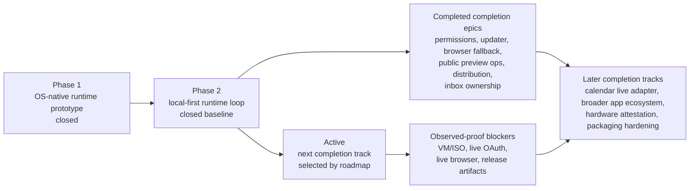

# AgentOS

[English](README.md) | [한국어](README.ko.md) | [日本語](README.ja.md) | [中文](README.zh.md)

**A bootable, headless-first OS prototype with an agent-managed post-boot runtime.**

AgentOS explores what an operating system looks like when the default interface
after boot is an agent runtime instead of a traditional desktop.

It can receive a request, classify intent, run a capability, reply, and leave a
proof/activity log.

```text
TTY / Web / Telegram request
        ↓
intent dispatch
        ↓
capability execution
        ↓
reply + proof/activity log
```

This is a public prototype, not a production AI OS distribution.

## Try It

Docker is the easiest way to try the AgentOS runtime today. The bootable ISO
remains the long-term OS form factor.

```bash
git clone git@github.com:Jongtae/agentos.git
cd agentos
cp .env.example .env
docker compose up
```

Open:

```text
http://localhost:8787
```

Try prompts such as:

```text
status
hi
workspace 파일 목록 보여줘
search AgentOS roadmap and summarize it
```

## What You Should See

- Runtime status and setup state in the browser.
- Prompt routing through the AgentOS runtime.
- Human-readable activity/proof output.
- Degraded states when LLM or Telegram credentials are missing.
- No required API key for the basic local preview.

## What AgentOS Is Proving

AgentOS is not “just a bot” and not “just a Python CLI.”

The project is testing this product thesis:

> After boot, the OS should expose a managed agent runtime that can understand
> requests, coordinate tools, and show what it did.

Today that proof is available in two forms:

- **Docker preview:** fastest public way to try the runtime loop.
- **Bootable ISO:** advanced VM path for testing the OS-shaped form factor.

Docker does not prove boot ownership. The ISO path is not yet polished. Both are
kept because the runtime must be easy to try while the OS form factor matures.

## What Works Now

- `docker compose up` starts a local AgentOS runtime preview.
- `http://localhost:8787` shows status, setup state, prompt execution, and activity.
- Greeting, status, workspace, and search-style requests route through intent dispatch.
- A terminal-first operator surface exists for the VM/ISO path.
- Agent/shell modes exist in the TTY operator prototype.
- Local Ollama is the default local LLM path in the OS prototype.
- Telegram setup/reply experiments work when credentials are configured.
- Runtime proof/activity hooks write evidence under the workspace.

## Quick Paths

### Docker Runtime Preview

```bash
docker compose up
```

CLI shortcut:

```bash
docker compose run --rm agent-os --prompt "status"
docker compose run --rm agent-os --prompt "workspace 파일 목록 보여줘"
```

### Advanced VM/ISO Path

```bash
./scripts/build_latest_agentos_iso.sh
```

Then boot the generated ARM64 ISO in a VM such as UTM on Apple Silicon.

Expected flow:

```text
Boot
  -> AgentOS TTY/operator surface
  -> managed agent runtime
  -> readiness for LLM / Telegram / Web
  -> AgentOS prompt and command shortcuts
```

### Local Developer Shortcut

```bash
python3 src/main.py --doctor
python3 src/main.py --no-tui
./scripts/agentos-kernelctl phase2-run --message "status"
```

## Operator Commands

In the TTY operator prototype:

```text
/status          show runtime status
/mode agent      talk to AgentOS
/mode shell      run Linux commands directly
/setup llm       configure the LLM path
/setup telegram  configure Telegram
/power           restart/reboot/shutdown menu
% <command>      run one Linux command from agent mode
```

## Architecture

```text
Docker preview or bootable ISO
        ↓
AgentOS runtime
        ↓
TTY / Web / Telegram input
        ↓
intent dispatcher
        ↓
capabilities: status, workspace, web, LLM, setup
        ↓
reply + proof/activity log
```

Useful entry points:

- `scripts/docker_runtime_preview.py` — browser preview
- `scripts/agentos-kernelctl` — runtime/status/setup commands
- `src/kernel/intent_dispatch.py` — intent routing
- `src/kernel/operator_activity.py` — activity feed

## Roadmap

Phase 1 closed as a public prototype. Phase 2 closed as the first
local-first runtime loop: a prompt can enter AgentOS, be classified, run a
bounded capability, narrate activity, write user-owned records, and recover
clearly when live credentials or VM proof are missing.

The current roadmap is governed by completion tracks rather than repeated
smoke-only hardening. Each track must either move AgentOS toward capability
ownership, reduce mediation cost, strengthen OS-native runtime defaults, or
make runtime proof more truthful.



| Track | Status | Runtime impact |
| --- | --- | --- |
| Docker runtime preview | Developer/demo proof path | Makes the managed runtime easy to try without claiming boot ownership. |
| Phase 2 golden runtime loop | Closed baseline | Proves prompt intake, intent classification, bounded capability execution, activity narration, records, and recovery. |
| Capability permission boundary | Completed | Defines how AgentOS declares, blocks, records, and narrates capability access. |
| Updater hardening | Completed | Protects runtime continuity and rollback/recovery truthfulness. |
| Browser fallback boundary | Completed | Keeps browser automation as fallback while common patterns graduate to internal capabilities. |
| Public preview operations | Completed | Defines safe preview promotion, manual proof blockers, and release non-claims. |
| Distribution packaging boundary | Completed | Separates local packaging checks from real release/signing/VM proof claims. |
| Inbox capability ownership | Completed | Moves Gmail, Calendar, Maildir, fixtures, and future inbox adapters toward a read-first OS-native substrate. |
| Verified boot and attestation boundary | Completed | Keeps Secure Boot, TPM, PCR/event-log, IMA, and hardware attestation proof explicit and unclaimed until observed. |
| Observed proof intake | Completed | Defines, validates, and surfaces how live credentials, VM/ISO, release, browser, and boot-chain evidence can be attached without claiming unobserved proof. |
| Live Gmail OAuth | Blocked on credentials and observed read-only proof | Fixture and missing-credential paths are automated; real mailbox proof requires explicit tester OAuth. |
| VM/ISO boot, recovery, and rejoin | Blocked on observed VM proof | Must show boot, reboot/recovery, and managed runtime rejoin before signoff. |
| Calendar live adapter | Future read-only track | Starts from fixture-backed contracts and must stay read-only until live OAuth proof exists. |
| Live browser fallback proof | Blocked on user-approved browser acceptance | Browser automation remains fallback; repeated patterns should become internal capabilities. |
| Release artifacts and signing | Blocked on real release evidence | Requires actual artifacts, checksums/signatures, and release publication proof. |
| Broader app/inbox ecosystem | Future capability ownership track | Expands only after common access patterns can use internal substrate capabilities. |
| Hardware attestation | Future proof track | Secure Boot, TPM, PCR/event-log, and IMA claims stay explicit non-claims until observed. |

Docker remains a developer/demo runtime preview, not the product target or a
replacement for observed boot/VM proof.

See [Next Roadmap](docs/next-roadmap.md).

## Limitations

AgentOS is not yet:

- a production desktop OS
- a Linux, macOS, or ChromeOS replacement
- a secure multi-user OS
- a polished installer
- a production Telegram automation platform
- a general app marketplace

Known rough edges: setup UX, always-on receiver reliability, lifecycle controls,
recovery messages, and ISO/VM acceptance polish.

## Secrets

Never commit:

- `.env`
- Telegram bot tokens
- OpenAI or provider API keys
- generated ISOs or `build-output/`
- runtime workspace artifacts
- real conversation logs

Docker and local preview paths run in degraded mode without credentials.
Telegram and hosted LLM paths require user-provided runtime secrets.

## Docs

- [Getting Started](docs/getting-started.md)
- [Docker Runtime Preview Boundary](docs/architecture/docker-runtime-preview-boundary.md)
- [Docker Runtime Preview Acceptance](docs/acceptance/docker-runtime-preview.md)
- [Runtime Overview](docs/architecture/runtime-overview.md)
- [Operator Surface](docs/operator-surface.md)
- [Security Notes](docs/security.md)

## Contributing

Good first contribution areas:

- Docker preview polish
- TUI usability
- activity feed wording
- command router rules
- workspace/file tools
- i18n examples
- VM boot testing

See [CONTRIBUTING.md](CONTRIBUTING.md) and [AGENTS.md](AGENTS.md).

## License

MIT. See [LICENSE](LICENSE).
