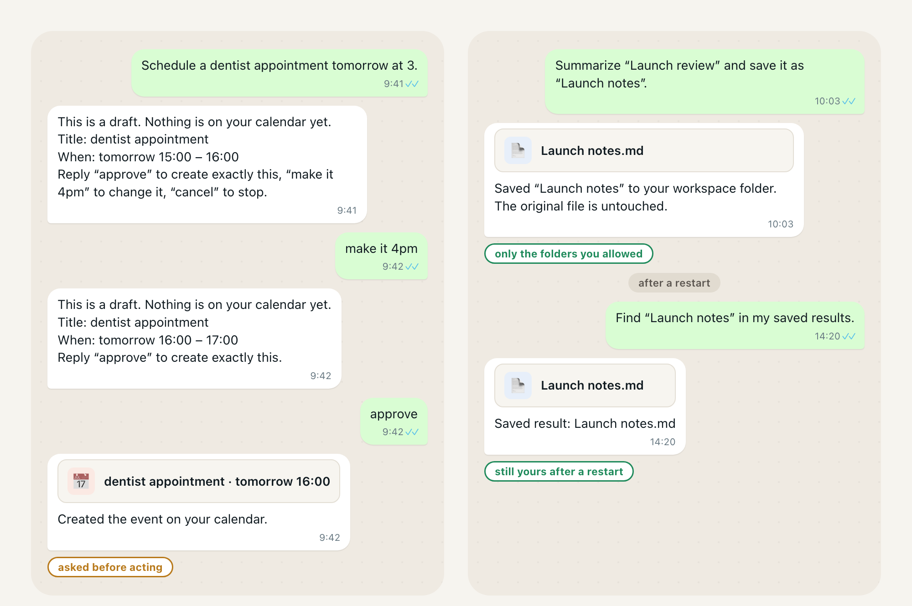
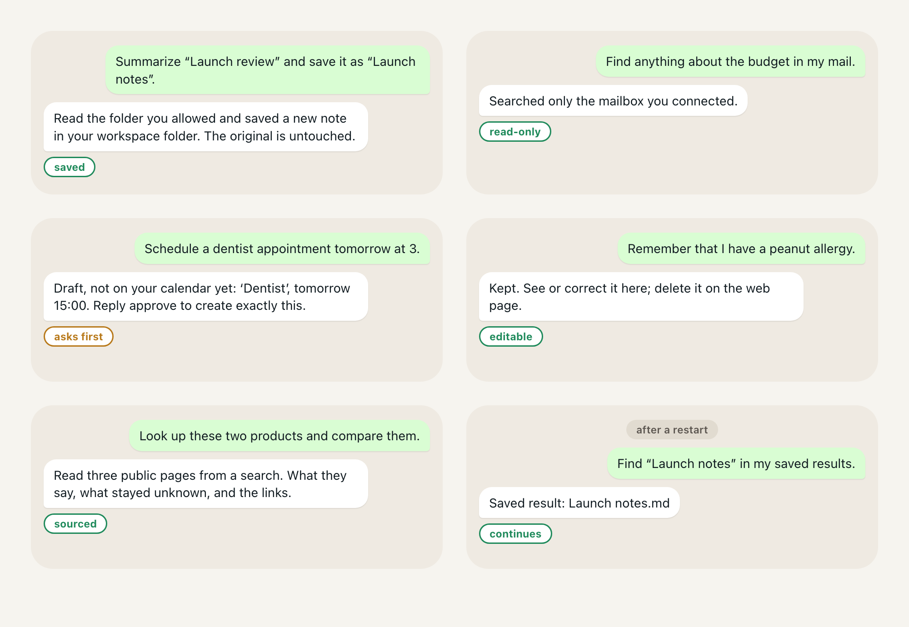

# Personal AgentOS

[English](README.md) | [한국어](README.ko.md) | [简体中文](README.zh-CN.md) | [日本語](README.ja.md)

<!-- readme-parity:v1 -->
<!-- readme-section:hero -->

## Your own AI assistant, on your own machine.

**Your choice of model. Your files, mail, calendar and memory. Your rules.**



Both conversations are the product's real behaviour, condensed and translated from its Korean replies. Nothing is created until you say approve, and the note you saved is still there after a restart. It runs on your own computer (macOS or Linux, Python 3.12 or newer) and you bring your own model: a local Ollama model, an OpenAI-compatible endpoint or Anthropic. Local-first is not local-only: with a hosted model, the context you approve goes to that provider.

<!-- readme-section:try-today -->

## Install

```sh
brew install jongtae/agentos/agentos
agentos start
```

You will see:

```text
AgentOS: http://127.0.0.1:8787/
초기 설정 링크: /Users/you/.local/share/agentos/private/setup-link.txt (개인 파일)
```

The browser opens on that address. Press **바로 시작하기** (Start now), connect a model, and you are talking to it. The interface is in Korean today; it understands requests in Korean or English.

**Homebrew installs the newest published release, `v1.1.0` (2026-09-23), which carries everything on this page.** Work merged to `main` after it is not in that build, so Homebrew can be behind `main` until the next release; for the newest code run from a source checkout (`git clone https://github.com/Jongtae/agentos.git`, then `python3 -m pip install -e .` on Python 3.12 or newer). [QUICKSTART](QUICKSTART.md) has every step.

<!-- capability:current-supported-slice -->
<!-- readme-section:scenes-today -->

## Then try these



The journeys behind these were run end to end by the project's automated first-user check, against a local folder and stand-in mail, calendar and web services rather than live accounts. The wording is the wording that routes today.

- **Files.** *Summarize “Launch review” and save it as “Launch notes”.* It reads the folder you allowed, writes a new note into the workspace folder you chose and leaves the original untouched.
- **Mail.** *Find anything about the budget in my mail.* It searches only the mailbox you connected and shows what it found.
- **Calendar.** *Schedule a dentist appointment tomorrow at 3.* It shows an exact draft and creates the event only after you say approve. “Make it 4pm” and “cancel” work on the same draft.
- **Memory.** *Remember that I have a peanut allergy.* It keeps that where you can inspect and correct it from the conversation, and delete it from the web page. A memory the model proposes on its own is held for your review until you accept it.
- **Research.** *Look up these two products and compare them.* It searches, reads up to three public pages from that search, and returns what they say, what stayed unknown, and the links.

Then restart the app and ask *Find “Launch notes” in my saved results.* The saved result, the folders you allowed, memory and Telegram pairing survive the restart.

<!-- readme-section:settings -->

## The settings you will need

- **A model.** A local Ollama server, an OpenAI-compatible endpoint or Anthropic, with your own access. The file scene needs one of these direct connections.
- **Two folders.** In **내 에이전트 관리 → 내 자료**: one reference folder it may read, one workspace folder it may write into. Nothing outside them. With a hosted model you approve document sharing once before the file scene.
- **Mail and calendar, optional.** Your own Google account through a Google Cloud OAuth client you create, one setup command each (`agentos gmail-config`, `agentos calendar-config`), then connect read and write separately. QUICKSTART has the exact steps.
- **Telegram, optional.** Your own bot token from BotFather, pasted in Settings, then open the pairing link. Only your paired account can talk to it.

That is all of it.

<!-- readme-section:more -->

## More

[What works and what still has friction](docs/product-status.en.md) · [Where this is going](docs/product-status.en.md#where-this-is-going) · [Why this is different](docs/product-status.en.md#why-this-is-different) · [Under the hood](docs/product-status.en.md#under-the-hood-briefly) · License [AGPL-3.0-only](LICENSE) and [trademark notice](TRADEMARKS.md) · [How it is built](AGENTS.md)
