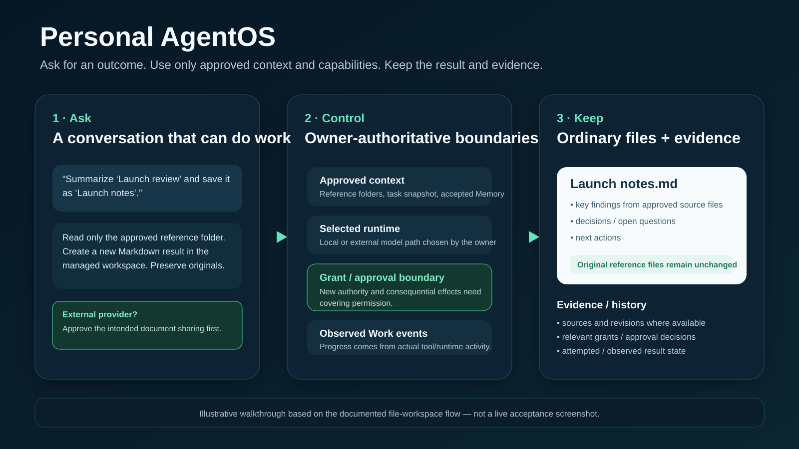
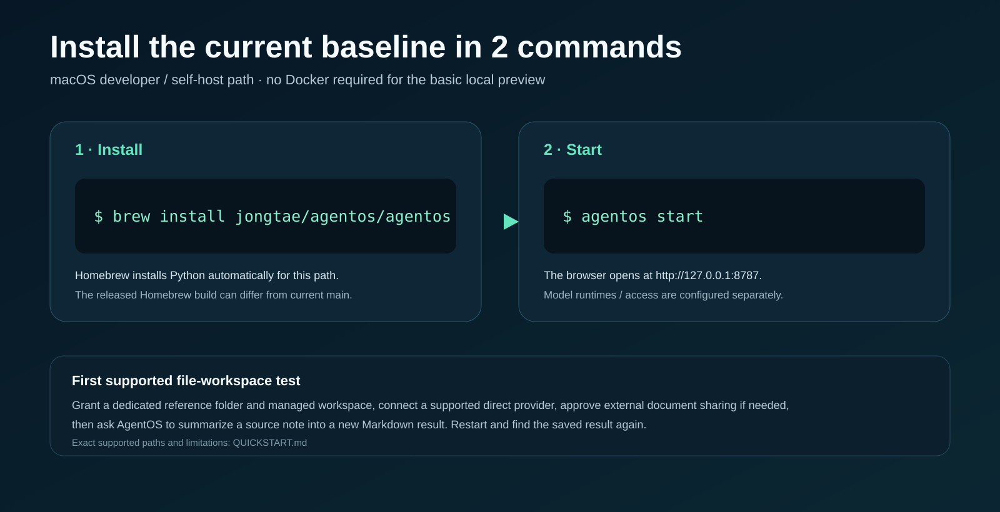
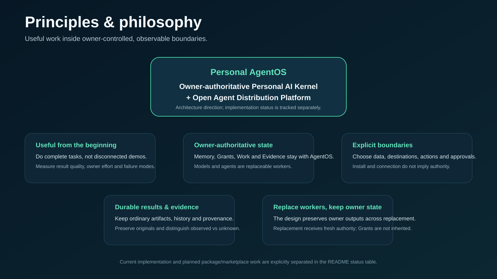
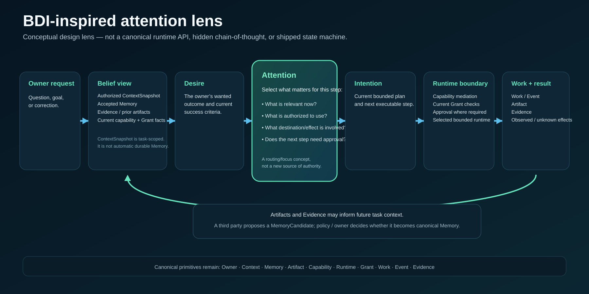

# Personal AgentOS

[English](README.md) | [한국어](README.ko.md) | [简体中文](README.zh-CN.md) | [日本語](README.ja.md)

**A personal AI environment you install, own, and control — built to do useful work.**

Personal AgentOS is a local-first, owner-installed personal AI operating environment for one person. You ask for an outcome; AgentOS works with the models and material you chose, inside bounded authority, then keeps useful results and evidence in owner-controlled state.

> **Personal AgentOS = Owner-authoritative Personal AI Kernel + Open Agent Distribution Platform**



> [!NOTE]
> The overview is an illustrative walkthrough based on the documented file-workspace flow, not a live acceptance screenshot. Current support is defined by merged implementation, [QUICKSTART](QUICKSTART.md), the [roadmap](docs/roadmap.md), and named acceptance evidence.

## What this project is trying to make simple

The intended experience is closer to a personal assistant than a catalogue of agents:

- **Ask for an outcome, not an integration workflow.**
- **Choose what it may use:** folders, accepted Memory, tools, runtimes/models, destinations and approvals.
- **Keep the result:** ordinary Artifacts, Work/Event history and Evidence remain independent of a replaceable worker.
- **Change workers without making them the owner of your state:** models, coding agents, packages and delegated runtimes stay subordinate to AgentOS policy and current Grants.

Useful work and owner control are joint requirements. Control without useful results is not enough; useful results without enforceable boundaries are not enough.

## Install the current baseline



```sh
brew install jongtae/agentos/agentos
agentos start
```

The browser opens at `http://127.0.0.1:8787`. Homebrew is the current macOS developer/self-host path and may differ from current `main`. Model runtimes and model access are separate. Follow [QUICKSTART](QUICKSTART.md) for supported connection choices and the recommended file-workspace test.

For that documented file-workspace path, use a supported **direct model-provider connection**, explicitly grant a reference folder and managed workspace, and approve document sharing before sending approved context to an external provider. The subscription-engine path is not the documented file-workspace dogfood path.

## See one useful task end-to-end

A current bounded owner test is intentionally small:

1. Put a small Markdown/text note in a dedicated reference folder.
2. Grant that folder read access and a separate managed workspace for results.
3. Ask: **“Summarize ‘Launch review’ and save it as ‘Launch notes’.”**
4. Confirm a new Markdown result appears only in the managed workspace and the original remains unchanged.
5. Restart AgentOS and ask it to find the saved result again.

Repository acceptance for this journey uses simulated providers and temporary/local test files. Real owner browser/provider use is separately observed; the example is not evidence that every natural-language request, provider, or arbitrary file task already works.

## What exists today — and what is planned

| Status | Scope and evidence |
| --- | --- |
| **Existing product code** | Local browser setup/chat, model-provider adapters, bounded tools, notes, approved folders and managed file results. Exact supported operating paths are in [QUICKSTART](QUICKSTART.md). |
| **File-workspace development complete** | #314, PR #320 and PR #324: scoped file use, original preservation, saved results and restart/reuse, supported by deterministic/temporary-local-file evidence. |
| **v0.1 contract complete** | #334 / PR #350: Core Primitive and AgentPackage schemas, semantic validation and fixtures. **This is not package execution or installation.** |
| **DOGFOOD-01 development complete** | #351 / PRs #354–#356: simulated-provider HTTP/file/restart acceptance and operating instructions. Real-provider/browser use remains separately observed owner acceptance. |
| **Planned useful default-agent work** | [USE-01 #358](https://github.com/Jongtae/personal-agentos/issues/358): better research, file artifacts and continuity with measured outcome quality. |
| **Planned control/app experience** | [OBS-01 #359](https://github.com/Jongtae/personal-agentos/issues/359), [AGENT-UX-01 #360](https://github.com/Jongtae/personal-agentos/issues/360) and the uncompleted children of #333: receipts, install/use/revoke/remove and ecosystem expansion. |

There is **no current claim** of arbitrary third-party AgentPackage execution, a public Registry/Marketplace, universal agent compatibility, autonomous purchasing, full-page web reading, live inventory/checkout verification, or automatic durable memory from every conversation. Legacy declaration-only plugins are not the planned executable AgentPackage system.

## Principles & philosophy



The first product targets are three complete journeys rather than disconnected demos:

- **Research → decision:** compare public options using appropriate evidence, distinguish known facts from missing inventory/fees, and produce a decision brief without purchasing.
- **My files → artifact:** understand approved documents, reconcile facts and save a useful result as an ordinary file without changing originals.
- **Follow-up → continuity:** accept corrections, find previous work and reuse results after restart without forcing the owner to rebuild context.

Current public search returns snippets; it is not full-page or checkout verification. The [usefulness plan](docs/default-agent-usefulness.en.md) defines the gap and a 24-case synthetic evaluation seed. Static tests are not model-performance results. Quality, result substance, latency, cost and owner effort must be measured on the supported operating path.

## BDI-inspired attention lens



This is a **conceptual design lens**, not a new canonical runtime API, not a claim that a BDI state machine is already implemented, and not a request to expose hidden chain-of-thought.

It maps the product model this way:

- **Belief view:** the authorized task-scoped `ContextSnapshot`, accepted owner `Memory`, relevant `Evidence`/Artifacts, and current capability/Grant facts.
- **Desire:** the owner’s current wanted outcome and success criteria.
- **Attention:** the focus/routing step — what is relevant now, what is authorized, which destination/effect is involved, and whether the next step needs approval.
- **Intention:** the current bounded plan and next executable step.
- **Execution:** capability/runtime mediation and current Grant checks create observed `Work`/`Event` records, Artifacts and Evidence.

Results can inform later task context, but that does **not** mean every result automatically becomes durable Memory. Third parties propose a `MemoryCandidate`; policy/the owner decides canonical Memory disposition.

The canonical kernel primitives remain:

`Owner · Context · Memory · Artifact · Capability · Runtime · Grant · Work · Event · Evidence`

## Control the environment, not just the conversation

The [owner-control contract](docs/owner-control-contract.en.md) defines six observable rights to implement and verify:

1. **Inspect** package source, publisher, version, execution mode and requested authority.
2. **Choose data** — the documents, memories and accounts an agent may use.
3. **See destinations** for task information.
4. **Bound actions** separately from connecting or installing.
5. **Stop and revoke** authority, while reporting in-flight uncertainty honestly.
6. **Keep and move owner state** when agents are removed or replaced.

Controls must be enforced by the capability/runtime boundary, not only by instructing a model to behave. Useful low-risk reads already covered by a Grant should not require repeated prompts; new authority and consequential external effects require covering approval.

Progress and receipts should come from observed Work/tool events. Relevant redacted inputs, destinations, authorization decisions and results should be inspectable. Hidden reasoning, secrets, full personal documents and raw system prompts are not telemetry requirements.

Local installation is not the same as local-only processing. A local package using an external model sends approved context to that provider. A remote-agent connector does not make the remote service locally controlled. Disconnecting, revoking authority, removing an agent and deleting retained information are distinct operations, and already transmitted data or completed remote effects cannot be promised away by a local stop button.

## Architecture and application model

| Layer | Responsibility |
| --- | --- |
| **Owner plane** | Owner identity/policy, Context/Memory authority, data/workspace, Grants/approvals, Work/Event, Artifacts, Evidence and recovery |
| **Capability plane** | Typed tools/connectors and bounded runtime interfaces |
| **Distribution plane** | AgentPackage, Package Manager, Registry, trust metadata and Marketplace/discovery |
| **Worker plane** | Replaceable models, Codex/Claude Code, local/API workers and optional delegated runtimes such as Ruflo |
| **Experience plane** | Conversation, useful results, inspectable progress, approval/control and future agent discovery |

The kernel is **agent-independent**; the product and ecosystem can be **agent-centric**. Agents request authority; AgentOS policy and the owner decide it. Models, agents, registries and marketplaces must not become the source of truth for canonical owner state.

The AgentPackage lifecycle deliberately distinguishes:

`downloaded != installed != enabled != connected != authorized-for-action`

Installation must not create a Grant. Updates that expand data, actions, destinations, Memory or background behavior require fresh authority. Third-party durable-memory output is a `MemoryCandidate` by default. Removal revokes package authority while preserving owner-owned outputs and retained Evidence according to policy.

A Registry is intended to resolve exact identity/version/digest/compatibility/advisories. A Marketplace is intended for discovery, ranking, reviews and possible commerce; popularity must never override security policy. Private owner Context is not marketplace search data.

See the canonical [architecture](docs/personal-agentos-architecture.en.md), [PRD](PRD.md), [platform foundation](docs/agent-distribution-platform-foundation.en.md), [product vision](PRODUCT_VISION.ko.md) and [roadmap](docs/roadmap.md).

## Bootstrap the ecosystem

First prove one useful Files reference package and a public authoring path, then expand. Bundled and external agents should use the same public contracts with no hidden first-party privilege. Compatibility adapters for MCP and selected skill/plugin formats are planned only where formats, licences and authority can be mapped. Ruflo is an optional future worker adapter, not the kernel or a required dependency.

The first integrated app experience to prove is:

`inspect → install disabled → grant → useful work → inspect receipt → revoke → denied retry → remove → restart → separately authorized replacement/reuse`

A public store and payments are not prerequisites.

## Portability and limits

```sh
scripts/agentos-backup.py DATA ARCHIVE
scripts/agentos-restore.py ARCHIVE EMPTY_DATA
```

Supported owner state and reviewed declarations can be exported/restored with integrity checks. Provider credentials, sessions, local-folder Grants, engine/model selections and Telegram pairing are excluded from this portable archive; explicitly claim and reconnect the destination. This is distinct from backing up an entire private data directory, which may contain secrets.

Local-first does not mean local-only or automatically safe. Host security, package isolation, data already transmitted and remote-provider retention have limits. Supported cancellation/recovery must distinguish confirmed and unknown outcomes.

## Development governance

This is **not a coding harness, swarm framework, host kernel or replacement for macOS/Linux**. GitHub/Codex delivery automation builds Personal AgentOS; it is not the end-user product.

Follow [AGENTS.md](AGENTS.md), the [Development Constitution](docs/development-constitution.en.md) and [Goal Execution Contract](docs/goal-execution-contract.en.md): issue → bounded branch → implementation → validation → independent review → merge/closeout. Spec-driven patterns are development aids, not runtime dependencies.

Planned issues are not an automatic execution queue. A product completion claim must include useful outcome evidence and relevant denial/recovery evidence, not only schemas, file counts or green CI.
