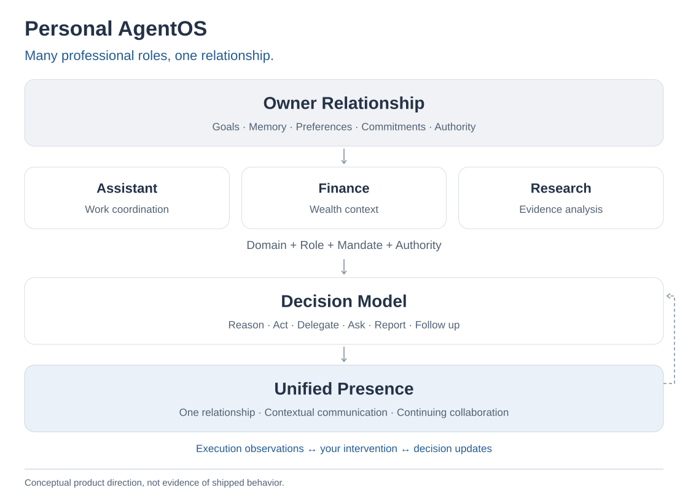
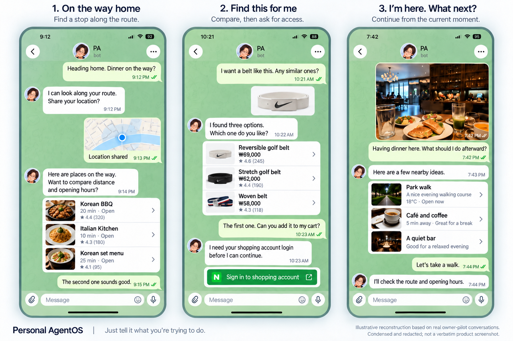

# Personal AgentOS

[English](README.md) | [한국어](README.ko.md) | [简体中文](README.zh-CN.md) | [日本語](README.ja.md)

<!-- readme-parity:v1 -->
<!-- readme-section:hero -->

## A personal agent that carries your work forward

An assistant answers a question. A task agent follows an explicit instruction, such as adding an item to a cart. But much of life does not arrive as a complete question or a one-off task. You mention a meeting, leave a decision open, return to it days later, and expect the work to have a next step.

**Personal AgentOS explores how to build a personal agent (PA) that stays with you and your unfinished work, in an environment you install and control.** It should keep track of what you meant, what remains unresolved and what it is waiting for. As the project grows, it should be able to prepare what comes next and bring a matter back when it needs your attention, while asking before an action needs your authority.

We call that continuing relationship **Presence**. Helping like an assistant is the starting role; the aim reaches across different kinds of work and survives a change of AI. Presence has to come from retained context, work and authority, not from a friendly tone.

<!-- readme-section:ownership -->

## What if Jarvis belonged to another company?

Think of the conversations and unfinished work Tony Stark shared with Jarvis. If Jarvis were another company's AI service, should Tony lose that context and delegated work when the company changed its model or closed the service? This [whitepaper thought experiment](docs/whitepapers/whose-agent.ko.md) asks who supplies the intelligence and who keeps the owner's memory, work and authority.

AgentOS keeps memory, work and authority in your environment. You choose the AI, the information it can use and the access you give it. Different expertise can serve the same owner; better AI should expand what your agent can do without making you start over.

Local-first is not local-only: you can use a local or hosted model. With a hosted model, the context used for a request is sent to that provider.

<!-- readme-section:presence -->

## How delegated work can continue

*The following meeting is an illustrative product-direction example. This sequence has not been observed in the current Homebrew build.*

Imagine saying, “Keep track of next week's project meeting. We still need to settle the proposal.” The PA would connect an allowed calendar invitation, proposal and record of earlier decisions to the same meeting to find what remains unresolved. An invitation alone does not mean you accepted the meeting or its follow-up. Before the meeting, it could prepare a brief for the open decision; when you later share notes, it would update the unfinished work. It could prepare a follow-up email as a **draft**, but a draft has not been sent. Without authority to send, it would ask first, and it would report “sent” only after the tool confirmed that result.

<picture>
  <source media="(max-width: 600px)" srcset="docs/assets/readme/presence-overview.en.narrow.svg">
  
</picture>

**The PA is the personal agent you talk to; AgentOS is the environment you control that carries its context, open work, authority and evidence.** Its judgment layer delegates to AI and tools and checks their results. The aim is for your PA and its work to continue when the AI underneath changes. **Same PA. Different AI.**

That takes more than a long chat history. **One meeting** has time, place and attendees as **metadata**. An **ontology** distinguishes its relationships to other things:

- **The meeting as a calendar event:** When is it, who is involved and what needs preparing?
- **The same meeting in the project:** Which proposal decision remains open?
- **The same meeting and a commitment:** Who suggested a follow-up, and who actually accepted it?

These are relationships attached to one sourced meeting, not three different meetings. Its identity, time and invitation come from records; a role's assessment of urgency or responsibility is an interpretation with its own scope and grounds. An invitation is not an accepted commitment. Missing information is not proof that something did not happen; conflicting sources remain visible rather than being silently reconciled. Open decisions continue as work; unconfirmed permission never becomes permission to act; evidence distinguishes a proposal or draft from an action that occurred.

Beyond meetings, AgentOS should not recreate reality for each role. An account's total balance of 100 million won and immediately available 80 million won may measure different things, so they are not automatically contradictory. Compare the account, measure, unit, scope, time and source; if those match and the values still differ, retain the source conflict.

The same balance can inform readiness for planned spending, asset liquidity or funds available under an investment mandate, but none of those interpretations overwrites the record. Likewise, **asset management** relates a sourced stock holding to total assets, liabilities, cash flow and goals; **discretionary investment** checks whether it is a managed position and which mandate, constraints and permitted actions apply. Neither a role name nor a useful inference grants permission to trade.

AgentOS aims to connect facts, role-specific interpretations, delegated work, permissions and evidence in a structure the owner controls. This is how a paused task or a different AI could pick up the right next step without making you reconstruct it. These are design illustrations, not released financial services or observed runs. Proactive attention to changing circumstances is a direction beyond the current reactive Presence work, not a claim of always-on monitoring today.

<!-- readme-section:conversation -->

## Ordinary moments, the same PA

*Illustrative product direction, not an observed live run or a shipped shopping integration.*

The illustration below condenses three PA conversations: sharing a location to find dinner on the way home, comparing a golf belt and pausing for account login before a cart action, and continuing from a restaurant photo to a nearby walk. It is an edited illustrative reconstruction, not a verbatim product screenshot or proof of those integrations.

<picture>
  <source media="(max-width: 600px)" srcset="docs/assets/readme/owner-pilot-conversation.en.png">
  
</picture>

[Open the English image at full size](docs/assets/readme/owner-pilot-conversation.en.png) · [View the original reference image](docs/assets/readme/owner-pilot-conversation-reference.jpg).

The image condenses the conversations. For the choices to make sense, the PA would need relevant information the owner has allowed it to use, and would need to ask again when information is missing or stale.

1. **Dinner on the way home:** “Dinner on my way back?” means a route from the current location toward home. The PA must check whether work/home locations are available and permitted, where the owner is now, the time and whether someone is coming along. In the image it asks for a current location, offers three options using route, distance and opening hours, and the owner picks the second.
2. **Find this belt:** A visual match alone may be a poor choice. If the owner has shared wardrobe styles and colors, preferences or a budget, the PA should use them; otherwise it asks only for what matters. In the image it compares three belts, then requests an account login for the chosen cart action. Adding to a cart and paying are different actions.
3. **Here at dinner. What next?** The restaurant photo and shared current place are only a start. The companion, occasion, time and weather may change a good suggestion. The PA should check what it does not know before offering a walk, café or bar. After the owner picks a walk, it would verify the route and opening hours.

All three need the same path: **what you say or show → allowed context with a source and time → a useful question or tool → the boundary for action → an observed result**. The image explains that relationship; it does not claim all that context is already collected or those map and shopping integrations are shipped.

Continuity also matters in smaller moments, hours apart:

> “We’re almost out of coffee.”<br>
> Hours later: “I’m heading out. Is there somewhere on the way I can pick it up?”<br>
> Later: “No time. Just get the same one as last time.”

The aspiration is simple: the PA follows what “it” and “the same one” mean, brings in relevant context, and asks for missing information or authority when needed. You keep talking; you do not assemble a workflow.

<!-- readme-section:try-today -->

## Try it

The published build lets you connect your own model and start a conversation. The meeting scene above is not an end-to-end verified release journey.

On macOS with [Homebrew](https://brew.sh):

```sh
brew install jongtae/agentos/agentos
agentos start
```

1. Browser setup opens at [http://127.0.0.1:8787](http://127.0.0.1:8787/). Choose **바로 시작하기** (Start now).
2. Connect and test your own model: a tool-capable local Ollama model, or OpenAI, an OpenAI-compatible service or Anthropic with your API access. The setup interface is currently Korean.
3. In **설정 → 외부 연결** (Settings → External connections), connect your own bot using its BotFather token. Open the generated pairing link in Telegram and press **Start**.
4. In that Telegram chat, say: **“I need to finish a proposal this week. Help me break it into the next few steps.”**

Homebrew installs Python for you; model access is separate. Keep `agentos start` running while you talk. [QUICKSTART](QUICKSTART.md) covers model setup, file work, Telegram and running the newest code from source.

**Where it stands:** Homebrew installs **v1.1.1** (2026-10-07), built from the tagged main commit. The meeting and shopping scenes above remain illustrative product direction, not verified end-to-end behavior of this release. The [release manifest](docs/release-manifest.json) records source coverage and installed checks; [product status](docs/product-status.en.md) separates available behavior, fixture evidence, owner-pilot evidence and future direction.

<!-- readme-section:more -->

## Explore the ideas

- [Why this project exists](VISION.md) · [Whose agent?](docs/whitepapers/whose-agent.ko.md) (Korean strategy whitepaper) — why the agent's continuity should stay with the owner when AI changes.
- [Architecture and ontology](docs/personal-agentos-architecture.en.md) · [Presence](docs/presence-experience-contract.en.md) · [Roles and delegation](docs/research/role-ontology-and-mandate-2026-10-05.ko.md) (Korean research proposal) — how personal state, work and control can support one agent across different roles.
- [Research and references](docs/acknowledgements.en.md) — the work on personal agents, memory, owner models and provenance that informed the design.
- [Documentation map](docs/README.md) · [Contributing](CONTRIBUTING.md) — find the current contracts, inspect the implementation and help develop it.

<!-- readme-section:license -->

## Open source

This is a working exploration, open for others to run, question and improve. It does not have to be the final answer to be a useful beginning.

Code: [AGPL-3.0-only](LICENSE). The Personal AgentOS name and logo follow the [trademark notice](TRADEMARKS.md). Third-party work is credited in [acknowledgements](docs/acknowledgements.en.md).
