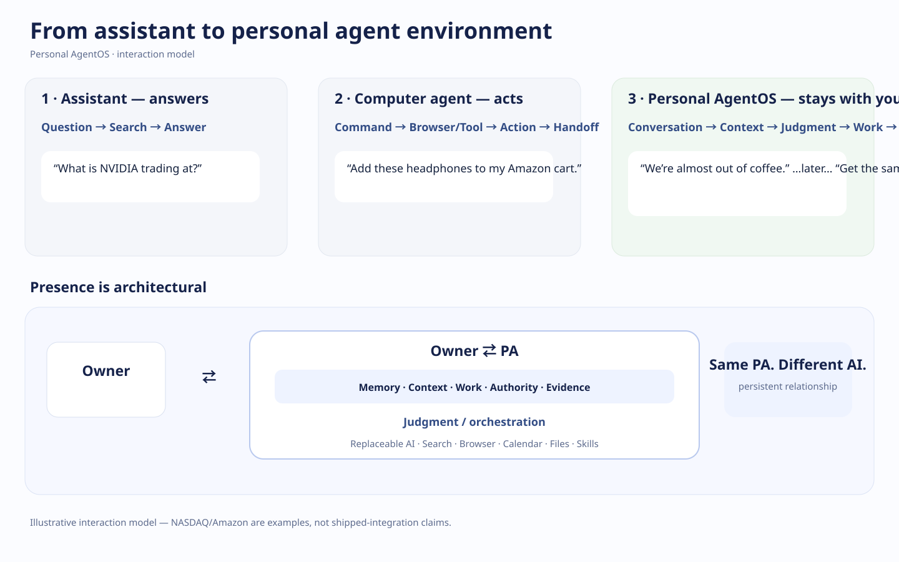
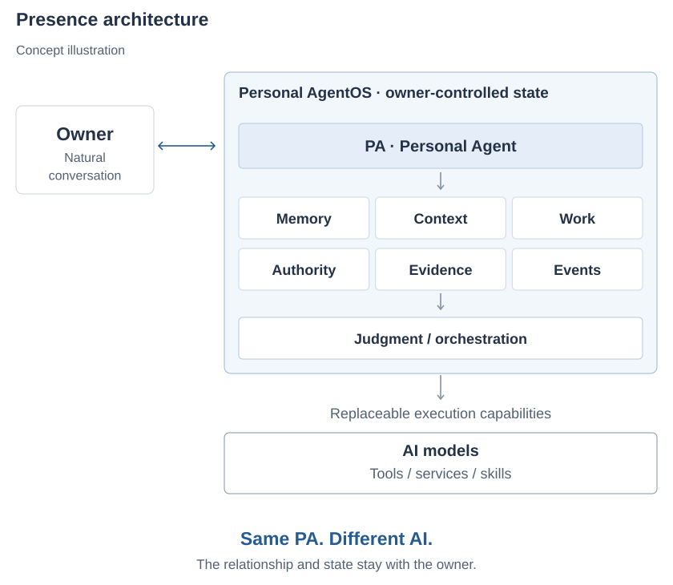
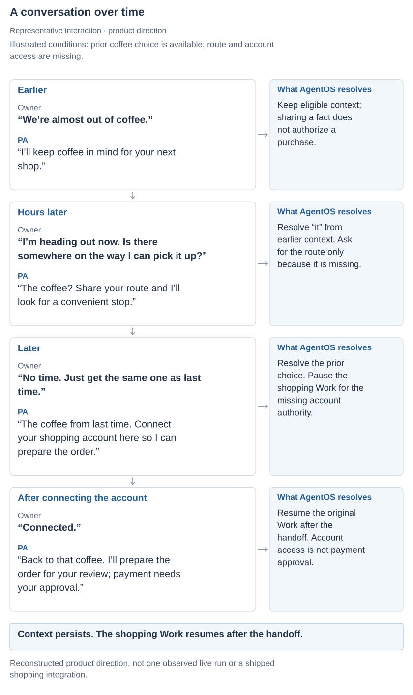
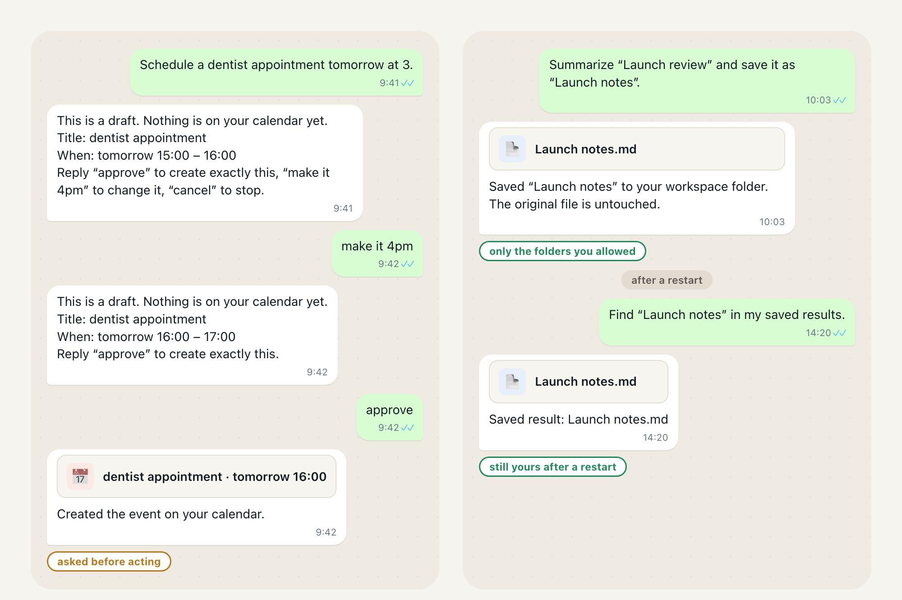
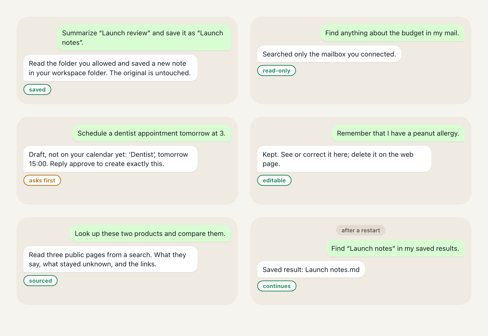

# Personal AgentOS

[English](README.md) | [한국어](README.ko.md) | [简体中文](README.zh-CN.md) | [日本語](README.ja.md)

<!-- readme-parity:v1 -->
<!-- readme-section:hero -->

## A personal AI environment that stays yours.

**One assistant. Replaceable AI. Owner-controlled memory, context, tools and authority.**

Local-first is not local-only: Personal AgentOS can use local or hosted models; with a hosted model, permitted context goes to that provider.

<!-- readme-section:concept -->

## The idea in one sentence

> 내가 설치하고 통제하는 개인 AI 환경에서, 좋은 기본 기능으로 실제 일을 끝내고, 더 좋은 에이전트를 앱처럼 설치·교체해도 내 기억과 결과는 나에게 남는다.
>
> *A personal AI environment I install and control: good built-in abilities finish real work, and even when I install or swap in better agents like apps, my memory and results stay with me.*

The author's sentence, in the original Korean. Why the project exists and the documents that define the concept are gathered on one page: [VISION.md](VISION.md).

<!-- readme-section:interaction-model -->

## From an assistant to a personal agent environment

<picture>
  <source media="(max-width: 600px)" srcset="docs/assets/readme/interaction-model.en.narrow.svg">
  
</picture>

The distinction is not whether an AI can search a stock price or click **Add to cart**. Assistants already answer questions, and computer-use agents can already execute commands. Personal AgentOS moves the **persistent relationship, owner context, authority and work state** out of the AI provider and into an environment the owner controls.

| Interaction model | What the owner does | What the system primarily holds |
| --- | --- | --- |
| **Assistant — answers** | asks a question such as “What is the current price of NVIDIA?” | the current conversation and an answer |
| **Computer agent — acts** | gives a command such as “Add these headphones to my Amazon cart.” | a task, browser/tool state and an action/handoff |
| **Personal AgentOS — stays with you** | talks naturally over time: “We’re almost out of coffee.” → later, “Just get the same one as last time.” | Memory, Context, Work, Authority and Evidence that persist independently of a particular AI |

The NASDAQ/Amazon examples above are **interaction-model illustrations**, not claims that those exact services are shipped integrations.

### Presence is an architectural property

The owner talks to one **PA**, not to a changing set of models, tools and workflows.

<picture>
  <source media="(max-width: 600px)" srcset="docs/assets/readme/presence.en.narrow.svg">
  
</picture>

That changes the conversation. A person can share an incomplete fact, continue it hours later, send a photo or location when it becomes relevant, and grant account/computer access only at the moment an external action needs it. The owner does not have to translate everyday intent into a tool, model, workflow or memory command.

**Representative interaction — product direction.** These owner-supplied interaction patterns are condensed into an example, not a single observed run:

<picture>
  <source media="(max-width: 600px)" srcset="docs/assets/readme/continuing-conversation.en.narrow.svg">
  
</picture>

> **Morning:** “We’re almost out of coffee.”  
> **Afternoon:** “I may finish work late today.”  
> **Evening:** “I’m heading out now. Is there somewhere on the way I can pick it up?”  
> **Later:** “No time. Just get the same one as last time.”

Underneath that ordinary conversation, AgentOS may resolve prior context, calendar/time, location, search, a continuing Work and—only when needed—an authority handoff. The dialogue is illustrative and condensed; current implementation evidence is classified separately below.

**Same PA. Different AI.** The model underneath can change without making the owner rebuild the relationship from scratch.

<!-- readme-section:working-software -->

## Working software, not only a concept

The repository contains implementation newer than the published release: replaceable Main AI and Judgment AI routes, durable Memory, Telegram conversation, contextual capability handoff, search/browser mediation, preparations and evidence-qualified recovery. Merged code and deterministic/fixture checks support those paths; they do not establish that the complete experience described here has been observed live.

Evidence is deliberately separated:

- **Published release:** installed-smoke and synthetic journey evidence is recorded in the release manifest. It does **not** contain everything now on `main`.
- **Current `main`:** merged code and deterministic/fixture evidence support newer Secretary, Presence, Decision and execution contracts. A merged contract or test is not by itself a live-service claim.
- **Owner-pilot evidence:** public owner-live claims remain pending until exact Telegram/desktop observations are selected, redacted and tied to a revision/evidence record.
- **Product direction:** the representative conversation above, shopping, booking and other future scenes remain direction until implementation and evidence support a stronger claim.

See [what works and how we know](docs/product-status.en.md), the [release manifest](docs/release-manifest.json), and the [documentation map](docs/README.md).

### Published-release journey illustrations

The two scenes below are reconstructed, condensed illustrations of the v1 synthetic calendar and file journeys, not screenshots of live accounts. Their replies are translated from Korean. The published release has local installed-smoke evidence; the release manifest does not claim live Google or Telegram operation.



<!-- readme-section:try-today -->

## Install

```sh
brew install jongtae/agentos/agentos
agentos start
```

You will see:

```text
AgentOS: http://127.0.0.1:8787/
초기 설정 링크: /Users/you/.local/share/agentos/private/setup-link.txt (개인 파일)
```

The browser opens on that address. Press **바로 시작하기** (Start now), connect a model, and you are talking to it. The interface is in Korean today; it understands requests in Korean or English.

**Homebrew installs the newest published release, `v1.1.0` (2026-09-23).** The [release manifest](docs/release-manifest.json) records what that build carries and its limits: calendar creation is unreachable (J4), and research is partial (J5). The synthetic scenes below are not a promise that every journey is reachable in that build. Newer Secretary/Presence/orchestration work on `main` is not in that release, so Homebrew can be behind `main` until the next release; for the newest code run from a source checkout (`git clone https://github.com/Jongtae/agentos.git`, then `python3 -m pip install -e '.[mcp-host]'` on Python 3.12 or newer). [QUICKSTART](QUICKSTART.md) has every step.

<!-- capability:current-supported-slice -->
<!-- readme-section:scenes-today -->

## Then try these



The journeys behind these were run end to end by the project's automated first-user check, against a local folder and stand-in mail, calendar and web services rather than live accounts. The wording is the wording that routes today.

- **Files.** *Summarize “Launch review” and save it as “Launch notes”.* It reads the folder you allowed, writes a new note into the workspace folder you chose and leaves the original untouched.
- **Mail.** *Find anything about the budget in my mail.* It searches only the mailbox you connected and shows what it found.
- **Calendar.** *Schedule a dentist appointment tomorrow at 3.* It shows an exact draft and creates the event only after you say approve. “Make it 4pm” and “cancel” work on the same draft.
- **Memory in published release.** *Remember that I have a peanut allergy.* The published build keeps durable memory and candidate review. **Current `main` has moved on:** the owner's own AI saves an eligible non-secret fact, tells you what it remembered and offers bounded undo; a third-party/delegated writer still uses the candidate/approval path.
- **Research.** *Look up these two products and compare them.* It searches, reads up to three public pages from that search, and returns what they say, what stayed unknown, and the links.

Then restart the app and ask *Find “Launch notes” in my saved results.* The saved result, the folders you allowed, memory and Telegram pairing survive the restart.

<!-- readme-section:settings -->

## The settings you will need

- **A model.** A local Ollama server, an OpenAI-compatible endpoint or Anthropic, with your own access. The file scene needs one of these direct connections.
- **Two folders.** In **내 에이전트 관리 → 내 자료**: one reference folder it may read, one workspace folder it may write into. Nothing outside them. With a hosted model you approve document sharing once before the file scene.
- **Mail and calendar, optional.** Your own Google account through a Google Cloud OAuth client you create, one setup command each (`agentos gmail-config`, `agentos calendar-config`), then connect read and write separately. QUICKSTART has the exact steps.
- **Telegram, optional.** Your own bot token from BotFather, pasted in Settings, then open the pairing link. Only your paired account can talk to it.

That is all of it.

<!-- readme-section:more -->

## More

[What works and what still has friction](docs/product-status.en.md) · [Where this is going](docs/product-status.en.md#where-this-is-going) · [Why this is different](docs/product-status.en.md#why-this-is-different) · [Under the hood](docs/product-status.en.md#under-the-hood-briefly) · License [AGPL-3.0-only](LICENSE) and [trademark notice](TRADEMARKS.md) · [How it is built](AGENTS.md) · [Acknowledgements and references](docs/acknowledgements.en.md)
