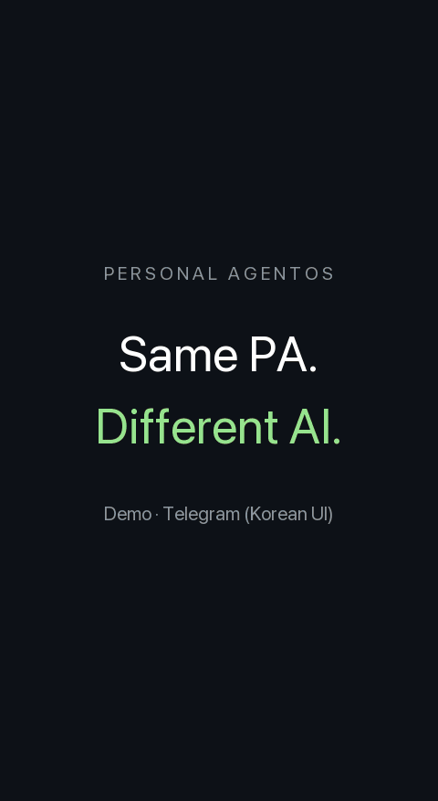

<div align="center">

<pre>
          P E R S O N A L           
                                    
   ___                __  ____  ____
  / _ |___ ____ ___  / /_/ __ \/ __/
 / __ / _ `/ -_) _ \/ __/ /_/ /\ \  
/_/ |_\_, /\__/_//_/\__/\____/___/  
     /___/                          
</pre>

**Your personal agent, on your own machine.<br>Change the AI underneath; keep its memory, open work and permissions.**

[](https://github.com/Jongtae/agentos/actions/workflows/validate.yml) [](https://github.com/Jongtae/agentos/actions/workflows/full-validate.yml) [](https://github.com/Jongtae/agentos/releases) [](pyproject.toml) [](QUICKSTART.md) [](LICENSE)

[English](README.md) | [한국어](README.ko.md) | [简体中文](README.zh-CN.md) | [日本語](README.ja.md)

[Quick start](#quick-start) · [What stays yours](#what-stays-yours) · [How it works](#how-it-works) · [Docs](#documentation)

</div>

<!-- readme-parity:v1 -->
<!-- readme-section:hero -->

## Same PA. Different AI.

If Jarvis belonged to another company, would Tony have to give up Jarvis (what it knows about him, the work they have not finished, the authority he delegated) just to use a better AI?

Personal AgentOS is built on the answer *no*. It is an open-source environment you install and control. One personal agent (PA) keeps your context, open work and permissions there, while the AI doing the work can change.

<p align="center">
  
</p>
<p align="center"><sub>Demo · Telegram (Korean UI) with English subtitles. Waiting time is cut and personal details are blurred.</sub></p>

**Highlights**

- **Bring your own AI.** A local Ollama model, an OpenAI-compatible or Anthropic API, or a Codex or Claude Code subscription does the work.
- **One PA across conversations.** Memory, saved results and the work in progress carry over to the next conversation and survive a restart.
- **Your boundaries.** It reaches only the folders, accounts and tools you connect. Payments always ask first; secrets never enter a prompt, a log or a record.
- **Told, not hidden.** When your AI saves something to memory it says so and offers an exact undo. Each task records which of your information it used and where it went.
- **Where you already talk.** Chat on Telegram from your phone, or in the browser on your own Mac, Linux or Windows (WSL2) computer.

<!-- readme-section:try-today -->

## Quick start

On macOS or Linux, one command installs and starts AgentOS. You do not need Homebrew, Python or Docker:

```sh
curl -LsSf https://raw.githubusercontent.com/Jongtae/agentos/main/scripts/install.sh | sh
```

If you use [Homebrew](https://brew.sh) on macOS:

```sh
brew install jongtae/agentos/agentos
agentos start
```

1. Setup opens at [http://127.0.0.1:8787](http://127.0.0.1:8787/). Choose **바로 시작하기** (Start now); the setup screens are in Korean for now.
2. Connect your AI: a tool-capable Ollama model, an OpenAI, OpenAI-compatible or Anthropic API key, or a Codex or Claude Code subscription.
3. Optional: in **설정 → 외부 연결** (Settings → External connections), add your own Telegram bot token and open the pairing link.
4. Ask: **“I need to finish a proposal this week. Help me break it into the next few steps.”**

On Windows, run `wsl --install` in PowerShell, restart, open Ubuntu and run the first command there. Windows details, what the installer does, running from source and every setting are in [QUICKSTART](QUICKSTART.md). Keep `agentos start` running while you talk.

**Release status:** both installers install **v1.1.1** (2026-10-07), built from the tagged main commit. The demo and the everyday-use image come from real sessions and are not release-specific end-to-end validation; the architecture figure is product direction. The [release manifest](docs/release-manifest.json) records what each release covers, and [product status](docs/product-status.en.md) separates shipped behavior, test evidence and direction.

<!-- readme-section:ownership -->

## What stays yours

| Can change | Stays with you |
| --- | --- |
| The model and its provider | Memory and context about you |
| The CLI agent or API doing the work | Open work and its next step |
| Tools and connectors | Permissions and approvals |
| | The record of what actually ran |

When a better AI appears, you switch the worker, not the agent. [Whose agent?](docs/whitepapers/whose-agent.ko.md) (Korean whitepaper) takes the question further.

Local-first is not local-only: you can use a local or hosted model. With a hosted model, the context used for a request is sent to that provider.

<!-- readme-section:presence -->

## How it works

<picture>
  <source media="(max-width: 600px)" srcset="docs/assets/readme/presence-overview.en.narrow.svg">
  
</picture>

- **The PA** is the agent you talk to. **AgentOS** is the environment that keeps its context, open work, authority and evidence.
- A **judgment layer** chooses the AI and tool for each request, writes the brief, checks the result and hands the work back when it falls short.
- An **ontology** links one sourced thing, such as a meeting or an account balance, to the work, roles and permissions around it. A draft is never taken for a send, or an invitation for an acceptance.

The figure shows the intended design, not an observed run. Details: [architecture and ontology](docs/personal-agentos-architecture.en.md) · [Presence](docs/presence-experience-contract.en.md).

<!-- readme-section:conversation -->

## Everyday use

*Condensed and translated from real conversations with the PA; not a verbatim screenshot.*

<picture>
  <source media="(max-width: 600px)" srcset="docs/assets/readme/owner-pilot-conversation.en.png">
  
</picture>

Dinner on the way home, a belt like the one in a photo, what to do after dinner. In each, the PA asks for what it is missing (your location, a sign-in), uses the context you allowed, and stops at your account before the cart step. **What you say or show → context you allowed, with source and time → a useful question or tool → the boundary for action → an observed result.** Adding to a cart and paying stay different actions.

**Next:** following what “it” and “the same one” mean across hours, so you keep talking instead of assembling a workflow.

> “We’re almost out of coffee.” · *hours later* · “Anywhere on my way out?” · *later* · “Just get the same one as last time.”

<!-- readme-section:more -->

## Documentation

| Document | What's inside |
| --- | --- |
| [QUICKSTART](QUICKSTART.md) | Install, connect a model, files, Telegram, run from source |
| [Product status](docs/product-status.en.md) | What works, what still has friction, and the evidence for each |
| [Why this exists](VISION.md) | The motivation behind the project |
| [Architecture and ontology](docs/personal-agentos-architecture.en.md) | Kernel primitives, packages, runtimes and owner control |
| [Documentation map](docs/README.md) | Every current contract and guide |
| [Acknowledgements](docs/acknowledgements.en.md) | Research and projects that shaped the design |

**Contributing.** Issues and pull requests are welcome. Start with [CONTRIBUTING](CONTRIBUTING.md); [AGENTS.md](AGENTS.md) describes the development workflow. Tried it? Tell us what worked and what didn't through the [feedback form](https://github.com/Jongtae/agentos/issues/new?template=feedback.yml) or [Discussions](https://github.com/Jongtae/agentos/discussions).

<!-- readme-section:license -->

## License

[AGPL-3.0-only](LICENSE). The Personal AgentOS name and logo follow the [trademark notice](TRADEMARKS.md).
