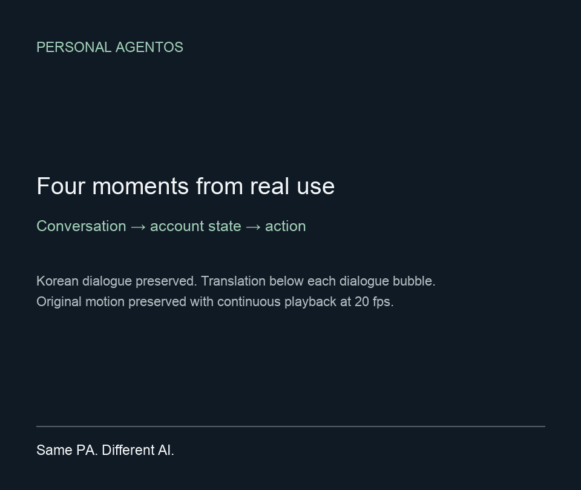

# Personal AgentOS

[English](README.md) | [한국어](README.ko.md) | [简体中文](README.zh-CN.md) | [日本語](README.ja.md)

<!-- readme-parity:v1 -->
<!-- readme-section:hero -->

## What if Jarvis belonged to another company?

Imagine Tony Stark had spent years working with Jarvis — sharing context, leaving decisions open, delegating work and learning how to work together.

Now imagine a better AI appears.

**Should Tony have to lose Jarvis to use it?**

Should he lose what Jarvis remembers about him, the work they have not finished, the authority he has delegated, and the way they have learned to work together — simply because the intelligence provider changes?

**The AI can change. Your personal agent should remain yours.**

Personal AgentOS explores that idea in an open-source environment you install and control. The PA's context, unfinished work, authority and evidence stay with you while the AI underneath can change.

The goal is not another chatbot with a longer history. It is one continuing personal agent.

**Same PA. Different AI.**

Want to run it before reading further? Skip to [Try it](#try-it); the rest of this page explains what the project is reaching for.

<!-- readme-section:real-use -->

## Four moments from real use

These are screen recordings from the owner's own use of Personal AgentOS, edited into four distinct scenes. Korean dialogue remains visible, with English translations below the matching dialogue excerpts. Taps, scrolling and emoji reactions play continuously at 20fps.

<details>
<summary>Expand to watch the recorded owner-use GIF · collapse to hide motion</summary>



[Open the GIF at full size](docs/assets/readme/owner-use/owner-use.en.gif).

</details>

1. **Meeting a friend in Dongtan:** departure point, GTX and dinner preferences become part of the same conversation. The PA also corrects an earlier route suggestion.
2. **Checking an E-Mart / SSG cart:** after sign-in, the PA replies that the cart contains 22 items and no Spam.
3. **“Just one small can”:** the owner asks for one small can because his wife would dislike buying too much. The PA reports adding one 200g can and a cart count of **22 → 23**.
4. **A separate Kyobo session:** the recording shows the owner's book cart; the PA lists four books, then discusses points and discounts and says one step was not verified.

The thread is **conversation → the owner's context → account state → a requested action → a reported result**. These are separate moments, not one continuous shopping transaction. Sign-in, waiting time and session persistence remain rough edges.

This owner-pilot recording does not identify the application revision or model. It shows neither an AI switch nor completed payment. [Recording provenance and editing details](docs/assets/readme/owner-use/README.md) distinguish visible screens, the PA's replies and release-specific validation.

<!-- readme-section:ownership -->

## What should remain yours?

The thought experiment becomes a concrete design question: when the intelligence underneath changes, what should remain with the owner? The [strategy whitepaper](docs/whitepapers/whose-agent.ko.md) develops that question across product and industry structure.

AgentOS keeps memory, work and authority in your environment. You choose the AI, the information it can use and the access you give it. Different expertise can serve the same owner; better AI should expand what your agent can do without making you start over.

Two of those controls ship in the current release: when your own AI saves a fact to Memory it tells you afterwards and offers an exact undo, and each piece of work records which of your information it used and where that information went.

Local-first is not local-only: you can use a local or hosted model. With a hosted model, the context used for a request is sent to that provider.

<!-- readme-section:presence -->

## How delegated work can continue

*The following meeting is an illustrative product-direction example. This sequence has not been observed in the current Homebrew build.*

Imagine saying, “Keep track of next week's project meeting. We still need to settle the proposal.” The PA would connect an allowed calendar invitation, proposal and record of earlier decisions to the same meeting to find what remains unresolved. An invitation alone does not mean you accepted the meeting or its follow-up. Before the meeting, it could prepare a brief for the open decision; when you later share notes, it would update the unfinished work. It could prepare a follow-up email as a **draft**, but a draft has not been sent. Without authority to send, it would ask first, and it would report “sent” only after the tool confirmed that result.

<picture>
  <source media="(max-width: 600px)" srcset="docs/assets/readme/presence-overview.en.narrow.svg">
  
</picture>

**The PA is the personal agent you talk to; AgentOS is the environment you control that carries its context, open work, authority and evidence.** Its judgment layer delegates to AI and tools and checks their results. The aim is for your PA and its work to continue when the AI underneath changes. **Same PA. Different AI.**

That takes more than a long chat history. **One meeting** has time, place and attendees as **metadata**. An **ontology** distinguishes its relationships to other things:

- **The meeting as a calendar event:** When is it, who is involved and what needs preparing?
- **The same meeting in the project:** Which proposal decision remains open?
- **The same meeting and a commitment:** Who suggested a follow-up, and who actually accepted it?

These are relationships attached to one sourced meeting, not three different meetings. Its identity, time and invitation come from records; a role's assessment of urgency or responsibility is an interpretation with its own scope and grounds. An invitation is not an accepted commitment. Missing information is not proof that something did not happen; conflicting sources remain visible rather than being silently reconciled. Open decisions continue as work; unconfirmed permission never becomes permission to act; evidence distinguishes a proposal or draft from an action that occurred.

AgentOS aims to connect facts, role-specific interpretations, delegated work, permissions and evidence in a structure the owner controls. This is how a paused task or a different AI could pick up the right next step without making you reconstruct it. The same rule applies beyond meetings; [Architecture and ontology](docs/personal-agentos-architecture.en.md#facts-and-role-interpretations) shows it on an account balance. These are design illustrations, not observed runs. Proactive attention to changing circumstances is a direction beyond the current reactive Presence work, not a claim of always-on monitoring today.

<!-- readme-section:conversation -->

## Ordinary moments, the same PA

*A condensed, redacted reconstruction based on owner-pilot conversations. It is not an evidence record of those conversations, and the map and shopping integrations shown are product direction, not shipped features.*

The illustration below condenses three PA conversations: sharing a location to find dinner on the way home, comparing a golf belt and pausing for account login before a cart action, and continuing from a restaurant photo to a nearby walk. It is an edited illustrative reconstruction, not a verbatim product screenshot or proof of those integrations.

<picture>
  <source media="(max-width: 600px)" srcset="docs/assets/readme/owner-pilot-conversation.en.png">
  
</picture>

[Open the English image at full size](docs/assets/readme/owner-pilot-conversation.en.png) · [View the original reference image](docs/assets/readme/owner-pilot-conversation-reference.jpg).

The image condenses the conversations. For the choices to make sense, the PA would need relevant information the owner has allowed it to use, and would need to ask again when information is missing or stale.

1. **Dinner on the way home:** “Dinner on my way back?” means a route from the current location toward home. The PA must check whether work/home locations are available and permitted, where the owner is now, the time and whether someone is coming along. In the image it asks for a current location, offers three options using route, distance and opening hours, and the owner picks the second.
2. **Find this belt:** A visual match alone may be a poor choice. If the owner has shared wardrobe styles and colors, preferences or a budget, the PA should use them; otherwise it asks only for what matters. In the image it compares three belts, then requests an account login for the chosen cart action. Adding to a cart and paying are different actions. The cart step itself is what a task agent does too; the difference is that the PA brings your context and preferences to the choice and stops at your account and authority boundary, not at the click.
3. **Here at dinner. What next?** The restaurant photo and shared current place are only a start. The companion, occasion, time and weather may change a good suggestion. The PA should check what it does not know before offering a walk, café or bar. After the owner picks a walk, it would verify the route and opening hours.

All three need the same path: **what you say or show → allowed context with a source and time → a useful question or tool → the boundary for action → an observed result**. The image explains that relationship; it does not claim all that context is already collected or those map and shopping integrations are shipped.

Continuity also matters in smaller moments, hours apart:

> “We’re almost out of coffee.”<br>
> Hours later: “I’m heading out. Is there somewhere on the way I can pick it up?”<br>
> Later: “No time. Just get the same one as last time.”

The aspiration is simple: the PA follows what “it” and “the same one” mean, brings in relevant context, and asks for missing information or authority when needed. You keep talking; you do not assemble a workflow.

<!-- readme-section:try-today -->

## Try it

The published build lets you connect your own model and start a conversation. The meeting scene above is not an end-to-end verified release journey.

On macOS with [Homebrew](https://brew.sh):

```sh
brew install jongtae/agentos/agentos
agentos start
```

1. Browser setup opens at [http://127.0.0.1:8787](http://127.0.0.1:8787/). Choose **바로 시작하기** (Start now).
2. Connect and test your own model: a tool-capable local Ollama model, or OpenAI, an OpenAI-compatible service or Anthropic with your API access. A Codex or Claude Code subscription can do the work instead of an API key ([QUICKSTART](QUICKSTART.md)). The setup interface is currently Korean.
3. In **설정 → 외부 연결** (Settings → External connections), connect your own bot using its BotFather token. Open the generated pairing link in Telegram and press **Start**.
4. In that Telegram chat, say: **“I need to finish a proposal this week. Help me break it into the next few steps.”**

Homebrew installs Python for you; model access is separate. Keep `agentos start` running while you talk. [QUICKSTART](QUICKSTART.md) covers model setup, file work, Telegram and running the newest code from source.

**Where it stands:** Homebrew installs **v1.1.1** (2026-10-07), built from the tagged main commit. The meeting illustration and reconstructed conversations are product direction. The owner-use GIF records separate pilot sessions and is not release-specific end-to-end validation. The [release manifest](docs/release-manifest.json) records source coverage and installed checks; [product status](docs/product-status.en.md) separates available behavior, fixture evidence, owner-pilot evidence and future direction.

<!-- readme-section:more -->

## Explore the ideas

- [Why this project exists](VISION.md) · [Whose agent?](docs/whitepapers/whose-agent.ko.md) (Korean strategy whitepaper) — why the agent's continuity should stay with the owner when AI changes.
- [Architecture and ontology](docs/personal-agentos-architecture.en.md) · [Presence](docs/presence-experience-contract.en.md) · [Roles and delegation](docs/research/role-ontology-and-mandate-2026-10-05.ko.md) (Korean research proposal) — how personal state, work and control can support one agent across different roles.
- [Research and references](docs/acknowledgements.en.md) — the work on personal agents, memory, owner models and provenance that informed the design.
- [Documentation map](docs/README.md) · [Contributing](CONTRIBUTING.md) — find the current contracts, inspect the implementation and help develop it.

<!-- readme-section:license -->

## Open source

This is a working exploration, open for others to run, question and improve. It does not have to be the final answer to be a useful beginning.

Code: [AGPL-3.0-only](LICENSE). The Personal AgentOS name and logo follow the [trademark notice](TRADEMARKS.md). Third-party work is credited in [acknowledgements](docs/acknowledgements.en.md).
