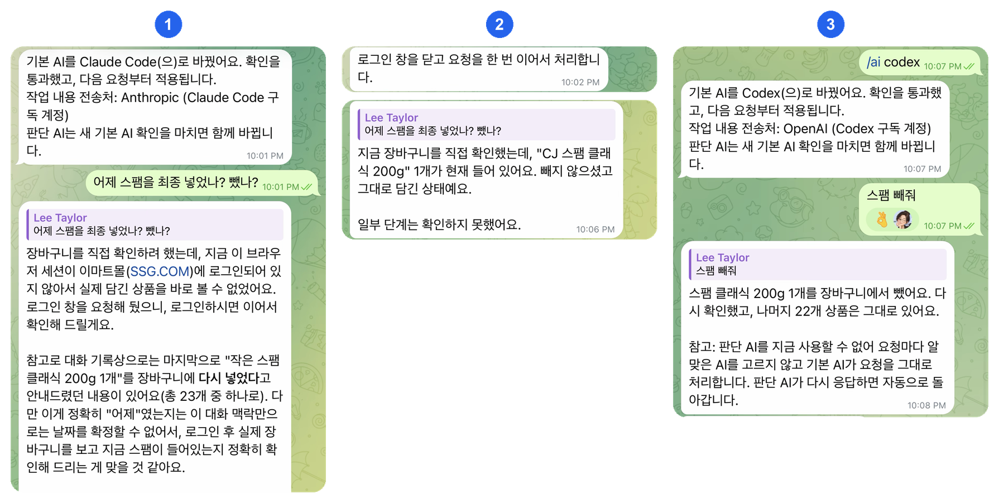

<div align="center">

<pre>
          P E R S O N A L           
                                    
   ___                __  ____  ____
  / _ |___ ____ ___  / /_/ __ \/ __/
 / __ / _ `/ -_) _ \/ __/ /_/ /\ \  
/_/ |_\_, /\__/_//_/\__/\____/___/  
     /___/                          
</pre>

**Your personal agent, on your own machine.<br>Change the AI underneath; keep its memory, open work and permissions.**

[](https://github.com/Jongtae/agentos/actions/workflows/validate.yml) [](https://github.com/Jongtae/agentos/actions/workflows/full-validate.yml) [](https://github.com/Jongtae/agentos/releases) [](pyproject.toml) [](docs/QUICKSTART.md) [](LICENSE)

[English](README.md) | [한국어](docs/i18n/README.ko.md) | [简体中文](docs/i18n/README.zh-CN.md) | [日本語](docs/i18n/README.ja.md)

[Quick start](#quick-start) · [What stays yours](#what-stays-yours) · [How it works](#how-it-works) · [Docs](#documentation)

</div>

<!-- readme-parity:v1 -->
<!-- readme-section:hero -->

## Can we have our own J.A.R.V.I.S. without owning its brain?

**The brain can be borrowed. The assistant should remain yours.**

Tony Stark had J.A.R.V.I.S.: an assistant that understood his context, stayed available and acted through his computers and systems. But Tony also owned the technology behind it. Most of us won't own the most capable AI brains we use. They come from providers whose models, prices, policies and availability can change.

So the question isn't just *can we build our own Jarvis?* It's **can we keep a personal assistant that is truly ours while borrowing its intelligence?** If a better model appears, should we have to give up what our assistant knows, the work we've left unfinished or the authority we've delegated?

Personal AgentOS explores an answer: *no*. It is an open-source environment you install and control. One personal agent (PA) keeps your context, open work and permissions there, while the AI doing the work can change.

<p align="center">
  
</p>
<p align="center"><sub>Demo · Telegram (Korean UI) with English subtitles. Waiting time is cut and personal details are blurred. · <a href="docs/assets/readme/demo/demo-v2.en.gif">Open full size</a></sub></p>

**Highlights**

- **Bring your own AI.** A local Ollama model, an OpenAI-compatible or Anthropic API, or a Codex or Claude Code subscription does the work.
- **One PA across conversations.** Memory, saved results and open-work state persist across conversations and restarts. Interrupted execution is reported rather than silently replayed.
- **Your boundaries.** Access begins with the folders, accounts and tools you connect. Supported payment flows require per-action approval; [current browser limitations](https://github.com/Jongtae/agentos/issues/758) are documented. [Secrets](.github/SECURITY.md) are excluded from model prompts, logs and Evidence.
- **Told, not hidden.** When your AI saves something to memory it says so and offers an exact undo. Each task records which of your information it used and where it went.
- **Where you already talk.** Chat on Telegram from your phone, or in the browser on macOS or Linux. Windows works through [WSL2 with current limitations](docs/QUICKSTART.md#windows-wsl2).

<!-- readme-section:principles -->

## Five pillars of Personal AgentOS

These are not features of one particular AI model. They are the criteria by which we judge the assistant we are building.

- **Presence:** An assistant that stays with me where I already communicate, instead of making me open a separate app each time I need something done.
- **Portable Memory:** My memories and context are not locked into a single AI service.
- **Model Independence:** I can replace the AI model without losing the continuity of my assistant and our relationship.
- **Execution:** It doesn't only answer questions; it can act in real services and on computers.
- **Owner Control:** I retain control over my data, permissions and the outcomes of execution.

These are guiding principles, not a claim that every scenario already works. The [product status](docs/product-status.en.md), real demo above and [known browser limitations](https://github.com/Jongtae/agentos/issues/758) show what has been observed and what still needs work.

<!-- readme-section:try-today -->

## Quick start

On macOS or Linux, one command installs and starts AgentOS. You do not need Homebrew, Python or Docker:

```sh
curl -LsSf https://raw.githubusercontent.com/Jongtae/agentos/137681f2617bf6350ba0b24316d8766921d084f7/scripts/install.sh | sh
```

The URL pins the installer itself. [Inspect the pinned script](https://github.com/Jongtae/agentos/blob/137681f2617bf6350ba0b24316d8766921d084f7/scripts/install.sh) before running it; the script verifies the published AgentOS archive and the uv installer it downloads.

If you use [Homebrew](https://brew.sh) on macOS:

```sh
brew install jongtae/agentos/agentos
agentos start
```

1. Setup opens at [http://127.0.0.1:8787](http://127.0.0.1:8787/). Choose **바로 시작하기** (Start now); the setup screens are in Korean for now.
2. Connect your AI: a tool-capable Ollama model, an OpenAI, OpenAI-compatible or Anthropic API key, or a Codex or Claude Code subscription.
3. Optional: in **설정 → 외부 연결** (Settings → External connections), add your own Telegram bot token and open the pairing link.
4. Ask: **“I need to finish a proposal this week. Help me break it into the next few steps.”**

On Windows, run `wsl --install` in PowerShell, restart, open Ubuntu and run the first command there. Windows details, what the installer does, running from source and every setting are in [QUICKSTART](docs/QUICKSTART.md). Keep `agentos start` running while you talk.

**Release status:** both installers install **v1.1.1** (2026-10-07), built from the tagged main commit. The demo and the everyday-use image come from real sessions and are not release-specific end-to-end validation; the architecture figure is product direction. The [release manifest](docs/release-manifest.json) records what each release covers, and [product status](docs/product-status.en.md) separates shipped behavior, test evidence and direction.

<!-- readme-section:ownership -->

## What stays yours

| Can change | Stays with you |
| --- | --- |
| The model and its provider | Memory and context about you |
| The CLI agent or API doing the work | Open work and its next step |
| Tools and connectors | Permissions and approvals |
| | The record of what actually ran |

When a better AI appears, you switch the worker, not the agent. [Whose agent?](docs/whitepapers/whose-agent.ko.md) (Korean whitepaper) takes the question further.

Local-first is not local-only: you can use a local or hosted model. With a hosted model, the context used for a request is sent to that provider.

<!-- readme-section:presence -->

## How it works

<picture>
  <source media="(max-width: 600px)" srcset="docs/assets/readme/presence-overview.en.narrow.svg">
  
</picture>

- **The PA** is the agent you talk to. **AgentOS** is the environment that keeps its context, open work, authority and evidence.
- A **judgment layer** chooses the AI and tool for each request, writes the brief, checks the result and hands the work back when it falls short.
- An **ontology** links one sourced thing, such as a meeting or an account balance, to the work, roles and permissions around it. A draft is never taken for a send, or an invitation for an acceptance.

The figure shows the intended design, not an observed run. Details: [architecture and ontology](docs/personal-agentos-architecture.en.md) · [Presence](docs/presence-experience-contract.en.md).

<!-- readme-section:ai-switch -->

## A conversation that continues when the AI changes

<p align="center">
  
</p>
<p align="center"><sub>Excerpts from a real conversation (Telegram, Korean UI). The sign-in link is cropped out and the name is blurred. · <a href="docs/assets/readme/ai-switch/ai-switch-conversation.png">Open full size</a></sub></p>

① **Switch to Claude Code.** Asked “Did I end up adding the Spam yesterday, or taking it out?”, the PA picks up the earlier shopping conversation.

② **Check the current cart.** After signing in again, it answers that one 200 g can of Spam Classic is in the cart.

③ **Switch to Codex and ask for the next step.** “Take the Spam out.” In the same conversation it reports the removal and the 22 items still in the cart.

<!-- readme-section:conversation -->

## Everyday use

*Condensed from real conversations with the PA and redrawn: in Telegram the replies arrive as text and links, not cards.*

<picture>
  <source media="(max-width: 600px)" srcset="docs/assets/readme/owner-pilot-conversation.en.png">
  
</picture>

On the way home, the PA asks for your location before suggesting places to eat. For a belt like the one in a photo, it compares options and asks you to sign in before the cart step. From a restaurant photo, it picks up where you are and suggests what to do next. **What you say or show → context you allowed, with source and time → a useful question or tool → the boundary for action → an observed result.** Adding to a cart and paying stay different actions.

**Next:** following what “it” and “the same one” mean across hours, so you keep talking instead of assembling a workflow.

> “We’re almost out of coffee.” · *hours later* · “Anywhere on my way out?” · *later* · “Just get the same one as last time.”

<!-- readme-section:more -->

## Documentation

| Document | What's inside |
| --- | --- |
| [QUICKSTART](docs/QUICKSTART.md) | Install, connect a model, files, Telegram, run from source |
| [Product status](docs/product-status.en.md) | What works, what still has friction, and the evidence for each |
| [Why this exists](docs/VISION.md) | The motivation behind the project |
| [Architecture and ontology](docs/personal-agentos-architecture.en.md) | Kernel primitives, packages, runtimes and owner control |
| [Documentation map](docs/README.md) | Every current contract and guide |
| [Acknowledgements](docs/acknowledgements.en.md) | Research and projects that shaped the design |

**Contributing.** Issues and pull requests are welcome. Start with [CONTRIBUTING](.github/CONTRIBUTING.md); [AGENTS.md](AGENTS.md) describes the development workflow. Tried it? Tell us what worked and what didn't through the [feedback form](https://github.com/Jongtae/agentos/issues/new?template=feedback.yml) or [Discussions](https://github.com/Jongtae/agentos/discussions).

<!-- readme-section:license -->

## License

[AGPL-3.0-only](LICENSE). The Personal AgentOS name and logo follow the [trademark notice](docs/TRADEMARKS.md).
