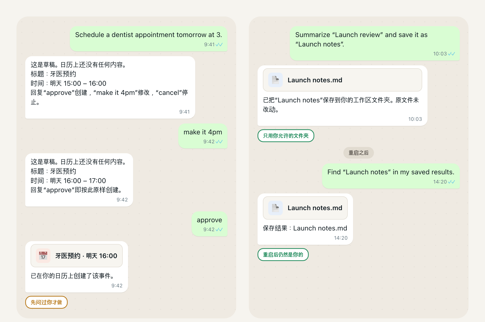
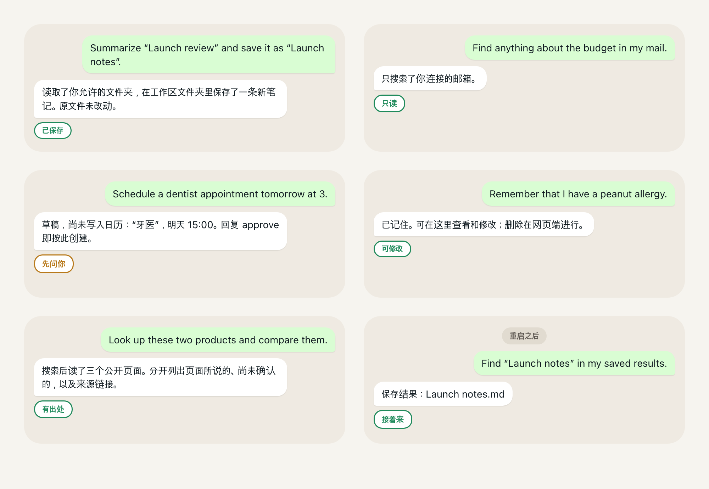

# Personal AgentOS

[English](README.md) | [한국어](README.ko.md) | [简体中文](README.zh-CN.md) | [日本語](README.ja.md)

<!-- readme-parity:v1 -->
<!-- readme-section:hero -->

## 运行在你自己电脑上的、属于你的 AI 助手。

**模型由你选。你的文件、邮件、日程和记忆归你。规则由你定。**



上面两段对话都是产品的真实行为，回复经过精简并译自韩语。请求保留英文原文（今天还不理解中文请求）。在你说 approve 之前什么都不会创建，保存的笔记重启后仍在原处。它运行在你自己的电脑上（macOS 或 Linux，Python 3.12 或更新），模型由你自己提供：本地 Ollama 模型、OpenAI 兼容端点或 Anthropic。本地优先（local-first）不等于只在本地（local-only）：使用托管模型时，你批准的上下文会发送给该提供商。

<!-- readme-section:try-today -->

## 安装

```sh
brew install jongtae/agentos/agentos
agentos start
```

你会看到：

```text
AgentOS: http://127.0.0.1:8787/
초기 설정 링크: /Users/you/.local/share/agentos/private/setup-link.txt (개인 파일)
```

浏览器会在该地址打开。按 **바로 시작하기**（立即开始），连接一个模型，就可以对话了。界面目前是韩语；请求可以用韩语或英语。

**Homebrew 安装的是最新公开发布版 `v1.1.0`（2026-09-23），本页的全部内容都包含在其中。** 之后合并到 `main` 的工作不在该构建里，所以在下一次发布之前 Homebrew 构建会落后于 `main`；要用最新代码，请从源码检出运行（`git clone https://github.com/Jongtae/agentos.git`，然后在 Python 3.12 或更新上执行 `python3 -m pip install -e .`）。每一步都在 [QUICKSTART](QUICKSTART.md) 里。

<!-- capability:current-supported-slice -->
<!-- readme-section:scenes-today -->

## 接下来还能这样



下面这些请求背后的流程都由本项目的自动化首次用户检查端到端跑通，用本地文件夹和模拟的邮件、日程、网页服务，而不是真实账户。措辞就是今天实际会被路由的措辞。

- **文件。** *Summarize “Launch review” and save it as “Launch notes”.* 它读取你允许的文件夹，在你选定的工作区文件夹里写入一条新笔记，原文件保持不动。
- **邮件。** *Find anything about the budget in my mail.* 它只搜索你连接的邮箱，并展示找到的内容。
- **日程。** *Schedule a dentist appointment tomorrow at 3.* 它展示精确的草稿，只有你说 approve 之后才创建事件。“make it 4pm”和“cancel”在同一份草稿上都有效。
- **记忆。** *Remember that I have a peanut allergy.* 它把这条记忆放在你能在对话里查看、修改，并在网页端删除的地方。模型自行提出的记忆在你接受之前保持待审核。
- **调研。** *Look up these two products and compare them.* 它先搜索，再读取其中最多三个公开页面，返回页面所说的内容、仍未确认的内容，以及链接。

然后重启应用，这样说：*Find “Launch notes” in my saved results.* 保存的结果、你允许的文件夹、记忆和 Telegram 配对在重启后都还在。

<!-- readme-section:settings -->

## 你需要的设置

- **一个模型。** 本地 Ollama 服务器、OpenAI 兼容端点或 Anthropic，用你自己的访问权限连接。文件场景需要其中一种直接连接。
- **两个文件夹。** 在 **내 에이전트 관리 → 내 자료**（我的代理管理 → 我的资料）里：一个它可以读取的参考文件夹，一个它可以写入的工作区文件夹。此外一律不碰。使用托管模型时，文件场景之前先批准一次文档共享。
- **邮件和日程，可选。** 通过你自己创建的 Google Cloud OAuth 客户端连接你的 Google 账户，各运行一次设置命令（`agentos gmail-config`、`agentos calendar-config`），然后分别连接读取和写入。精确步骤见 QUICKSTART。
- **Telegram，可选。** 把 BotFather 生成的机器人令牌粘贴到设置里，然后打开配对链接。只有你配对的账户能和它对话。

就这些。

<!-- readme-section:more -->

## 更多

[现在能做什么，哪里还有摩擦](docs/product-status.en.md)（英文） · [这是要去的方向](docs/product-status.en.md#where-this-is-going) · [为什么不一样](docs/product-status.en.md#why-this-is-different) · [内部结构](docs/product-status.en.md#under-the-hood-briefly) · 许可证 [AGPL-3.0-only](LICENSE) 与[商标声明](TRADEMARKS.md) · [它是怎么构建的](AGENTS.md)
