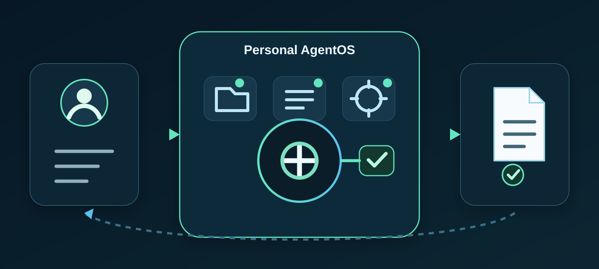
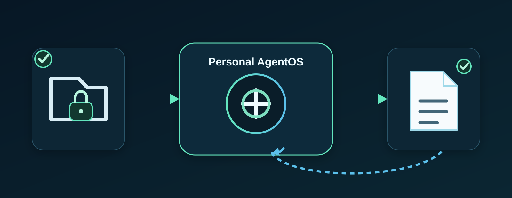

# Personal AgentOS

[English](README.md) | [한국어](README.ko.md) | [简体中文](README.zh-CN.md) | [日本語](README.ja.md)

<!-- readme-parity:v1 -->
<!-- readme-section:hero -->

## 把事情交给 AI，控制权留给自己。

**从日常生活到工作，都能真正交代任务的个人 AI。**

告诉 Personal AgentOS 你想要的结果。它被设计成只使用你允许的文件、工具、账户和模型，在这些边界内完成工作，在重要外部操作前请求批准，并把有用结果留在 owner-controlled state 中。

它的 mental model 很简单：**不是“和 AI 聊天”，而是“把事情交给自己的个人 AI”。**

> **Personal AgentOS = 可以委托真实任务的个人 AI + 以所有者权限为准的 AI 环境**



<!-- readme-section:everyday-scene -->

## 先从一个生活场景理解

<!-- capability:illustrative-product-direction -->

> **Product direction — 不代表当前已支持。**

> **你：**“洗衣液和纸巾快没了。找我平时买的商品或合适替代品，比较价格和运费，把购买准备好。下单前先问我。”
>
> **Personal AgentOS：**收集被允许的上下文，调查选项，把已确认的信息和仍需核实的内容分开，准备下一步，并在需要批准的边界停下。

这就是产品希望带来的体验：**把麻烦的部分交出去，把决定留给自己。**

**这个场景用于说明 product direction，并不表示今天已经支持 autonomous shopping 或 checkout。** 当前支持范围和证据在下方单独列出。预约确认、支付、外发消息等 consequential effect，只有在实现和证据确实支持时才会被描述为可用。

同样的模式也适用于其他生活场景：

- “找一个符合我周六下午时间的理发店，把预约准备好，确认前先问我。”
- “这周末我要出门。看我允许的信息，整理行李和购物清单，并保留下来方便之后继续。”
- “读这些允许的资料，做成有用的结果并保存，重启后还能继续找到。”

<!-- readme-section:delegation-flow -->

## 可以这样理解

**🗣️ 交代任务 → 🔎 在权限内工作 → ✋ 需要时请求批准 → 📦 保留结果**

1. **交代结果。** 不需要自己拼接集成流程，只需说清想要什么结果。
2. **在权限内工作。** AgentOS 中介已批准的 Context、Capability、目的地以及 Runtime/Model。
3. **重要决定留给所有者。** 新权限或有意义的外部效果需要相应批准。
4. **保留有用状态。** Artifact、已接受的 Memory、Work/Event 历史和 Evidence 与可替换 worker 分离保存。

<!-- readme-section:chatbot-difference -->

## 它和普通聊天机器人有什么不同

| 常见聊天机器人 | Personal AgentOS 的方向 |
| --- | --- |
| 回答提示词 | 在受限权限内把任务推进到结果 |
| Context 主要是当前对话 | 使用 owner 批准的文件、Memory、Connector 和 task context |
| 结果容易停留在聊天里 | 保留可复用 Artifact 和工作历史 |
| Tool 权限可能隐含或由服务方主导 | Owner policy 和 Grant 决定能用什么、能用到哪里 |
| 模型是产品中心 | Model/Agent 是 owner authority 下可替换的 worker |

目标不是让所有事情都自动执行。目标是 **在不放弃数据、权限、决定和长期状态控制权的前提下，把真实任务交给 AI。**

个人生产力工作区可以为 AI 整理目标、任务和知识。**Personal AgentOS 关注的是更底层的执行层：**一个受控环境，用来决定 AI 可以访问什么、可以做什么、实际发生了什么，以及更换 worker 后哪些 owner state 仍然保留。

<!-- capability:current-supported-slice -->
<!-- readme-section:try-today -->

## 今天可以先试已验证的范围

目前最清晰的第一项任务仍然是 file-workspace journey，因为保存结果、保护原件和重启后复用都有具体 repository evidence。



1. 在专用参考文件夹中放一个小型 Markdown/text 文件。
2. 给该文件夹 read access，并给另一个 managed workspace 结果写入权限。
3. 请求：**“Summarize ‘Launch review’ and save it as ‘Launch notes’.”**
4. 确认 managed workspace 中出现新的 Markdown 结果，而原文件没有变化。
5. 重启 AgentOS，再让它找到已保存的结果。

对于文档化的 file-workspace path，请使用受支持的 direct model-provider connection，明确授权 reference folder 和 managed workspace；在把获准文档 Context 发给外部 provider 前完成必要的分享批准。

### 安装

```sh
brew install jongtae/agentos/agentos
agentos start
```

浏览器会在 `http://127.0.0.1:8787` 打开。

**这个 Homebrew 命令安装的最新公开版本是 `v1.0.4`（2026-09-07），它落后于当前 `main`。** `main` 已包含此版本之后的功能开发和 first-user 改进。准确支持路径请看 [QUICKSTART](QUICKSTART.md)，发布状态请看 [release procedure](docs/release.en.md)。

<!-- readme-section:status -->

## 现在能做什么，以及哪里仍有摩擦

最新 synthetic first-user audit 是 [#472](https://github.com/Jongtae/personal-agentos/issues/472)。它在真实产品构造中使用 injected transports 进行验证；**live provider operation 没有运行。** fixture 成功不是 live service 成功的证明。

| 领域 | 当前证据 |
| --- | --- |
| Install/start/restart | #472 的 local deterministic first-use path 通过；新机器上的 Homebrew/launchd 验证仍是独立 operating gate。 |
| Files | Synthetic **pass-with-friction**：批准文件夹摘要、managed save、restart/reuse 可用，但自然表达“把那个保存成文件”仍有 gap（#481）。 |
| Gmail | Synthetic **pass-with-friction**：connect/re-auth/search/resume 路径存在，但 contextual resume 和 read/reply UX 仍有未解决 defect（#473, #478）。 |
| Calendar | Synthetic **pass-with-friction**：bounded create/preview/correct/cancel/approve 有证据，但 query/approval UX gap 仍存在（#475, #482, #483）。 |
| Research | Synthetic **pass-with-friction**：公开研究可以产生带 source、区分 known/unknown 的结果，但 routing/context defect 仍存在（#448, #474）。 |
| Memory | Synthetic **pass-with-friction**：remember/inspect/correct 和 owner-visible candidate 已有，但 delete/receipt UX 仍有摩擦（#479）。 |
| Agent distribution | v0.1 schema/contract 已存在，但任意第三方 AgentPackage 执行和公开 Marketplace 不是当前 product claim。 |

目前**不声称**支持自动购买、任意 computer use、所有网页验证、live inventory/checkout total 核实、任意第三方 package 执行或公开 Agent Marketplace。

<!-- readme-section:why-agentos -->

## 为什么叫 “AgentOS”？

因为你的个人 AI 不应该等同于某一个模型、某一家供应商或某一个 Agent。

Personal AgentOS 把 owner-authoritative 层和可替换 worker 分开：

`Owner · Context · Memory · Artifact · Capability · Runtime · Grant · Work · Event · Evidence`

Model、coding agent、Connector 和 delegated Runtime 都可以更换。它们请求 Capability，由 AgentOS policy 和 owner 决定真实 authority。更换 worker 时，有用的个人状态不应一起消失。

<!-- readme-section:owner-control -->

## 控制权属于所有者

[Owner Control Contract](docs/owner-control-contract.en.md) 定义六项可观察权利：

1. **Inspect** — 查看 package/source、publisher、version、execution mode 和 requested authority。
2. **Choose data** — 决定可使用哪些 document、Memory 和 account。
3. **See destinations** — 知道 task 信息会发到哪里。
4. **Bound actions** — 把 install/connect 与实际 action authority 分开。
5. **Stop and revoke** — 撤销 authority，并诚实报告 in-flight uncertainty。
6. **Keep and move owner state** — 删除或替换 worker 时仍保留 owner state。

本地安装不等于 local-only processing。使用外部模型的 local package 会把获准 Context 发送给该 provider。Disconnect、authority revoke、worker removal 和删除远程保留数据是不同操作。

<!-- readme-section:architecture -->

## 先理解产品，再看架构

| Layer | Responsibility |
| --- | --- |
| **Owner plane** | Owner identity/policy、Context/Memory authority、data/workspace、Grants/approvals、Work/Event、Artifacts、Evidence 和 recovery |
| **Capability plane** | Typed tools/connectors 和 bounded runtime interfaces |
| **Distribution plane** | AgentPackage、Package Manager、Registry、trust metadata、未来 Marketplace/discovery |
| **Worker plane** | 可替换 model、Codex/Claude Code、local/API worker、optional delegated runtime |
| **Experience plane** | Conversation、有用结果、inspectable progress、approval/control、未来 agent discovery |

Kernel 可以保持 **agent-independent**，而产品体验可以变得 **agent-centric**。

<!-- readme-section:bdi -->

## BDI-inspired attention lens

BDI 是一个**概念设计视角**，不是说 canonical BDI state machine 已经 shipped，也不是要求暴露 hidden chain-of-thought。

- **Belief view：**获准 task context、accepted Memory、相关 Evidence/Artifact、当前 Capability/Grant facts。
- **Desire：**owner 想要的 outcome 和 success criteria。
- **Attention：**现在什么重要、什么被允许、涉及什么 destination/effect、是否需要 approval。
- **Intention：**当前 bounded plan 和下一个 executable step。
- **Execution：**通过 Capability/Runtime mediation 产生 observed Work/Event、Artifact 和 Evidence。

结果可以帮助之后的 task context，但这不意味着每个结果都会自动成为 durable Memory。第三方提出 `MemoryCandidate`，由 policy/owner 决定是否进入 canonical Memory。

<!-- readme-section:ecosystem -->

## Agent ecosystem 方向

AgentPackage lifecycle 有意区分：

`downloaded != installed != enabled != connected != authorized-for-action`

Installation 不应自动创建 Grant。扩大 data、action、destination、Memory 或 background behavior 的 update 需要新的 authority。Removal 撤销 package authority，同时按 policy 保留 owner-owned output 和必要 Evidence。

先证明真正有用且 bounded 的 Agent 和 public authoring path；大型 store 和 payment 不是第一阶段前提。详情见 [architecture](docs/personal-agentos-architecture.en.md)、[PRD](PRD.md)、[platform foundation](docs/agent-distribution-platform-foundation.en.md)、[product vision](PRODUCT_VISION.ko.md) 和 [roadmap](docs/roadmap.md)。

<!-- readme-section:portability -->

## Portability 与边界

```sh
scripts/agentos-backup.py DATA ARCHIVE
scripts/agentos-restore.py ARCHIVE EMPTY_DATA
```

受支持的 owner state 和 reviewed declarations 可以带 integrity check 导出/恢复。Provider credential、session、local-folder Grant、engine/model selection、Telegram pairing 不包含在 portable archive 中，需要重新连接或批准。

Local-first 不代表 local-only 或自动安全。Host security、package isolation、已经发送的数据和 remote provider retention 仍然是真实边界。

<!-- readme-section:development -->

## 开发治理

本项目**不是 coding harness、swarm framework、host kernel，也不是 macOS/Linux 替代品。** GitHub/Codex delivery automation 是构建 Personal AgentOS 的开发基础设施，不是 end-user product。

按照 [AGENTS.md](AGENTS.md)、[Development Constitution](docs/development-constitution.en.md) 和 [Goal Execution Contract](docs/goal-execution-contract.en.md) 执行 issue → bounded branch → implementation → validation → 必要的 independent review → merge/closeout。

Product completion 不能只看 green CI、schema 或文件数量。**必须同时有 useful outcome evidence 和相应的 denial/recovery evidence。**
