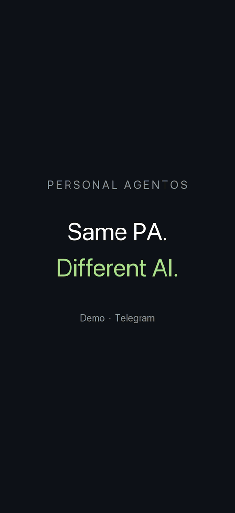

<div align="center">

<pre>
          P E R S O N A L           
                                    
   ___                __  ____  ____
  / _ |___ ____ ___  / /_/ __ \/ __/
 / __ / _ `/ -_) _ \/ __/ /_/ /\ \  
/_/ |_\_, /\__/_//_/\__/\____/___/  
     /___/                          
</pre>

**在你自己电脑上运行的个人智能体。<br>底层 AI 可以更换，记忆、进行中的工作和权限都会保留。**

[](https://github.com/Jongtae/agentos/actions/workflows/validate.yml) [](https://github.com/Jongtae/agentos/actions/workflows/full-validate.yml) [](https://github.com/Jongtae/agentos/releases) [](pyproject.toml) [](QUICKSTART.md) [](LICENSE)

[English](README.md) | [한국어](README.ko.md) | [简体中文](README.zh-CN.md) | [日本語](README.ja.md)

[快速开始](#快速开始) · [留给你的东西](#留给你的东西) · [工作原理](#工作原理) · [文档](#文档)

</div>

<!-- readme-parity:v1 -->
<!-- readme-section:hero -->

## 同一个 PA，不同的 AI。

如果贾维斯属于另一家公司，托尼为了用上更好的 AI，是否就得放弃贾维斯所了解的关于他的上下文、尚未完成的工作和他交付的权限？

Personal AgentOS 的出发点是：*不必*。在一个由你安装和掌控的开源环境里，一个个人智能体（PA）保管你的上下文、进行中的工作和权限，而真正干活的 AI 可以更换。

<p align="center">
  
</p>
<p align="center"><sub>演示 · Telegram（韩语界面）。等待时间已缩短，个人信息已模糊处理。</sub></p>

**主要特点**

- **接入你选择的 AI。** 本地 Ollama 模型、OpenAI 兼容或 Anthropic API，或 Codex、Claude Code 订阅来完成实际工作。
- **换了对话，还是同一个 PA。** 记忆、保存的结果和进行中的工作会延续到下一次对话，重启后依然保留。
- **边界由你决定。** 只访问你连接的文件夹、账户和工具。付款前总会先问你；密钥不会进入提示词、日志或记录。
- **告诉你，而不是瞒着你。** AI 记住某件事时会告诉你，并提供精确的撤销。每项委托工作都会记录用了你的哪些信息、发送到了哪里。
- **在你常用的地方对话。** 用手机上的 Telegram，或在你自己的 Mac、Linux 电脑的浏览器里对话。

<!-- readme-section:try-today -->

## 快速开始

在 macOS 上使用 [Homebrew](https://brew.sh) 安装：

```sh
brew install jongtae/agentos/agentos
agentos start
```

1. 设置页面会在 [http://127.0.0.1:8787](http://127.0.0.1:8787/) 打开。点击 **바로 시작하기**（立即开始）；设置界面目前为韩语。
2. 连接你的 AI：支持工具调用的 Ollama 模型，OpenAI、OpenAI 兼容或 Anthropic 的 API 密钥，或 Codex、Claude Code 订阅。
3. 可选：在 **설정 → 외부 연결**（设置 → 外部连接）中填入你自己的 Telegram 机器人令牌，然后打开配对链接。
4. 试着说：**“这周要完成一份提案，帮我把接下来的事拆成几步。”**

Linux、从源码运行以及所有设置，请见 [QUICKSTART](QUICKSTART.md)。对话期间请保持 `agentos start` 运行。

**发布状态：** Homebrew 安装的是从已打标签的 main 提交构建的 **v1.1.1**（2026-10-07）。演示是根据真实使用会话剪辑的，并非该发行版本的端到端验证；示意图属于产品方向。[release manifest](docs/release-manifest.json) 记录每个版本的覆盖范围，[产品状态](docs/product-status.en.md) 区分已提供的功能、测试依据和发展方向。

<!-- readme-section:ownership -->

## 留给你的东西

| 可以更换的 | 始终属于你的 |
| --- | --- |
| 模型及其提供方 | 关于你的记忆和上下文 |
| 干活的 CLI 智能体或 API | 进行中的工作及下一步 |
| 工具和连接器 | 权限与批准 |
| | 实际执行过的记录 |

出现更好的 AI 时，你更换的是干活的 AI，而不是智能体本身。[《谁的智能体？》](docs/whitepapers/whose-agent.ko.md)（韩语白皮书）对这个问题有更深入的探讨。

本地优先（local-first）不等于只在本地（local-only）：你可以选择本地模型或托管模型；使用托管模型时，请求所用的上下文会发送给该提供方。

<!-- readme-section:presence -->

## 工作原理

<picture>
  <source media="(max-width: 600px)" srcset="docs/assets/readme/presence-overview.zh-CN.narrow.svg">
  
</picture>

- **PA** 是你对话的智能体，**AgentOS** 是保管它的上下文、未完成工作、权限和证据的环境。
- **判断层** 为每个请求选择 AI 和工具，撰写任务说明，检查结果，不达标时重新委派。
- **本体** 把一个有来源的对象（如一场会议或账户余额）与其周围的工作、角色和权限联系起来，不会把草稿当成已发送，也不会把邀请当成已接受。

此图是设计方向，并非已观测的运行。详情：[架构与本体](docs/personal-agentos-architecture.en.md) · [Presence](docs/presence-experience-contract.en.md)

<!-- readme-section:conversation -->

## 未来方向

*这是根据真实对话浓缩重构的示意图。图中的地图和购物集成属于产品方向，并非已发布的功能。*

<picture>
  <source media="(max-width: 600px)" srcset="docs/assets/readme/owner-pilot-conversation.zh-CN.png">
  
</picture>

回家路上的晚餐、和照片里相似的腰带、晚饭后做什么，走的都是同一条路径：**你说的或展示的 → 带来源和时间的已授权上下文 → 有用的提问或工具 → 行动边界 → 确认的结果。** 加入购物车和付款是两种不同的行动。

> “咖啡快没了。” · *几小时后* · “出门路上有地方买吗？” · *之后* · “没时间了，买上次那个。”

目标是一个能理解“那个”和“上次那个”指什么的 PA，让你只需继续对话，而不必拼装工作流。

<!-- readme-section:more -->

## 文档

| 文档 | 内容 |
| --- | --- |
| [QUICKSTART](QUICKSTART.md) | 安装、连接模型、文件、Telegram、从源码运行 |
| [产品状态](docs/product-status.en.md) | 能做什么、还有哪些不便，以及各部分的依据 |
| [为什么做这个项目](VISION.md) | 项目的动机 |
| [架构与本体](docs/personal-agentos-architecture.en.md) | 内核基本概念、软件包、运行时和所有者控制 |
| [文档地图](docs/README.md) | 当前全部契约和指南 |
| [致谢与参考](docs/acknowledgements.en.md) | 影响设计的研究与项目 |

**参与贡献。** 欢迎提交 Issue 和 Pull Request。请先阅读 [CONTRIBUTING](CONTRIBUTING.md)；开发流程见 [AGENTS.md](AGENTS.md)。

<!-- readme-section:license -->

## 许可证

[AGPL-3.0-only](LICENSE)。Personal AgentOS 的名称和标志遵循[商标说明](TRADEMARKS.md)。
