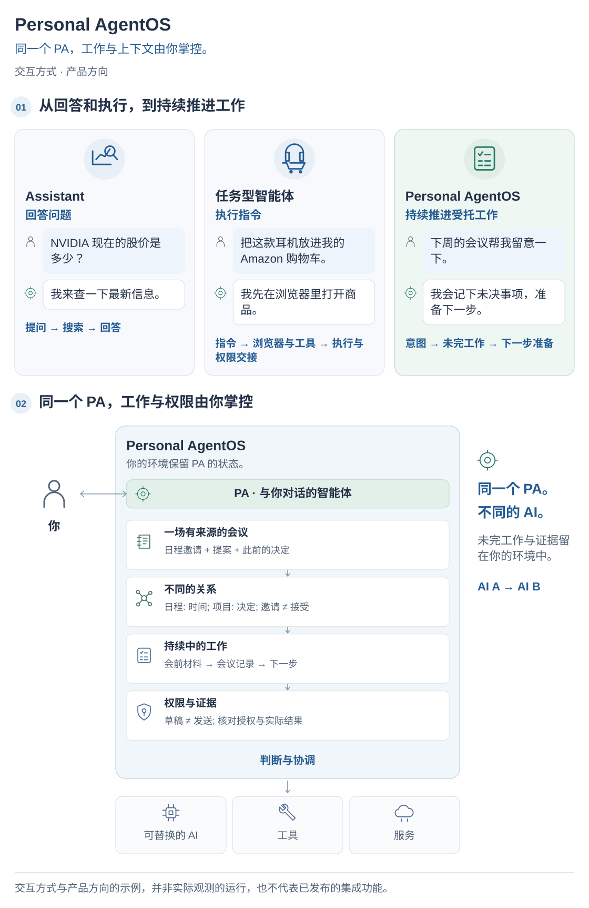
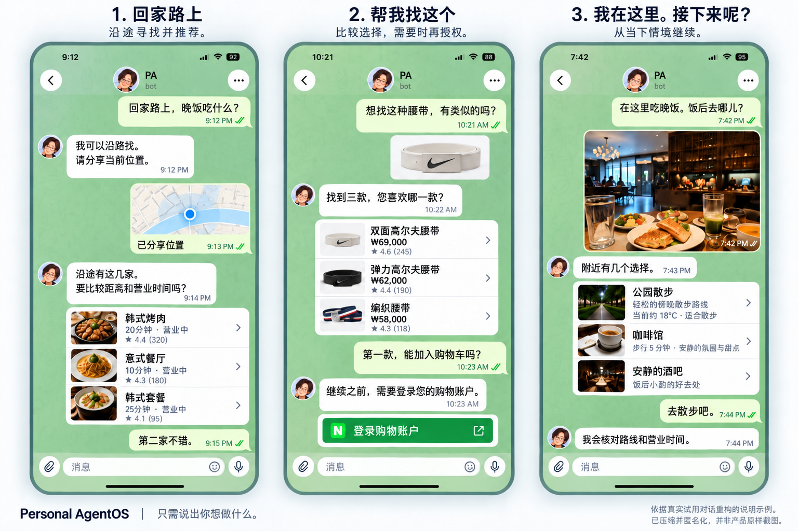

# Personal AgentOS

[English](README.md) | [한국어](README.ko.md) | [简体中文](README.zh-CN.md) | [日本語](README.ja.md)

<!-- readme-parity:v1 -->
<!-- readme-section:hero -->

## 把你交付的事持续做下去的个人智能体

助手在你提问时回答，计算机智能体在你下达指令时行动。但生活和工作并不总是完整的问题或一次性的任务。你提起一场会议，留下一个尚未做出的决定，几天后回来时，事情仍有下一步。

**Personal AgentOS 尝试在由你安装和掌控的环境中，构建与你和你交付的未完事项持续协作的个人智能体（PA）。** 它应保留你的意图、尚未解决的问题和正在等待的事。随着项目发展，它还应准备下一步，在需要你关注时重新提起，并在行动需要你的授权前先询问。

我们把这种持续的关系称为 **Presence**。像助手一样提供帮助是起点；目标是即使工作种类或 AI 发生变化，同一个 PA 仍能继续与你协作。支撑它的是保留下来的上下文、工作和权限，而非亲切的语气。

<!-- readme-section:ownership -->

## 你的智能体，由你掌控

智能体协助的事情越多，谁保有它的记忆、谁决定它能做什么，就越重要。你们积累的背景信息，不应该受限于某一家服务商、某一个模型或某一次会话。

AgentOS 把记忆、正在进行的工作和权限保存在你的环境里。由你选择 AI，决定它可以使用哪些信息、获得哪些访问权限。不同领域的能力服务于同一个人；更好的 AI 出现时，你的智能体可以做更多事，而你不必从头再来。

本地优先（local-first）不等于只在本地（local-only）。你可以选择本地模型或云端模型。使用云端模型时，请求所用的上下文会发送给该服务商。

<!-- readme-section:presence -->

## 让受托的工作继续下去

假设你说：“帮我留意下周的项目会议，我们还要确定提案。”PA 所追求的是把这场会议与尚未解决的决定联系起来，在会前准备有用的信息。会后，当你提供会议记录，它应区分真正接受的后续工作与尚处于建议阶段的事项，继续处理未完的事。它可以准备后续消息；如果发给对方超出了你授予的权限，就应先询问。**这是说明产品方向的场景，不是已观测的运行，也不是当前 Homebrew 版本承诺提供的功能。**

<picture>
  <source media="(max-width: 600px)" srcset="docs/assets/readme/presence-overview.zh-CN.narrow.svg">
  
</picture>

**PA 是与你对话的个人智能体；AgentOS 是由你掌控的环境，在其中保留 PA 的上下文、未完工作、权限和证据。** 判断层把工作交给合适的 AI 和工具，并检查结果。目标是即使底层 AI 更换，你熟悉的 PA 和交付给它的工作仍能继续。**同一个 PA，不同的 AI。**

这需要的不只是一份很长的聊天记录。会议的时间、地点和参与者是**元数据**。**本体结构（ontology）**区分不同视角如何把同一场有来源的会议与其他事项联系起来：

- **日程：** 会议 → 时间、参与者、准备事项。
- **项目：** 会议 → 目标、未决事项、后续责任。
- **承诺：** 请求 → 接受 → 应履行的责任。仅收到邀请并不等于作出承诺。

未决事项作为持续中的工作保留下来。实际权限限制 PA 可以采取的行动；证据区分建议与已经发生的执行。

在会议之外，同一事实也会有不同关联。**资产管理**把有来源的股票持仓与总资产、负债、现金流、计划支出和目标联系起来。**受托投资管理**则须先核对它是否属于管理对象，以及适用的委托范围、限制和获准执行的行动。角色名称或看似合理的推断都不会自动赋予交易权限。

AgentOS 希望在由你掌控的结构中，把事实、各角色的解释、受托工作、实际权限和执行依据联系起来。这样，即使工作中断或 AI 更换，也能找到下一步。这些是设计示例，并非已经提供的资产管理、受托投资服务或已观测的运行结果。主动注意环境变化是超越当前响应式 Presence 的后续方向，并不表示现在已经具备持续监测能力。

<!-- readme-section:conversation -->

## 日常的简短对话，仍是同一个 PA

*这是产品方向示例，并非实际观测的运行，也不代表已发布的购物功能。*

下图将与 PA 的对话浓缩成三个场景：分享位置后寻找回家路上的晚餐、比较高尔夫腰带并在加入购物车前请求登录账户，以及从餐厅照片接着聊附近的散步地点。这是经过编辑的说明性重构图，不是产品画面的原样截图，也不能证明这些集成功能已经发布。

<picture>
  <source media="(max-width: 600px)" srcset="docs/assets/readme/owner-pilot-conversation.zh-CN.png">
  
</picture>

[以完整尺寸查看中文版图片](docs/assets/readme/owner-pilot-conversation.zh-CN.png) · [查看原始参考图](docs/assets/readme/owner-pilot-conversation-reference.jpg)。

图中的对话是：

1. **回家路上的晚餐：**“下班路上要不要吃个晚饭？”PA 先询问当前位置，再列出三家店的距离和营业状态。所有者选了第二家。
2. **帮我找这条腰带：** 所有者发来照片，PA 比较三款腰带。所有者请它把第一款放进购物车时，PA 先要求登录购物账户，然后才会继续。
3. **我在这里，接下来呢？** 所有者发来餐厅照片，问饭后做什么。PA 提供附近的散步、咖啡馆和酒吧选项。所有者选择散步，PA 表示会核对路线和营业时间。

隔了几个小时才说出的简短一句话，也需要这样的连续性。

> “咖啡快没了。”<br>
> 几小时后：“我准备出门了，路上有地方可以买到吗？”<br>
> 之后：“没时间了，就买上次那款吧。”

想要的体验很简单：PA 能接上前文，理解要买的是什么、“上次那款”指什么，结合相关的上下文，只在需要时询问缺少的信息或权限。你继续说话就好，不必自己编排工作流程。

<!-- readme-section:try-today -->

## 先试试看

这个较早的预览版可以让你连接自己的模型并开始对话；它还不能重现上面的会议场景。

在 macOS 上使用 [Homebrew](https://brew.sh)：

```sh
brew install jongtae/agentos/agentos
agentos start
```

1. 浏览器打开 [http://127.0.0.1:8787](http://127.0.0.1:8787/) 的设置页面后，选择 **바로 시작하기**（立即开始）。
2. 连接自己的模型并完成连接测试。可以使用支持工具调用的本地 Ollama 模型，或凭自己的 API 访问权限连接 OpenAI、OpenAI 兼容服务或 Anthropic。目前设置界面为韩语。
3. 在 **설정 → 외부 연결**（设置 → 外部连接）中，填入自己通过 BotFather 创建的机器人的令牌并连接。在 Telegram 中打开生成的配对链接，点击**开始**。
4. 在这个 Telegram 对话里试着说：**“我这周要完成提案初稿。帮我把接下来要做的事分成几个步骤。”**

Homebrew 会一起安装 Python，模型的使用权限需另行准备。对话期间请保持 `agentos start` 运行。[QUICKSTART](QUICKSTART.md) 介绍了模型设置、文件处理、Telegram，以及如何从源码运行最新版本。

**当前阶段：** Homebrew 安装的是较早的预览版 **v1.1.0**（2026-09-23），后续 `main` 中的 Presence 实现尚未包含在此版本中。该版本无法创建日程，调研功能仅部分可用。具体范围见[版本清单](docs/release-manifest.json)。[当前状态](docs/product-status.en.md)区分了哪些功能可以使用、哪些经过验证、哪些仍是目标。

<!-- readme-section:more -->

## 进一步了解

- [为什么做这个项目](VISION.md) · [谁的智能体？](docs/whitepapers/whose-agent.ko.md)（韩语战略白皮书）— AI 更换后，智能体的连续性应由谁掌握。
- [架构与本体](docs/personal-agentos-architecture.en.md) · [Presence](docs/presence-experience-contract.en.md) · [角色与委托](docs/research/role-ontology-and-mandate-2026-10-05.ko.md)（韩语研究提案）— 个人状态、工作和控制权如何支撑跨越不同角色的同一个智能体。
- [研究与参考资料](docs/acknowledgements.en.md) — 设计所参考的个人智能体、记忆、用户模型和信息来源方面的研究与实践。
- [文档导航](docs/README.md) · [参与贡献](CONTRIBUTING.md) — 查阅当前规范与实现，一起改进项目。内部文档以英文为准。

<!-- readme-section:license -->

## 开源

这是一个可以亲自运行、提出质疑、共同改进的探索。它不必是最终答案，也可以成为有意义的开始。

代码采用 [AGPL-3.0-only](LICENSE) 许可证。Personal AgentOS 的名称和标志遵循[商标声明](TRADEMARKS.md)。参考的外部工作列于[致谢与参考资料](docs/acknowledgements.en.md)。
