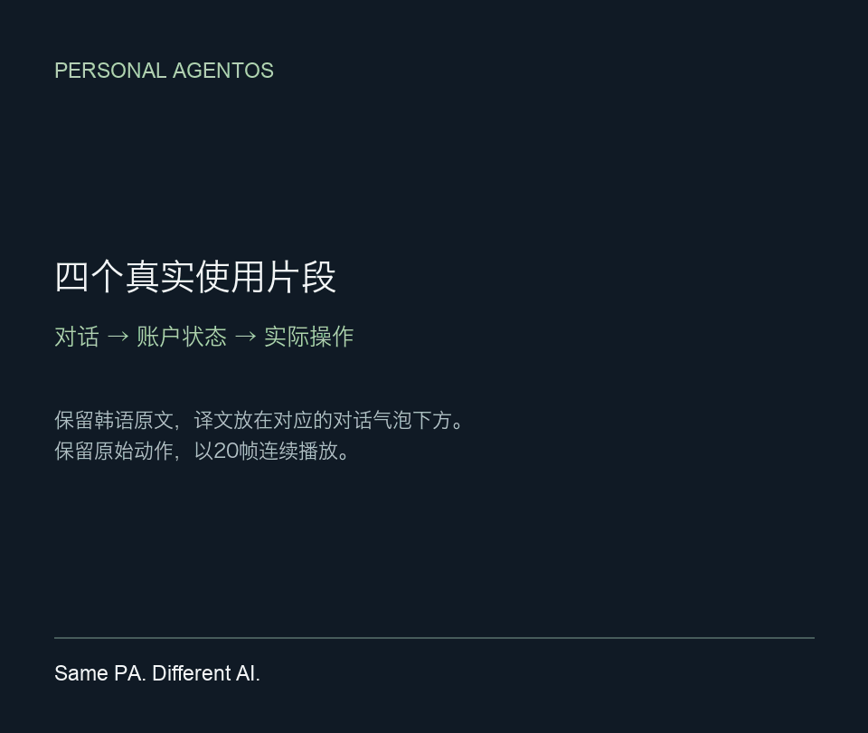

# Personal AgentOS

[English](README.md) | [한국어](README.ko.md) | [简体中文](README.zh-CN.md) | [日本語](README.ja.md)

<!-- readme-parity:v1 -->
<!-- readme-section:hero -->

## 如果贾维斯属于另一家公司？

想象托尼·斯塔克已经和贾维斯一起工作多年：共享背景、留下尚未决定的事情、委托工作，也逐渐形成彼此协作的方式。

现在，更好的 AI 出现了。

**托尼为了使用更好的 AI，就必须失去贾维斯吗？**

仅仅因为智能提供商改变，他就应该失去贾维斯记得的个人背景、尚未完成的工作、已经委托的权限，以及长期形成的协作方式吗？

**AI 可以更换，但你的个人智能体应该仍然属于你。**

Personal AgentOS 在一个由你安装和掌控的开源环境中探索这一想法。PA 的上下文、未完工作、权限和执行证据留在你手中，而底层 AI 可以更换。

目标不是聊天记录更长的聊天机器人，而是一个能够持续存在的个人智能体。

**同一个 PA，不同的 AI。**

想先运行再看？直接跳到[先试试看](#先试试看)；本页其余部分说明这个项目想要达到的目标。

<!-- readme-section:real-use -->

## 四个真实使用片段

这是所有者亲自使用 Personal AgentOS 时录下的画面，剪辑为四个独立场景。保留韩语对话，并在对应的对话节选下方添加中文翻译。点击、滚动和表情反应以20fps连续播放。



[以原始尺寸查看GIF](docs/assets/readme/owner-use/owner-use.zh-CN.gif).

1. **在东滩见朋友：** 出发地点、GTX和晚餐偏好在同一段对话中延续，PA也纠正了先前的路线建议。
2. **查询易买得 / SSG购物车：** 登录后，PA回答购物车里有22件商品，没有午餐肉。
3. **“只要一小罐”：** 所有者说买太多太太会不高兴，所以只加一小罐午餐肉。PA回答已添加一罐200克的午餐肉，商品数量变为 **22 → 23**。
4. **独立的教保文库会话：** 录像显示实际的图书购物车，PA列出4本书的明细。随后讨论积分和折扣，并说明有一步尚未核实。

共同的过程是 **对话 → 所有者的上下文 → 账户状态 → 请求的操作 → 结果回复**。这些是不同的使用片段，并非一次连续的购物流程。登录、等待时间和会话保持仍有不便。

这段所有者试点录像未注明应用版本或模型，也没有展示AI切换或付款完成。[录像来源与剪辑记录](docs/assets/readme/owner-use/README.md)区分画面可见事实、PA的回复和特定发行版本的验证。

<!-- readme-section:ownership -->

## 什么应该继续属于你？

这个思想实验会变成一个具体的设计问题：当底层智能更换时，哪些东西应该继续由所有者掌握？[战略白皮书](docs/whitepapers/whose-agent.ko.md)从产品和产业结构进一步展开这一问题。

AgentOS 把记忆、正在进行的工作和权限保存在你的环境里。由你选择 AI，决定它可以使用哪些信息、获得哪些访问权限。不同领域的能力服务于同一个人；更好的 AI 出现时，你的智能体可以做更多事，而你不必从头再来。

其中两项控制已包含在当前发布版本中：当你选择的 AI 把一条事实保存为记忆时，它会在保存后告知你并提供精确的撤销；每项受托工作都会记录使用了你的哪些信息以及这些信息发送到了哪里。

本地优先（local-first）不等于只在本地（local-only）。你可以选择本地模型或云端模型。使用云端模型时，请求所用的上下文会发送给该服务商。

<!-- readme-section:presence -->

## 受托的工作如何继续？

*下面的会议是说明产品方向的假设场景。目前的 Homebrew 版本尚无按此顺序运行的观测记录。*

假设你说：“帮我留意下周的项目会议，我们还要确定提案。”PA 会尝试把你允许访问的日程邀请、提案和此前的决定记录关联到同一场会议，找出尚未解决的问题。收到邀请不等于已接受参会或后续责任。会前可以准备决策所需材料；之后你提供会议记录时，再更新未完工作。后续邮件可以先做成**草稿**，但草稿并不等于发送。没有发送权限就先询问，只有工具确认结果后才报告“已发送”。

<picture>
  <source media="(max-width: 600px)" srcset="docs/assets/readme/presence-overview.zh-CN.narrow.svg">
  
</picture>

**PA 是与你对话的个人智能体；AgentOS 是由你掌控的环境，在其中保留 PA 的上下文、未完工作、权限和证据。** 判断层把工作交给合适的 AI 和工具，并检查结果。目标是即使底层 AI 更换，你熟悉的 PA 和交付给它的工作仍能继续。**同一个 PA，不同的 AI。**

只保存很长的聊天记录不足以让工作继续。**同一场会议**有时间、地点和参与者等**元数据**。**本体（ontology）**则区分它与其他事项之间的关系：

- **作为日程的会议：** 何时与谁见面，要准备什么？
- **同一会议在项目中：** 提案的哪个决定还未作出？
- **同一会议与承诺：** 谁提出后续工作，谁真正接受了？

这不是三场不同的会议，而是同一场有来源的会议所关联的不同关系。会议标识、时间和邀请有记录依据；是否紧急、由谁负责的判断还需要说明视角和理由。邀请不是已接受的承诺。缺少记录不等于事情未发生；来源冲突时也不能悄悄用一方覆盖另一方。未决事项留作持续工作，**未确认的权限不等于行动许可**；证据将草稿与实际发送区分开。

AgentOS 希望在由你掌控的结构中，把事实、各角色的解释、受托工作、实际权限和执行依据联系起来。这样，即使工作中断或 AI 更换，也能找到下一步。同样的原则也适用于会议之外；[架构与本体](docs/personal-agentos-architecture.en.md#facts-and-role-interpretations)以账户余额为例加以说明。这些是设计示例，并非已观测的运行结果。主动注意环境变化是超越当前响应式 Presence 的后续方向，并不表示现在已经具备持续监测能力。

<!-- readme-section:conversation -->

## 日常的简短对话，仍是同一个 PA

*这是基于所有者试点对话浓缩并脱敏后的重构图。它不是那些对话的证据记录；图中的地图和购物集成属于产品方向，并非已发布的功能。*

下图将与 PA 的对话浓缩成三个场景：分享位置后寻找回家路上的晚餐、比较高尔夫腰带并在加入购物车前请求登录账户，以及从餐厅照片接着聊附近的散步地点。这是经过编辑的说明性重构图，不是产品画面的原样截图，也不能证明这些集成功能已经发布。

<picture>
  <source media="(max-width: 600px)" srcset="docs/assets/readme/owner-pilot-conversation.zh-CN.png">
  
</picture>

[以完整尺寸查看中文版图片](docs/assets/readme/owner-pilot-conversation.zh-CN.png) · [查看原始参考图](docs/assets/readme/owner-pilot-conversation-reference.jpg)。

图中只浓缩了对话。要提出有用的建议，PA 必须在你允许的范围内使用相关信息，遇到缺失或过时的信息就重新确认。

1. **回家路上的晚餐：**“下班路上吃什么？”中的“路上”是从当前位置前往住处的路线。PA 需要确认工作地点和住处是否已获准保存及使用、现在在哪里、是否有人同行，以及当前时间。图中它先询问当前位置，再结合路线、距离和营业状态给出三家店，你选择第二家。
2. **帮我找这条腰带：** 外观相似并不保证合适。如果你分享过衣物类型和颜色、偏好或预算，PA 应一并比较；没有的话只问必要信息。图中它比较三款腰带，在把选定商品加入购物车前请求登录。加入购物车与付款是两种不同的行动。加入购物车这一步本身任务型智能体也会做；区别在于 PA 把你的上下文和偏好带入选择，并在你的账户和权限边界处停下，而不是停在点击之前。
3. **我在这里，接下来呢？** 餐厅照片和共享的当前位置只是起点。同伴、约会目的、时间和天气都可能改变合适的建议。PA 不应编造未知情况；需要时先确认，再推荐散步、咖啡馆或酒吧。你选散步后，它应再次核对路线和营业时间。

三个场景遵循同一条路径：**话语和照片 → 获准使用且有来源、时间的上下文 → 必要的询问和工具 → 行动边界 → 已核实的结果**。图示说明这种关系，并不表示所有信息已被收集，或地图、购物集成已发布。

隔了几个小时才说出的简短一句话，也需要这样的连续性。

> “咖啡快没了。”<br>
> 几小时后：“我准备出门了，路上有地方可以买到吗？”<br>
> 之后：“没时间了，就买上次那款吧。”

想要的体验很简单：PA 能接上前文，理解要买的是什么、“上次那款”指什么，结合相关的上下文，只在需要时询问缺少的信息或权限。你继续说话就好，不必自己编排工作流程。

<!-- readme-section:try-today -->

## 先试试看

公开版本可以让你连接自己的模型并开始对话；上面的完整会议场景尚未作为该版本的端到端旅程得到验证。

在 macOS 上使用 [Homebrew](https://brew.sh)：

```sh
brew install jongtae/agentos/agentos
agentos start
```

1. 浏览器打开 [http://127.0.0.1:8787](http://127.0.0.1:8787/) 的设置页面后，选择 **바로 시작하기**（立即开始）。
2. 连接自己的模型并完成连接测试。可以使用支持工具调用的本地 Ollama 模型，或凭自己的 API 访问权限连接 OpenAI、OpenAI 兼容服务或 Anthropic。也可以用 Codex 或 Claude Code 订阅代替 API 密钥（[QUICKSTART](QUICKSTART.md)）。目前设置界面为韩语。
3. 在 **설정 → 외부 연결**（设置 → 外部连接）中，填入自己通过 BotFather 创建的机器人的令牌并连接。在 Telegram 中打开生成的配对链接，点击**开始**。
4. 在这个 Telegram 对话里试着说：**“我这周要完成提案初稿。帮我把接下来要做的事分成几个步骤。”**

Homebrew 会一起安装 Python，模型的使用权限需另行准备。对话期间请保持 `agentos start` 运行。[QUICKSTART](QUICKSTART.md) 介绍了模型设置、文件处理、Telegram，以及如何从源码运行最新版本。

**当前阶段：** Homebrew 安装的是从已打标签的 main 提交构建的 **v1.1.1**（2026-10-07）。会议示意图和重构对话属于产品方向。真实使用GIF记录的是独立的所有者试点会话，并非该发行版本的端到端验证。[版本清单](docs/release-manifest.json)记录所含源码和安装检查；[当前状态](docs/product-status.en.md)区分可用行为、测试依据、所有者试用依据和未来方向。

<!-- readme-section:more -->

## 进一步了解

- [为什么做这个项目](VISION.md) · [谁的智能体？](docs/whitepapers/whose-agent.ko.md)（韩语战略白皮书）— AI 更换后，智能体的连续性应由谁掌握。
- [架构与本体](docs/personal-agentos-architecture.en.md) · [Presence](docs/presence-experience-contract.en.md) · [角色与委托](docs/research/role-ontology-and-mandate-2026-10-05.ko.md)（韩语研究提案）— 个人状态、工作和控制权如何支撑跨越不同角色的同一个智能体。
- [研究与参考资料](docs/acknowledgements.en.md) — 设计所参考的个人智能体、记忆、用户模型和信息来源方面的研究与实践。
- [文档导航](docs/README.md) · [参与贡献](CONTRIBUTING.md) — 查阅当前规范与实现，一起改进项目。内部文档以英文为准。

<!-- readme-section:license -->

## 开源

这是一个可以亲自运行、提出质疑、共同改进的探索。它不必是最终答案，也可以成为有意义的开始。

代码采用 [AGPL-3.0-only](LICENSE) 许可证。Personal AgentOS 的名称和标志遵循[商标声明](TRADEMARKS.md)。参考的外部工作列于[致谢与参考资料](docs/acknowledgements.en.md)。
