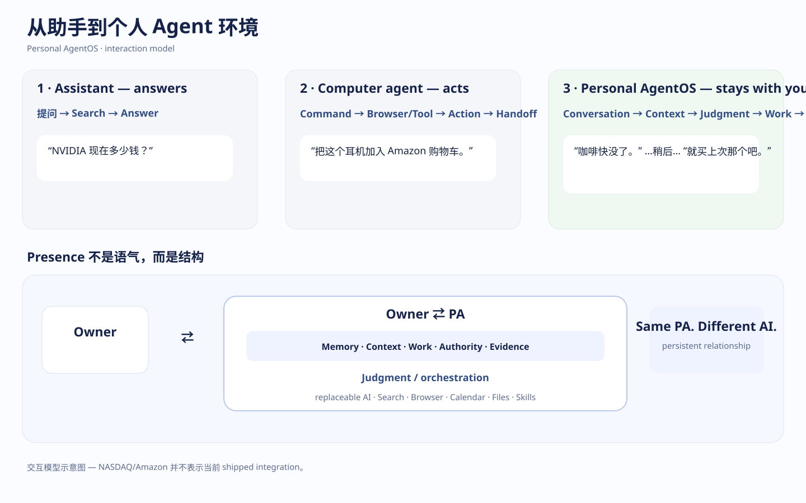
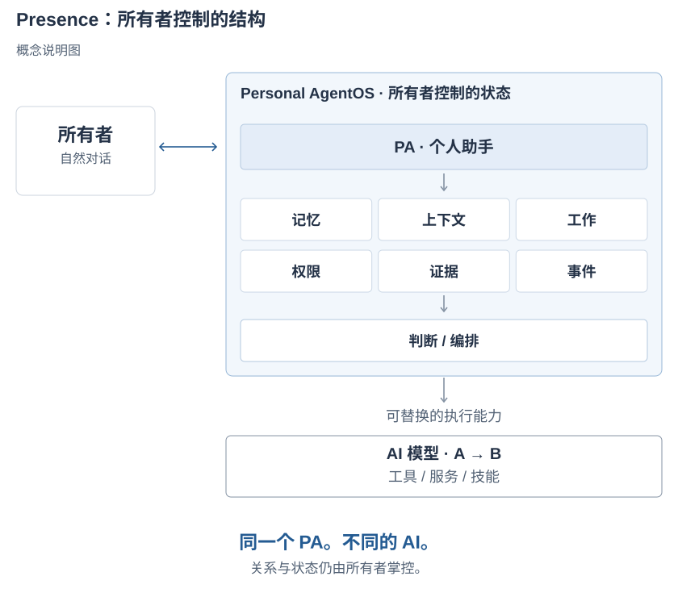
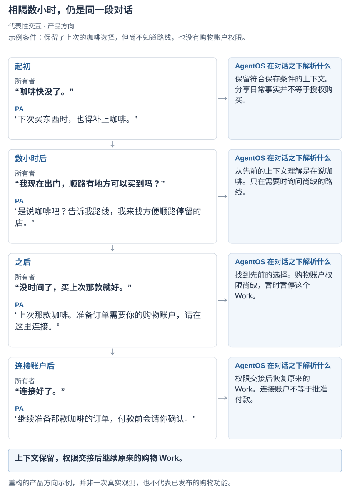
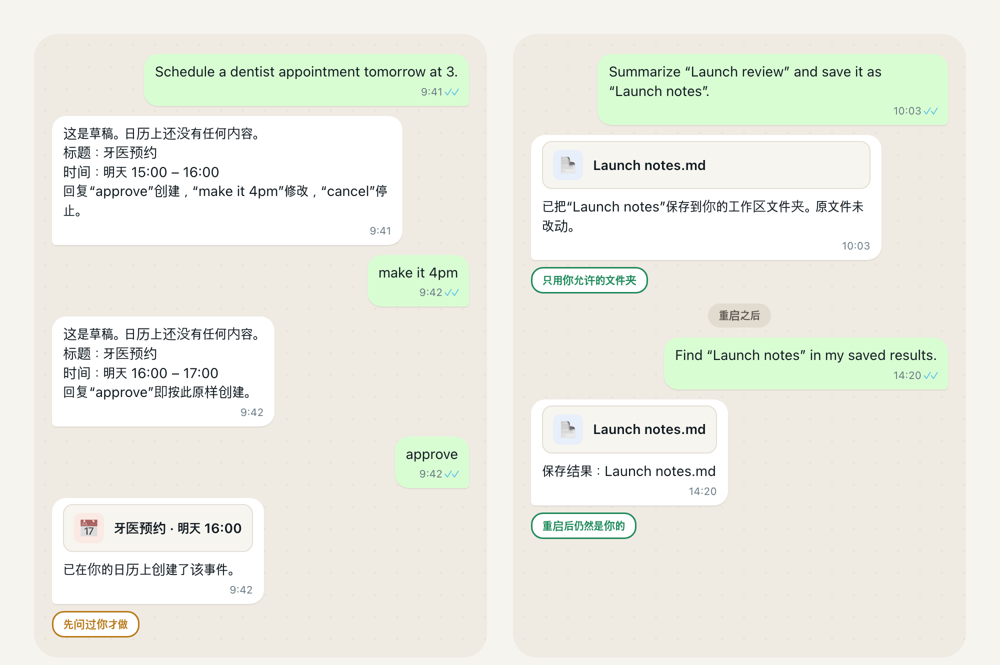
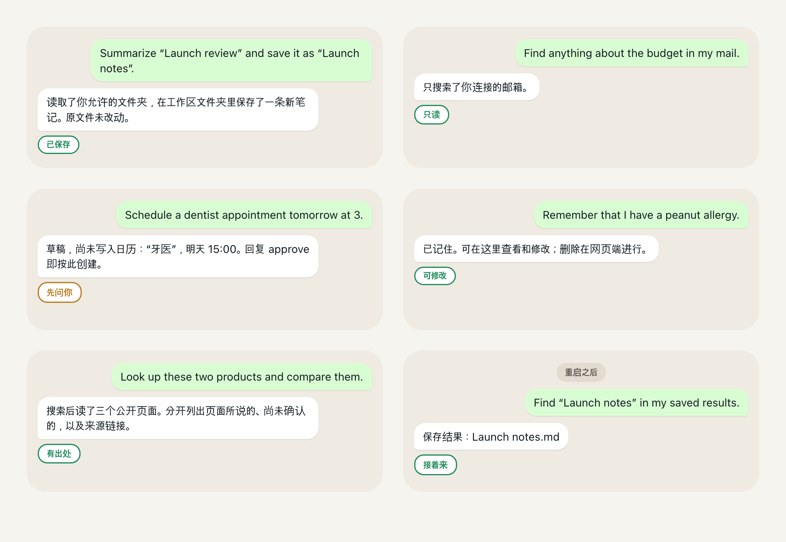

# Personal AgentOS

[English](README.md) | [한국어](README.ko.md) | [简体中文](README.zh-CN.md) | [日本語](README.ja.md)

<!-- readme-parity:v1 -->
<!-- readme-section:hero -->

## 留在你手中的个人 AI 环境。

**一个助手。可替换的 AI。由你掌控的记忆、上下文、工具和权限。**

本地优先（local-first）不等于只在本地（local-only）。Personal AgentOS 可以使用本地或托管模型；使用托管模型时，获准的上下文会发送给该提供商。

<!-- readme-section:concept -->

## 一句话说

> 내가 설치하고 통제하는 개인 AI 환경에서, 좋은 기본 기능으로 실제 일을 끝내고, 더 좋은 에이전트를 앱처럼 설치·교체해도 내 기억과 결과는 나에게 남는다.
>
> *在我自己安装、自己掌控的个人 AI 环境里，好用的基础功能把真正的事情做完；即使像安装应用一样安装或更换更好的智能体，我的记忆和成果也仍然属于我。*

这是作者的原话，保留韩语原文。这个项目为什么存在，以及定义这个理念的文档，都汇集在一页上：[VISION.md](VISION.md)（英文）

<!-- readme-section:interaction-model -->

## 从助手到个人 Agent 环境

<picture>
  <source media="(max-width: 600px)" srcset="docs/assets/readme/interaction-model.zh-CN.narrow.svg">
  
</picture>

区别不在于 AI 能不能查询股价或点击**加入购物车**。助手已经能回答问题，computer-use agent 也已经能执行命令。Personal AgentOS 把**持续的关系、owner context、authority 和 work state**从 AI provider 中移出来，放在由 owner 控制的环境里。

| Interaction model | Owner 做什么 | 系统主要保留什么 |
| --- | --- | --- |
| **Assistant — answers** | 像“现在 NVIDIA 的价格是多少？”这样提问 | 当前会话和答案 |
| **Computer agent — acts** | 像“把这个耳机加入 Amazon 购物车”这样下命令 | task、browser/tool state 和 action/handoff |
| **Personal AgentOS — stays with you** | 像“咖啡快没了。”→之后“就买上次那个吧。”这样跨时间自然交谈 | 独立于某个 AI 持续存在的 Memory、Context、Work、Authority、Evidence |

上面的 NASDAQ/Amazon 是**交互模型示例**，并不表示这些服务已经作为当前 shipped integration 提供。

### Presence 不是语气，而是 architecture

Owner 不需要分别和不断变化的 model、tool、workflow 对话，而是始终和一个 **PA** 对话。

<picture>
  <source media="(max-width: 600px)" srcset="docs/assets/readme/presence.zh-CN.narrow.svg">
  
</picture>

因此，人可以只说一个不完整的生活事实，几小时后继续说；在需要时才发送照片或位置；只有真正的外部 action 需要 account/computer authority 时才 handoff。不必把日常 intent 翻译成 tool、model、workflow 或 memory command。

**代表性交互 — 产品方向。** 这是将所有者提供的交互模式浓缩而成的示例，并不是对一次完整观测运行的重现。

<picture>
  <source media="(max-width: 600px)" srcset="docs/assets/readme/continuing-conversation.zh-CN.narrow.svg">
  
</picture>

> **早上：**“咖啡快没了。”  
> **下午：**“今天工作可能会晚一点结束。”  
> **晚上：**“我现在要走了，路上有地方可以买到吗？”  
> **稍后：**“没时间了，就买上次那个吧。”

在这段普通对话下面，AgentOS 可以按需解析 prior context、calendar/time、location、search 和持续中的 Work，并且只在真正需要 authority 时进行 handoff。这段对话是为了说明而一般化、压缩的示例；当前 implementation evidence 会在下文单独分类。

**Same PA. Different AI.** 即使底层 model 改变，目标也是让 owner 不必从头重建关系。

<!-- readme-section:working-software -->

## 不只是一个概念

当前仓库包含公开版本之后的实现。可替换的 Main AI 与 Judgment AI、持久 Memory、Telegram 对话、按上下文交接权限、搜索与浏览器中介、准备任务及基于 Evidence 的恢复，都有已合并代码和 deterministic / fixture 验证。这些证据并不意味着这里描述的完整体验已经在实际外部服务上得到观测。

我们区分不同的证据：

- **公开版本：** release manifest 记录了 installed-smoke 和 synthetic journey 证据，但不包含当前 `main` 的全部内容。
- **当前 `main`：** 已合并代码与 deterministic / fixture 证据支持新的 Secretary、Presence、Decision 和 execution 合约。合约或测试本身并不证明实际服务的运行。
- **所有者试用证据：** 在选定准确的 Telegram / 桌面观测、遮盖个人信息并关联 revision / evidence 记录之前，公开的 owner-live 声明仍然待定。
- **产品方向：** 上面的代表性对话，以及购物、预订等场景，在实现和证据足以支持更强声明之前，都属于产品方向。

参见 [product status](docs/product-status.en.md)、[release manifest](docs/release-manifest.json) 与 [documentation map](docs/README.md)。

### 公开版本验证流程示意

下面两段场景是对 v1 synthetic 日历与文件验证流程的重构和浓缩示意，并非真实账户的截图。回复译自韩语。公开版本具有本地 installed-smoke 证据，但 release manifest 并未声称观测到了 Google / Telegram 的实际运行。



<!-- readme-section:try-today -->

## 安装

```sh
brew install jongtae/agentos/agentos
agentos start
```

你会看到：

```text
AgentOS: http://127.0.0.1:8787/
초기 설정 링크: /Users/you/.local/share/agentos/private/setup-link.txt (개인 파일)
```

浏览器会在该地址打开。按 **바로 시작하기**（立即开始），连接一个模型，就可以对话了。界面目前是韩语；请求可以用韩语或英语。

**Homebrew 安装的是最新公开发布版 `v1.1.0`（2026-09-23）。** [release manifest](docs/release-manifest.json) 记录了该构建的内容与限制：日程创建尚不可达（J4），调研仅部分支持（J5）。下面的 synthetic 场景并不保证每个流程都能在该构建中运行。 之后合并到 `main` 的工作不在该构建里，所以在下一次发布之前 Homebrew 构建会落后于 `main`；要用最新代码，请从源码检出运行（`git clone https://github.com/Jongtae/agentos.git`，然后在 Python 3.12 或更新上执行 `python3 -m pip install -e '.[mcp-host]'`）。每一步都在 [QUICKSTART](QUICKSTART.md) 里。

<!-- capability:current-supported-slice -->
<!-- readme-section:scenes-today -->

## 接下来还能这样



下面这些请求背后的流程都由本项目的自动化首次用户检查端到端跑通，用本地文件夹和模拟的邮件、日程、网页服务，而不是真实账户。措辞就是今天实际会被路由的措辞。

- **文件。** *Summarize “Launch review” and save it as “Launch notes”.* 它读取你允许的文件夹，在你选定的工作区文件夹里写入一条新笔记，原文件保持不动。
- **邮件。** *Find anything about the budget in my mail.* 它只搜索你连接的邮箱，并展示找到的内容。
- **日程。** *Schedule a dentist appointment tomorrow at 3.* 它展示精确的草稿，只有你说 approve 之后才创建事件。“make it 4pm”和“cancel”在同一份草稿上都有效。
- **公开版本 的记忆。** *Remember that I have a peanut allergy.* 公开构建提供持久 Memory 和 candidate 审核。**当前 `main` 已经进一步演进：** 所有者自己的 AI 会直接保存可保存且非 secret 的事实，告诉你记住了什么，并提供有期限的 undo；第三方/委派 writer 仍走 candidate/approval 路径。
- **调研。** *Look up these two products and compare them.* 它先搜索，再读取其中最多三个公开页面，返回页面所说的内容、仍未确认的内容，以及链接。

然后重启应用，这样说：*Find “Launch notes” in my saved results.* 保存的结果、你允许的文件夹、记忆和 Telegram 配对在重启后都还在。

<!-- readme-section:settings -->

## 你需要的设置

- **一个模型。** 本地 Ollama 服务器、OpenAI 兼容端点或 Anthropic，用你自己的访问权限连接。文件场景需要其中一种直接连接。
- **两个文件夹。** 在 **내 에이전트 관리 → 내 자료**（我的代理管理 → 我的资料）里：一个它可以读取的参考文件夹，一个它可以写入的工作区文件夹。此外一律不碰。使用托管模型时，文件场景之前先批准一次文档共享。
- **邮件和日程，可选。** 通过你自己创建的 Google Cloud OAuth 客户端连接你的 Google 账户，各运行一次设置命令（`agentos gmail-config`、`agentos calendar-config`），然后分别连接读取和写入。精确步骤见 QUICKSTART。
- **Telegram，可选。** 把 BotFather 生成的机器人令牌粘贴到设置里，然后打开配对链接。只有你配对的账户能和它对话。

就这些。

<!-- readme-section:more -->

## 更多

[现在能做什么，哪里还有摩擦](docs/product-status.en.md)（英文） · [这是要去的方向](docs/product-status.en.md#where-this-is-going) · [为什么不一样](docs/product-status.en.md#why-this-is-different) · [内部结构](docs/product-status.en.md#under-the-hood-briefly) · 许可证 [AGPL-3.0-only](LICENSE) 与[商标声明](TRADEMARKS.md) · [它是怎么构建的](AGENTS.md) · [致谢与参考资料](docs/acknowledgements.en.md)（英文）
