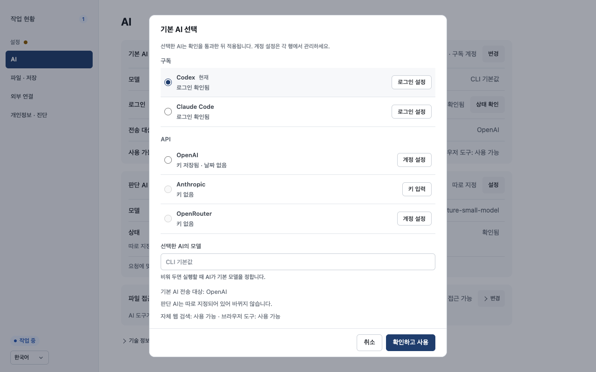
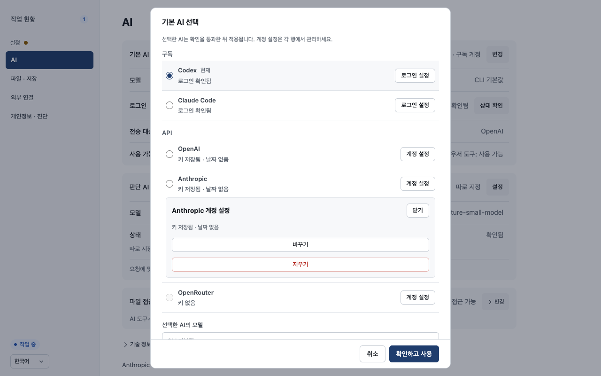
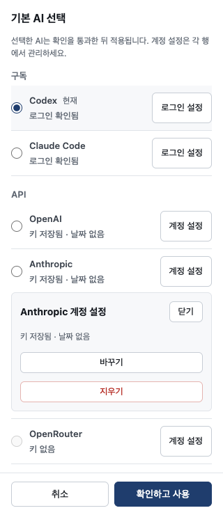

# UX-PREF-02 — AI chooser evidence

Issue #782; parent #780. Implements specification A03–A07 and chooser portion of A10.

## Observed UI

The checked-out production assets were served by the existing local browser fixture on port 18789. `/app.js` and `/style.css` matched checkout bytes. Synthetic route responses and intercepted mutations were used; no actual account, secret, login, model, provider or external effect was exercised.

- Five providers remain in fixed order; current configuration is selected.
- Radio selection changes the draft; one account editor and one model editor are independent.
- Unsaved secret input survives route selection; dirty account switching and Escape offer keep/discard.
- Discard/reopen resets model drafts to observed configuration.
- One pending activation stays guarded after close/reopen; a late response leaves the new dialog open.
- Synthetic activation refusal retains route/model and reports an error. A key save sends only its key endpoint and reports success after refresh consumes the overview notice.
- Request spy observed exactly two intended activation calls (success and refusal) and one key save, with no duplicate activation.
- Desktop 1280×800: collapsed list and footer fit. At 320×740: document width 320 and footer bottom 740; body scrolls independently. This is browser viewport evidence, not an on-device virtual-keyboard claim.

## Capture asset hashes

- `index.html`: `c3c62b50cd4c7335afbf6a991f80ffa3f860a8cd5f2d539ae7cc99b74f62bceb`
- `app.js`: `0dceb1504cebcfa6d50785314bb8a5f4ac911feb47dbbb14ec106eb9feb4b1aa`
- `style.css`: `ab1cec998df190e09beed0113ad6a6e4635f33993be3e17eab2a0ed3d14c1b13`

Unit tests preserve credential transport shapes, async session isolation, missing-key eligibility, cached model suggestions, sidecar model clearing and API failure retention. Required CI applies to the PR head. Final integrated evidence is delivered in #784.

## Consolidated review remediation
Clean account panels rebuild when observed credential state changes; actual dirty secret drafts retain node/value/caret. OAuth completion settles the in-dialog notice. Candidate failures retain their translated reason. Repeated replacement, pending-login dismissal and saved-credential/discard callback races have explicit regression coverage. The browser walkthrough and captures were repeated on these assets.
