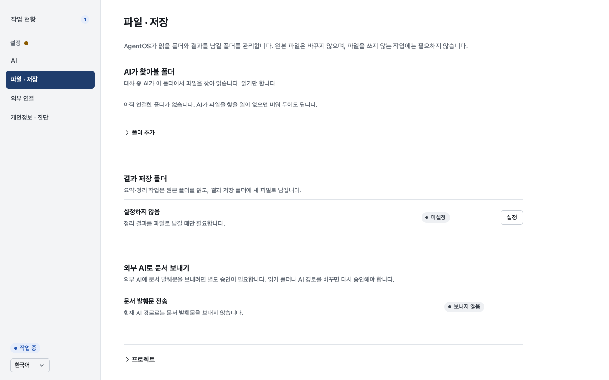
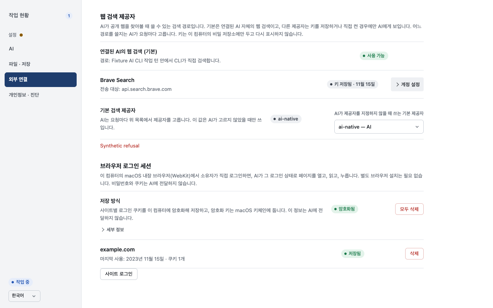
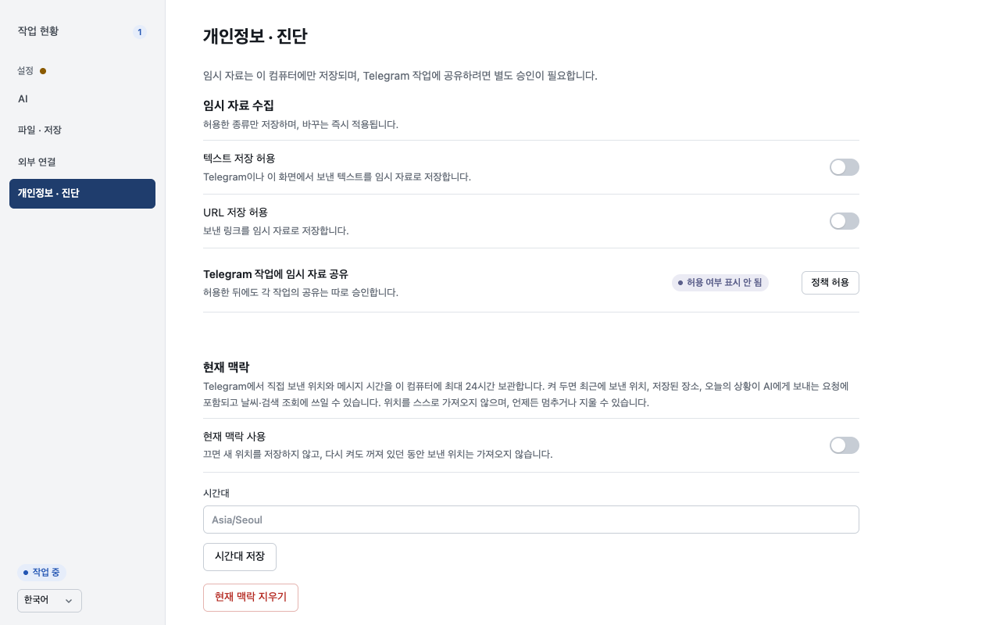

# UX-PREF-03 — Existing settings management

Issue #783; parent #780. Implements existing-settings portion of A09, with relevant A07/A10 retention and reflow checks.

## Changes and preserved behavior

- Reference-folder entry and optional projects use native disclosures. Existing result-folder editing, pending requests, document approval and off-Mac refusal/draft behavior stay intact. Work-to-project navigation opens its target first.
- Browser availability and saved sessions precede explicit site login. The static URL editor retains its draft through polling and close/reopen. Platform/Google limitations, encryption details and deletion receipts remain.
- Search credentials show neutral saved state. Management is disclosed. Actual secret input nodes/caret survive changing observed state; failed saves keep the draft. Pending key operations guard repeated submit, cancellation and editor switching. Native search/Bing/default controls remain independent.
- Privacy collection/sharing and current-context controls precede retained records; retention/transmission/pause/deletion explanations remain. Developer settings are disclosed.
- A changed settings destination opens at the top. Same-destination scroll and retained-item back navigation are preserved.

## Evidence

115 focused tests and 26 subtests passed across settings, browser, search, UI quality, management readiness, current context, owner profile and settings orchestrator. Node syntax and diff checks passed. Required CI applies to the PR head.

Production assets served by the existing fixture on port18789 matched checkout bytes below. Synthetic browser/search read models and an intercepted refused key save were used. Browser walkthrough observed retained folder/URL/key drafts, retained key caret through polling, failed-save recovery, focus return, one explicit key POST, privacy section order and scroll reset. At320×740 all three panes had document width320. Desktop captures are1280×800. No live login, credential, provider, filesystem grant or external effect was exercised.

## Capture asset hashes

- `index.html`: `8ed6828ec581167db12fc6368cf7d1b110bd36e8fa2c8b886c39946e838256e2`
- `app.js`: `6bb7e3b5ddb899c0d2ff168193ca63c42beaf7f817625cdcc027c8f467874859`
- `style.css`: `4b34f2539ddd26375dc1454a1a2cf653fc9453bad005b2e8988fbf798d5800ad`
