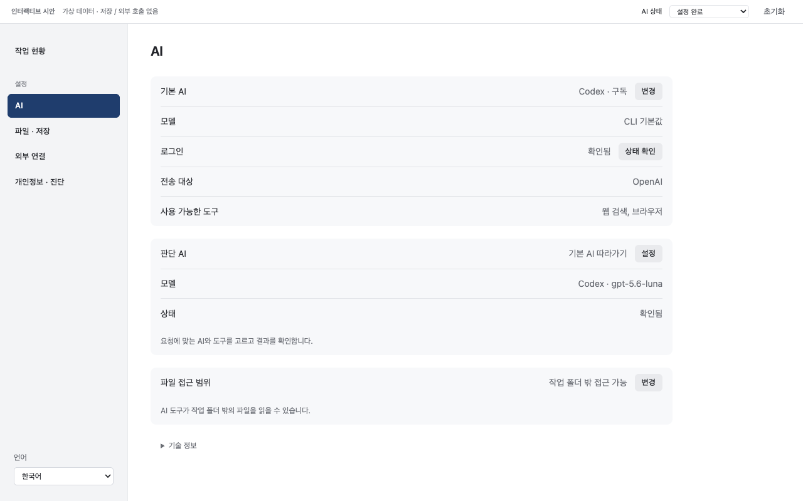
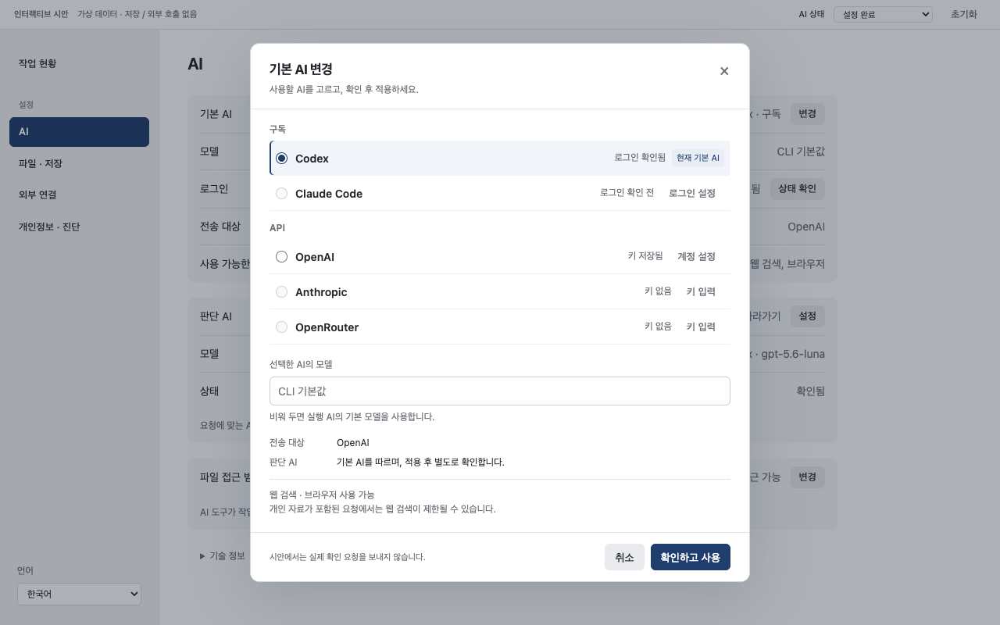

# 설정 UI/UX 개선 명세 — 소유자 검토본

- 명세 이슈: [#766](https://github.com/Jongtae/agentos/issues/766)
- 작성일: 2026-09-28
- 기준: 소유자의 요청·첨부 화면과 `main`의 `00ccf640e69208c7d911469e7521bda5b54392c4` 코드
- [영문 구현 명세](settings-ux-renewal-spec.en.md)가 정본입니다. 이 문서는 같은 결정을 한국어로 설명합니다.
- 이번 산출물은 **개선안·구현 명세와 독립 실행 시안**입니다. 실제 앱 코드는 변경하지 않습니다. 아래 목표 화면은 아직 구현된 화면이 아니며, 후속 구현 단위를 자동으로 시작하지 않습니다.


## 시안 보기

[인터랙티브 시안 열기](settings-ux-renewal-preview.html) · [영문 구현 명세](settings-ux-renewal-spec.en.md)

시안 상단에서 AI 상태를 바꾸고, 사이드바의 설정 화면과 언어를 선택할 수 있습니다. 기본 AI의 `변경`을 누르면 선택창과 계정 편집 모습을 확인할 수 있습니다. 실제 앱이나 계정에 영향을 주지 않습니다.





[계정 편집 시안](settings-ux-renewal-preview/account.png) · [모바일 시안](settings-ux-renewal-preview/mobile.png)

시안은 가상 데이터로 레이아웃과 일부 조작을 보여줍니다. 실제 인증·키 삭제·비동기 검증·실패 복구까지 구현한 제품이 아닙니다. 키 입력은 예시 값으로 고정되어 있고, 시안의 언어 선택은 메모리에서만 바뀝니다. 실제 앱의 언어 설정에는 접근하지 않습니다. 예시 피드백 일부의 번역과 전체 접근성 검증은 제품 구현에서 완료할 항목입니다.

## 1. 제품과 이번 개선의 목표

Personal AgentOS는 내가 선택한 AI가 내 상황을 이해하고 일을 수행하며, 기억·작업·결과·권한은 내 환경에 남는 개인 비서입니다. 판단 AI는 요청에 맞는 실행 AI와 도구를 고르고 결과를 확인합니다. 사용자가 내부 실행 과정을 매번 조립하는 부담을 줄여야 합니다.

로컬 웹의 역할은 현재 **작업 현황 확인과 설정 관리**입니다. 기존 대화 채널, 작업 이력, 결과물 접근을 유지합니다. 장기적인 비서·기억·Attention·가족 협업 방향은 이번 화면 개선에 새 기능을 추가하라는 뜻이 아닙니다.

설정 화면의 목표는 다음 세 가지입니다.

1. 지금 무엇이 설정되어 있고, 어디까지 확인됐는지 바로 이해한다.
2. 필요한 항목을 바꾸고, 성공·실패와 영향을 이해한다.
3. 원래 하던 일로 돌아간다.

Codex·Claude 앱은 사용 밀도와 일관된 조작의 참고 기준입니다. 큰 제목, 설명 카드, 기능 소개를 늘리는 방향은 채택하지 않습니다.

## 2. 현재 문제와 개선 결정

첨부 화면에는 `AI 연결`과 큰 제공자 카드가 보입니다. 확인한 최신 코드에는 이미 `AI 설정`과 더 평평한 선택 행이 있으므로, 첨부 화면 전체를 최신 코드의 재현 결과라고 단정할 수 없습니다. 당시 로컬 주소도 연결되지 않아 최신 앱 화면을 직접 대조하지 못했습니다. 아래는 화면 관찰과 코드 확인을 구분한 개선 목록입니다.

| 문제 | 확인 근거 | 개선 결정 |
| --- | --- | --- |
| 기본으로 선택된 AI가 실제 정상 동작 중인 것처럼 보임 | `mainAiView`에 선택 상태와 로그인 확인 상태가 섞임 | `기본으로 설정됨`과 `로그인/연결 확인됨`을 구분 |
| 긴 CLI 격리 설명이 주 화면을 차지함 | 최신 `renderExecutionConnection`에도 원시 제한·버전 문자열이 본문에 노출 | 짧은 접근 범위 설명은 표시하고 상세 진단은 접기 |
| AI 선택과 키·토큰 관리가 한꺼번에 펼쳐짐 | `chooserRow`에 여러 종류의 입력·삭제·확인 동작이 혼재 | 고정 순서의 선택 목록과 한 번에 하나의 계정 편집 패널 |
| 판단 AI가 ‘대화 해석’만 하는 것처럼 보임 | 현재 제목과 실제 오케스트레이션 역할의 차이 | 제목은 `판단 AI`, 역할 설명은 요청에 맞는 AI·도구 선택과 결과 확인 |
| 모델·전송 대상·확인 시각·제약이 한 문단에 섞임 | `mainAiView`의 긴 설명 문자열 | 항목별 짧은 정보와 확인 상태를 분리 |
| 선택창이 길어지고 하단 내용이 가려질 가능성 | 첨부 화면 관찰; 최신 CSS의 모든 상태에서 재현됐다는 뜻은 아님 | 본문만 스크롤하고 하단 버튼 영역은 별도 배치 |
| 완료 처리와 사용자가 보는 결과가 일치하지 않음 | 이전 머지 이후에도 같은 불편 제기 | 실행 중인 빌드와 화면 상태를 확인한 전후 자료로 완료 판단 |

이는 사용자 실험으로 수치화한 결과가 아니라 소유자 피드백과 코드에 근거한 전문가 검토입니다. 소유자 화면·계정·개인 경로는 공개 저장소 증빙에 복사하지 않습니다.

## 3. 화면 구성

기존 `작업 현황`과 설정 항목인 `AI`, `파일 · 저장`, `외부 연결`, `개인정보 · 진단`을 **한 개의 사이드바**에 배치합니다. 첨부한 시스템 설정 화면의 단순한 접근을 따릅니다. 화면 안의 로고, 제공자 장식 아이콘, 두 번째 메뉴 열, 반복되는 설정 제목은 제거합니다. 앱 이름은 브라우저·창 제목으로 식별할 수 있습니다. 새 대시보드·메뉴·상시 안내 패널은 추가하지 않습니다.

설정은 **왼쪽 항목명, 오른쪽 현재 값과 조작**이 정렬되는 목록으로 구성합니다. 기본 AI와 판단 AI는 독립된 설정 그룹으로 둡니다. 판단 AI는 작업을 배분하고 평가하는 역할이며, 기본 AI를 따르는 것은 설정 옵션일 뿐 상하 관계가 아닙니다. 정상 상태는 담백한 텍스트로, 주의가 필요한 상태만 강조합니다. 시스템 글꼴과 기존 14px 기본 글자, 중립색, 파란 강조색을 사용합니다. 넓은 모니터에서도 본문은 약 720–840 CSS px의 읽기 편한 폭을 목표로 합니다. 이 수치는 이 제품의 설계 목표입니다.

현재 설정과 변경 버튼을 먼저 보고, 계정 관리와 기술 정보는 필요할 때 펼칩니다. 다만 오류·전송 대상·접근 범위처럼 사용자의 판단에 필요한 내용은 접힌 곳에만 두지 않습니다.

## 4. AI 설정 목표 화면

아래는 **가상 상태를 사용한 배치 예시**입니다. 소유자의 실제 설정이나 이미 구현된 기능을 보여주는 캡처가 아닙니다.

```text
AI

기본 AI                              Codex · 구독  [변경]
모델                                         CLI 기본값
로그인                                확인됨  [상태 확인]
전송 대상                                       OpenAI
사용 가능한 도구                         웹 검색, 브라우저

판단 AI                            기본 AI 따라가기 [설정]
모델                                <확인된 AI·모델명>
상태                                            확인됨
요청에 맞는 AI와 도구를 고르고 결과를 확인합니다.

파일 접근 범위                  작업 폴더 밖 접근 가능 [변경]
AI 도구가 작업 폴더 밖의 파일을 읽을 수 있습니다.

› 기술 정보
```

- 본문 제목은 `AI` 하나만 두고 항목명은 `기본 AI`, `판단 AI`로 유지합니다. `설정 안 됨`은 상태이며 제목을 대신하지 않습니다.
- 기본 AI가 없으면 같은 항목에 `선택된 AI 없음`, 짧은 설명, `AI 선택`을 표시합니다.
- `기본 AI` 행의 현재 값이 기본 경로를 나타냅니다. 별도 구분이 필요한 위치에서는 `기본으로 설정됨`이라고 표시하되, 기본 화면에 같은 뜻의 배지를 반복하지 않습니다. 판단 AI가 요청별로 다른 실행 AI를 선택할 수 있으므로, 실제 실행한 AI는 해당 작업 기록에서 확인합니다.
- 판단 AI의 설명은 `요청에 맞는 AI와 도구를 고르고 결과를 확인합니다.`로 합니다. 기존 `대화 해석` 관련 진입·안내 연결은 유지합니다.
- 기본 AI가 없어도 판단 AI에 별도로 설정된 유효한 경로가 있으면 그 상태를 표시합니다. 일괄적으로 대기 상태라고 하지 않습니다.
- 판단 AI가 기본 AI를 따르도록 설정됐더라도 현재 대체 AI를 쓰거나 확인 중이면 그 사실과 실제 전송 대상을 함께 표시합니다.
- 실제 모델을 알 수 없으면 `CLI 기본값` 또는 `모델 확인 안 됨`으로 표시합니다. 임의의 모델명을 넣지 않습니다.
- `상태 확인`은 사용자가 명시적으로 누르는 동작입니다. 페이지를 여는 것만으로 로그인 확인이나 모델 호출을 실행하지 않습니다.

## 5. 상태와 문구 규칙

기존 API가 반환하는 사실을 화면에 나눠 표시합니다. 새로운 상태 저장소는 만들지 않습니다.

| 실제 상태 | 표시 예시 | 주의점 |
| --- | --- | --- |
| 기본 AI 없음 | 선택된 AI 없음 · AI 선택 | 앱 전체 장애처럼 표시하지 않음 |
| 기본 경로 선택됨 | 기본으로 설정됨 | 실제 작업 중이라는 의미로 사용하지 않음 |
| CLI 설치 확인 불가 | 설치 확인 필요 | 자동 설치·다른 엔진 전환 없음 |
| 로그인 확인 성공 | 로그인 확인됨 | 작업 결과의 품질을 보장하지 않음 |
| 로그아웃 상태 확인 | 로그인 필요 | 로그인 설정 행동 제공 |
| 로그인 확인 안 함 | 로그인 확인 전 | 초록색 정상 표시 금지 |
| 로그인 상태 불명 | 로그인 상태 확인 필요 | 연결 실패로 단정하지 않음 |
| 토큰 저장만 완료 | 토큰 저장됨 · 로그인 확인 전 | 저장과 인증 성공 구분 |
| 별도 실행 환경이 인증 관리 | 실행 환경에서 인증 관리 | 로컬 로그인 확인을 했다고 표현하지 않음 |
| API 키 저장만 완료 | 키 저장됨 · 연결 확인 전 | 저장과 적용·확인 구분 |
| 현재 경로의 새 키 적용 대기 | 새 키 적용 전 | 기존 활성 설정과 새 키를 혼동하지 않음 |
| 현재 설정과 일치하는 API 확인 성공 | 연결 확인됨 | 모든 도구·작업이 검증됐다는 의미로 사용하지 않음 |
| 마지막 확인 실패 또는 현재 설정 확인 불가 | 확인 필요 + 이유 + 해결 행동 | 이전 성공으로 최근 실패를 가리지 않음 |
| 판단 AI 확인 중 | 판단 AI 확인 중 | 기본 AI까지 실패한 것처럼 표시하지 않음 |
| 판단 AI 대체 경로 | 대체 AI 사용 설정 + 모델·전송 대상 | ‘따라가기’ 희망 설정과 실제 상태 구분 |
| 판단 AI 정상 / 꺼짐 / 문제 | 확인됨 / 사용 안 함 / 확인 필요 | 실제 응답의 상태를 따름 |
| 로컬 상태 요청 실패 | 상태를 불러오지 못했습니다 | AI 제공자 장애로 단정하지 않고 이전 값은 마지막 확인값으로 구분 |

선택된 항목의 문제는 눈에 띄게 표시하고, 사용하지 않는 선택지의 미설정 상태는 전역 경고로 만들지 않습니다. 색상 외에 텍스트를 반드시 제공합니다. 확인 시각은 필요할 때 펼치되, 오래된 정보나 실패가 의사결정에 영향을 주면 본문에서 알립니다.

## 6. 기본 AI 변경 흐름

```text
기본 AI 변경

구독
  (●) Codex          로그인 확인됨       현재 기본 AI
  ( ) Claude Code    로그인 확인 전       [로그인 설정]
API
  ( ) OpenAI         키 저장됨            [계정 설정]
  ( ) Anthropic      키 없음              [키 입력]
  ( ) OpenRouter     키 없음              [계정 설정]

선택한 AI의 모델     [CLI 기본값                  ]
전송 대상           OpenAI
판단 AI             기본 AI를 따르며 별도 확인 예정
선택한 AI의 제한     <해당할 때 짧게 표시>

                                    [취소] [확인하고 사용]
```

### 선택

1. `변경`으로 하나의 선택창을 엽니다. 현재 기본 AI가 선택되어 있습니다.
2. 구독과 API 안에서 제공자 순서를 고정합니다. 선택 여부나 로그인 상태 때문에 행이 움직이지 않습니다.
3. 라디오를 고르는 것은 변경할 후보를 정하는 행동입니다. 아직 저장하거나 전환하지 않습니다.
4. 모델 입력은 선택한 AI에 대해서만 한 곳에 표시합니다. 기존에 가져온 모델 목록이 있으면 활용하고, 현재 지원하는 수동 입력도 유지합니다. 창을 연 것만으로 목록을 가져오지 않습니다.
5. 전송 대상과 판단 AI에 미치는 영향을 확인한 뒤 `확인하고 사용`으로 적용합니다.

선택할 수 없는 항목은 이유와 설정 행동을 제공합니다. 계정 설정 버튼은 라디오 선택과 독립적으로 작동합니다. 현재 API의 모델 제한과 별도 판단 AI 설정을 유지하며, 특정 실행 환경에서 모델 설정이 지워지는 경우 적용 전에 알립니다.

### 계정 설정

- 해당 행의 버튼으로 그 아래에 계정 편집 영역 하나만 엽니다. 창 위에 또 창을 띄우지 않습니다.
- 키 교체·삭제, Claude 토큰 관리, OpenRouter 계정 연결·이어가기는 이 영역에 둡니다.
- 비밀 값은 다시 보여주지 않습니다. 저장 유무와 날짜만 표시합니다.
- 입력 중 새로고침이 일어나도 입력값·커서·선택을 잃지 않습니다. 다른 계정 편집으로 옮길 때 미저장 입력이 있으면 같은 창 안에서 버릴지 확인합니다.
- `키 저장`은 즉시 저장하는 별도 동작입니다. 성공 시 `키를 저장했습니다. 기본 AI는 아직 바뀌지 않았습니다.`라고 알립니다.
- 바깥의 `취소`는 AI 선택 변경을 취소합니다. 이미 저장한 키까지 되돌리는 것처럼 표현하지 않습니다.
- 키 삭제는 기존 방식대로 별도 확인하며, 다른 AI로 자동 전환하지 않습니다. 연결 해제·키 삭제·보관 자료 삭제는 구분합니다.

### 적용과 실패

- 확인 중에는 중복 제출을 막습니다. 실패하면 기존 활성 설정과 사용자가 고른 후보·모델을 유지하고, 관련 위치에 오류와 다음 행동을 표시합니다.
- 기본 AI 변경이 성공했지만 판단 AI 확인이 진행 중이면 두 결과를 구분합니다. 기존 대체 경로·확인 취소 동작도 유지합니다.
- 대기 중이 아닌 창은 Escape/취소로 닫고 원래 버튼으로 초점을 돌립니다. 입력을 버려야 한다면 같은 창 안에서 확인합니다.
- 적용 요청 중의 `닫기`는 요청 취소가 아닙니다. 계속 처리된다는 설명과 이후 결과를 제공합니다. 늦게 도착한 응답이 새로 연 창의 다른 입력을 덮어쓰면 안 됩니다.
- 응답이 끊기면 서버 상태를 다시 확인합니다. 화면상 재시도가 같은 변경을 중복 실행하거나, 응답 실패를 미적용으로 단정하면 안 됩니다.

## 7. 실행 환경과 도움말

화면의 항목명은 `파일 접근 범위`로 합니다. `신뢰된 로컬` 같은 내부 명칭 대신 `작업 폴더 밖 접근 가능`으로 실제 영향을 설명합니다. 검증된 격리는 `작업 폴더로 제한`, 재검증 상태는 `격리 다시 확인 필요`, 알 수 없는 프로필은 `접근 범위 확인 필요`로 구분합니다. 기술 식별자 `trusted-local`은 상세 정보에만 둡니다. 이 표현은 모든 파일의 무제한 접근이나 안전성 보증을 뜻하지 않습니다. 엄격 격리, 재검증 필요, 알 수 없는 프로필도 구별하며, 실행을 막는 상태와 해결 버튼은 접지 않습니다.

`변경`을 열면 기존 프로필 선택과 검증 동작을 제공합니다. CLI 버전·원시 진단·세부 제한은 `기술 정보`에서 확인합니다. 보기 좋게 만들기 위해 격리 검증이나 권한 조건을 바꾸지 않습니다.

툴팁은 짧은 용어 설명에만 선택적으로 사용합니다. 로그인 방법, 전송 대상, 접근 범위, 오류, 버튼이 포함된 설명은 툴팁에만 두지 않습니다. 긴 설명은 짧은 본문이나 접기 영역으로 제공하며, 키보드와 터치에서도 접근할 수 있어야 합니다.

## 8. 다른 화면에 적용할 범위

| 영역 | 개선 내용 | 유지할 의미 |
| --- | --- | --- |
| 파일 · 저장 | 참조 폴더와 결과 저장 폴더, 접근 범위, 변경 행동 정렬 | 원본·파생물 구분, 읽기/쓰기 권한, 기존 폴더 선택·경로 입력, 편집 중 값, 선택적 프로젝트 |
| Telegram | 현재 연결·페어링 상태를 먼저 표시 | 토큰 경계, 페어링 과정, 연결 해제 확인 |
| Google 연결 | 서비스별 상태와 관리 진입점 정리 | 로컬 연결 해제와 원격 권한 회수의 차이·불확실성 |
| 검색 제공자 | 사용 가능 여부와 키/활성화 상태 표시 | 검색 경로는 AI가 선택; 키 저장이 실행 성공은 아님 |
| 브라우저 세션 | 플랫폼 지원 여부와 저장된 사이트 세션 표시 | 로그인 제약, 세션·비밀 경계, 삭제 범위 |
| 개인정보 · 진단 | 수집·공유 설정과 보관 자료 조작을 앞에 배치 | 보관 기간·공유 승인·삭제 의미; 임시 맥락과 장기 기억 구분 |
| 작업 현황 | 실제 결과·문제·필요 행동과 상태 문구의 일관성 확인 | 기존 시간순·관계·자료 링크·실패·불확실 상태 |

작업 현황은 검토에서 확인된 일관성 문제만 수정합니다. 이번 명세로 대화 입력창이나 새 이력 구조를 추가하지 않습니다.

## 9. 크기·접근성·다국어 기준

- 데스크톱 선택창은 기존 640px 폭을 기본으로 화면 여백을 확보합니다. 헤더·스크롤 본문·푸터를 나누어 마지막 입력이 버튼에 가려지지 않게 합니다.
- 1280×800 기본 배율에서 AI 요약과 변경 버튼이 첫 화면에 보이고, 접힌 5개 제공자 목록과 적용 버튼을 확인할 수 있어야 합니다.
- 620px 이하에서는 기존 전체 화면 선택창을 활용합니다. 390×844, 320 CSS px 폭, 확대, 짧은 가로 화면, 가상 키보드에서 가로 넘침과 잘림을 확인합니다.
- 기본 버튼 높이는 36px을 유지하고 터치 영역은 44px을 목표로 합니다. 글자를 작게 줄여서 맞추지 않습니다.
- 기본 라디오·대화상자·탭 의미를 활용하고 Tab, 방향키, Escape, 초점 복귀를 확인합니다. 화면을 읽는 도구에서 이름·설명·오류를 파악할 수 있어야 합니다.
- 상태는 색상만으로 구분하지 않습니다. 초점은 하단 고정 영역에 가려지지 않아야 합니다. 반복 갱신으로 같은 안내를 계속 읽어주지 않습니다.
- **언어 선택을 보존합니다.** 데스크톱은 사이드바 아래, 모바일은 접근 가능한 상단에 둡니다. 한국어·영어·일본어·중국어와 기존 기본 언어·새로고침 후 선택 유지 동작을 보존합니다. 초기 화면의 언어 선택과 인증된 상태의 로그아웃도 사라지면 안 됩니다.
- 변경 문구는 한국어·영어·일본어·중국어에 함께 반영합니다. 모델명은 임의 번역하지 않고, 날짜는 기존 현지화 처리를 사용합니다.

## 10. 구현 방법

기존 순수 HTML/CSS/JavaScript 구조를 **Adapt**하고, 브라우저 기본 요소와 접근성 지침을 **Adopt**합니다. 새 UI 프레임워크는 도입하지 않습니다.

| 구현 대상 | 활용할 기존 코드 | 수정 방향 |
| --- | --- | --- |
| 상태 표시 | `mainAiView`, `judgmentView`, `effectiveJudgmentText` | 설정·확인·실행 의미 분리; 실제 상태와 대체 경로 보존 |
| AI 기본 화면 | `renderExecutionConnection`, `settingsRow`, `settingsDisclosure` | 긴 문장을 짧은 메타 정보·본문·접기 영역으로 재구성 |
| 선택창 | `openAiChooser`, `chooserRow`, `renderAiChooser` | 정렬된 행, 선택한 모델 하나, 계정 편집 하나 |
| 키·토큰 | `chooserKeyForm`, `claudeTokenForm`, 기존 계정 연결 동작 | 편집 위치만 변경하고 저장·삭제·인증 의미 유지 |
| 적용·복구 | `applyAiChoice`, `checkMainAi`, `followMainAi`, `renderDecisionRoute` | 현재 요청과 확인 흐름 보존, 결과 문구·입력 보존 개선 |
| 갱신·초점 | `rememberFocus`, `restoreFocus`, 기존 편집 보호·fingerprint | 갱신 때 입력·선택·펼침·초점 보존 |
| 언어·기존 조작 | `language-select`, `welcome-language`, `LANGUAGES`, `setLanguage`, `storedLanguage`, `translateStatic`, `agentos-language` | 현재 4개 언어·선택 저장·초기화면·해당 시 로그아웃 진입점 보존 |
| 공통 레이아웃 | `style.css`의 기존 토큰과 settings/chooser/dialog 규칙 | 충돌하는 덮어쓰기 누적 없이 관련 규칙 정리 |

서버 API·자격증명·판단 모델·권한·결제·실행 경로는 변경하지 않습니다. `main_ai.py`, `decision_routes.py`는 화면이 사실을 올바르게 표시하기 위한 참조입니다. 필요한 정보가 없으면 확인되지 않았다고 표시하고, 별도 서버 기능을 암묵적으로 추가하지 않습니다.

WAI-ARIA의 대화상자·라디오 패턴, HTML 기본 `dialog`와 `details`, NN/g의 단계적 정보 공개 원칙을 검토했습니다. Radix Primitives도 검토했지만 현재 코드에 React 통합을 추가해야 하고, 기존 기본 요소로 해결할 수 없는 요구가 확인되지 않아 선택하지 않았습니다. 라이선스·유지보수·출처 검토는 영문 정본 3절에 기록했습니다.

## 11. 구현 순서와 완료 기준

아래는 후속 구현을 위한 제안 단위입니다. 이번 명세 작성으로 구현 이슈를 자동 활성화하지 않습니다.

| 순서 | 단위 | 완료 결과 |
| --- | --- | --- |
| 1 | UX-PREF-01 · AI 상태와 기본 화면 | 기본 AI·모델·검증·판단 AI가 읽히고, 기술 설명이 주 화면을 압도하지 않음 |
| 2 | UX-PREF-02 · AI 선택과 계정 편집 | 고정된 목록에서 선택하고, 필요한 계정만 편집하며, 실패해도 기존 설정과 입력을 보존 |
| 3 | UX-PREF-03 · 다른 설정에 공통 규칙 적용 | 파일·연결·개인정보 화면도 이름·상태·행동이 일관됨; 크면 화면별 분할 |
| 4 | UX-PREF-04 · 통합 화면 검증 | 크기·언어·키보드·실제 제공 빌드 확인, 변경된 안내 문서 정합성 확보 |

각 단위부터 반응형·접근성·상호작용을 확인합니다. 마지막 단위까지 미루지 않습니다. `app.js`, `style.css`, `index.html`을 여러 작업자가 동시에 수정하지 않습니다. 병렬화는 읽기 전용 검토·문구 검토·검증 준비처럼 독립적인 작업에 한정합니다. 착수마다 최신 `main`과 실제 진행 중인 작업 소유권을 확인합니다.

`AI 연결`, `판단 AI (대화 해석)`, `현재 사용 중` 등의 문구를 실제로 바꾸는 단위에서 관련 최신 계약·작업 지침도 함께 맞춥니다. 과거 기록은 보존하고, 마지막 단위에서는 전체 정합성을 확인합니다. 문구 변경으로 두 AI의 역할이나 서버 동작을 바꾸지 않습니다.

영문 정본 A01–A12는 다음 증거를 요구합니다.

- 설정됨·미설정·로그인 미확인·새 키 적용 대기·확인 실패·판단 AI 확인 중/대체 상태의 표시.
- 화면 진입과 선택만으로 제공자 호출이나 활성화가 발생하지 않는다는 요청 기록.
- 키 저장과 AI 적용의 구분, 실패 시 기존 설정 보존, 삭제·닫기·취소의 실제 의미.
- 갱신·늦은 응답에도 입력·커서·선택·펼침 상태가 유지되는 상호작용.
- 접근 범위와 차단 오류는 보이고, 긴 기술 정보는 필요할 때 읽을 수 있는 화면.
- 데스크톱·모바일·확대·다국어 전후 캡처와 키보드 확인.
- 실제 제공되는 빌드 식별, 필요한 기존 회귀 검사, 머지 대상 커밋의 필수 CI.

기존 UI·AI 경로 검사를 활용하고 필요한 행동 검증만 보강합니다. CSS 문구나 마크업 개수만 고정하는 검사는 늘리지 않습니다. 가상 상태·주입된 요청으로 화면을 확인하며, 이를 실제 제공자 인증이나 실작업 성공으로 표현하지 않습니다.

## 12. 배포와 롤백

각 구현 단위는 독립적으로 검토·되돌리기 가능한 커밋/PR로 처리합니다. 실제 확인 전에 어느 체크아웃과 정적 파일이 제공되는지 확인합니다. 오래 실행된 앱이 이전 파일을 보여주면 해당 인스턴스만 정상 절차로 다시 시작하고 데이터를 보존합니다.

되돌릴 때는 후속 UI 의존성을 확인한 뒤 해당 변경을 revert합니다. 데이터 구조 변경은 제안하지 않습니다. UI를 되돌려도 사용자가 삭제한 키나 이미 수행한 외부 작업이 복구되는 것은 아닙니다.

완료 보고에서는 **코드 머지**, **실제 앱에서 확인한 화면과 상태**, **소유자의 경험 수용 여부**를 구분합니다. 이번 명세 완료는 문서가 전달됐다는 뜻이며 화면 구현 완료를 뜻하지 않습니다.

## 참고

- 제품 기준: [Presence 경험 계약](../presence-experience-contract.en.md), [개발 헌법 C16](../development-constitution.en.md#c16-ai-is-the-engine-agentos-orchestrates-it-does-not-implement-requests), [기존 UI 설계](ui-quality-01.md).
- 공개 지침과 재사용 검토: [영문 정본 3절 및 14절](settings-ux-renewal-spec.en.md).
