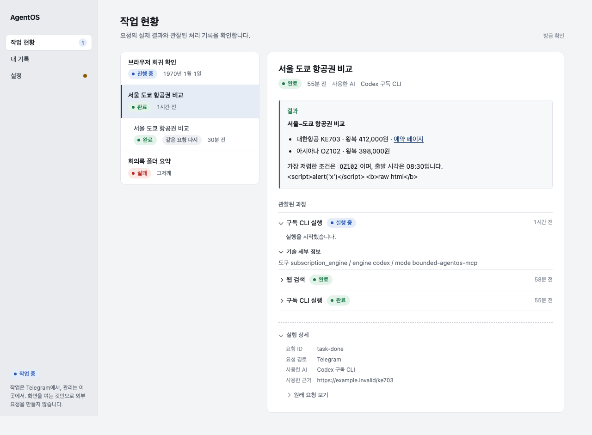
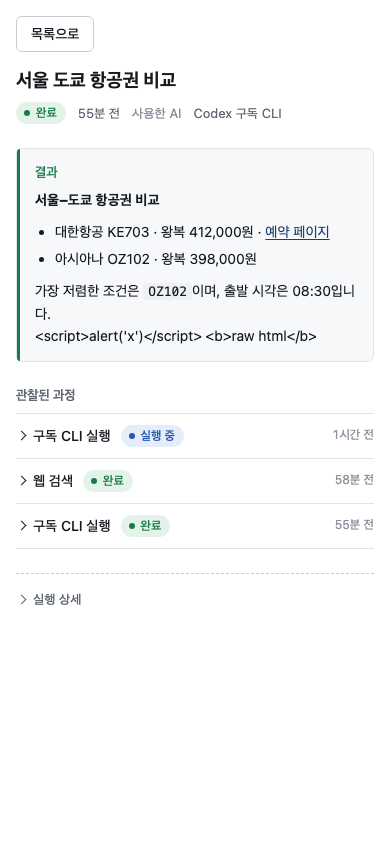
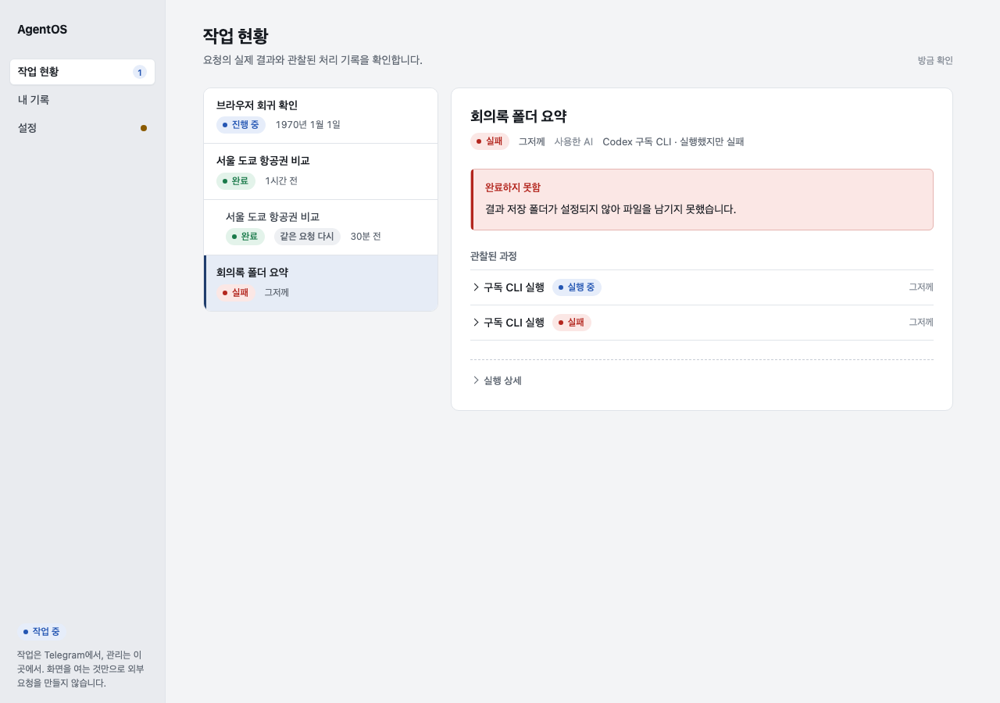

# UI-QUALITY-01 design direction (#558)

Status: direction for owner review before broad implementation. Presentation only:
no API, payload, validation, Grant, connector or runtime change. Vanilla HTML/CSS/JS,
no build step, no runtime dependency. The pinned review aids
`.claude/skills/frontend-design/` and `.claude/skills/web-interface-guidelines/` were
applied to reach this direction; `src/personal_agent/web/AGENTS.md` and the
[Presence Experience Contract](../presence-experience-contract.en.md) win over both.

## 1. Subject, audience, job

- Subject: the owner-local management utility of one person's AgentOS. It is a
  record book of what the assistant did, what it may touch, and what needs the
  owner's decision. It is not a chat client, a dashboard or a marketplace.
- Audience: one owner on a Mac, Korean copy, mostly checking results after a
  Telegram request or inspecting a connection.
- Primary job: answer three questions at a glance: what happened, is anything
  wrong or waiting on me, and which connection is actually in use.

## 2. Concept: a ledger, not a dashboard

The one memorable element is the **status language**. Every owner-visible state
(진행 중 · 완료 · 실패 · 일부 완료 · 전달 여부 알 수 없음 · 현재 사용 중 · 확인 필요 ·
사용 가능 · 연결 안 됨 …) is a badge with exactly one tone, and that same badge is
used in the task list, task detail, timeline, records, Settings rows and the
navigation rail. The result of a task is a "receipt" block whose left rule takes
the state tone. Everything else stays quiet: one neutral canvas, white surfaces,
one accent for the single primary action and selection, no decoration.

Reviewed against the generic defaults the frontend-design skill warns about:

| Default tell | Decision |
| --- | --- |
| ALL-CAPS eyebrow above headings (`WORK`, `RECORDS`, `SETTINGS`, `OWNER-LOCAL`) | Removed. The rail already names the destination. |
| Middle-dot meta strings (`완료 · 1970. 1. 1. 오전 9:00 · 사용한 AI: …`) | Replaced by a `.meta` row: badge, `<time>`, labelled value. Dots remain only inside owner data (folder role, model name) where they are content, not chrome. |
| Identical rounded cards with one radius and one shadow | Lists are one bordered surface with row separators; only the detail pane is a card. Two radii: 6px controls, 10px surfaces. No shadows. |
| Warm cream + terracotta, or near-black + acid accent | Cool neutral canvas `#f3f4f6`, ink `#161a20`, ledger blue accent `#1f3d6d`. State tones are the only saturated colour. |
| Monospace for data labels, `→` on buttons | Not used. Monospace only for inline `code` inside a result. |
| Marketing hero, mascot, tips | Excluded by `web/AGENTS.md`; the sign-in view is one heading and one form. |

## 3. Tokens (`style.css` `:root`)

Colour

| Token | Value | Use |
| --- | --- | --- |
| `--canvas` / `--rail` | `#f3f4f6` / `#e9ebef` | page and navigation rail |
| `--surface` / `--surface-2` / `--surface-3` | `#fff` / `#f7f8fa` / `#eef0f3` | cards, result block, neutral badge |
| `--ink` / `--ink-2` / `--muted` / `--faint` | `#161a20` / `#3b424c` / `#5f6772` / `#8a919b` | text hierarchy |
| `--line` / `--line-strong` | `#e0e4e9` / `#c7cdd5` | separators, control borders |
| `--accent` / `--accent-soft` / `--focus` | `#1f3d6d` / `#e6ecf6` / `#2f6bd6` | primary button, selected row, focus ring |
| `--ok` / `--ok-soft` | `#1a7a4a` / `#e3f3ea` | 완료, 연결됨, 현재 사용 중 |
| `--attn` / `--attn-soft` | `#8a5a00` / `#fbf0d9` | 확인 필요, 일부 완료, 승인 필요 |
| `--danger` / `--danger-soft` / `--danger-line` | `#b3261e` / `#fbe7e5` / `#e5b4b0` | 실패, destructive actions |
| `--run` / `--run-soft` | `#2456b3` / `#e6edfa` | 진행 중, 실행 중 |
| `--unknown` / `--unknown-soft` | `#5b5f8a` / `#ebebf4` | 전달 여부 알 수 없음 |

All text tones meet 4.5:1 on their soft backgrounds; the faint tone is used only
for 12px labels beside stronger text.

Type: system Korean sans (`-apple-system, "Apple SD Gothic Neo", Pretendard, "Noto Sans KR"`),
no web font (local-first, no network on page entry). Scale: 12 / 13 / 14 (base) /
16 / 19 / 23. Weights 400 body, 500 controls, 600 row titles, 650 h2/h3, 700 h1.
Line height 1.55; result text is capped at 70ch. Numbers and times use
`tabular-nums`. Headings use `text-wrap: balance`.

Spacing: 4 / 8 / 12 / 16 / 24 / 32 / 48. Radius: 6 (controls), 10 (surfaces),
pill (badges). Control heights: 36 (default), 30 (row action).

## 4. Layout

Desktop: a 212px rail (brand, three destinations, runtime state, one-line
boundary note) and a content column of at most 960px, left-aligned. Settings keep
the same rail and add a segmented tab bar above the pane; the pane is 760px wide.
Mobile (≤620px): the rail becomes a top bar with a horizontally scrolling nav, the
detail pane opens full-screen with a "목록으로" button (existing behaviour).

```
┌ rail ───────┐┌ content ───────────────────────────────────────┐
│ AgentOS     ││ 작업 현황                              방금 확인 │
│ ▸ 작업 현황 1││ subtitle                                        │
│   내 기록   ││ ┌ list ─────────┐ ┌ detail ────────────────────┐ │
│   설정    ● ││ │ title         │ │ h2 title                   │ │
│             ││ │ [badge] time  │ │ [badge] time  사용한 AI  … │ │
│             ││ │ ───────────── │ │ ▌결과 (receipt block)      │ │
│ [작업 중]   ││ │ …             │ │ 관찰된 과정 (timeline)     │ │
│ boundary    ││ └───────────────┘ │ ┈ 실행 상세 (technical)    │ │
└─────────────┘└────────────────────────────────────────────────┘
```

The rail shows live state derived only from data the page already fetched: the
count of running tasks next to 작업 현황, and a dot next to 설정 when any
Settings row is in an attention state.

## 5. Component rules

- Buttons. Three kinds, never mixed on one row without hierarchy: primary (solid
  accent, one per surface), secondary (white, border), destructive (white with red
  text/border; becomes solid red only in the confirm step). Quiet text buttons are
  for 로그아웃 and 목록으로 only. Labels are verbs that name the effect
  ("이 연결 사용", "연결 해제", "삭제 확인"). No compound labels such as
  "Claude Code 로그인 완료 · 전환".
- Inputs and selects. 36px, 1px border, 2px focus ring in `--focus`. Selects draw
  their own chevron and background so they match in dark-mode Windows too. Every
  field has a visible or sr-only label, a `name`, and `autocomplete="off"` unless
  it is a credential. Placeholders show an example and end with `…`.
- Toggle vs checkbox. A switch is a preference that applies as soon as it is
  changed (임시 자료 수집 허용). A checkbox stays inside a form that is submitted
  later. A state is never shown as a button: "Telegram 작업에 공유 허용" becomes a
  row with a state badge and a "허용" action.
- Rows. One grammar everywhere: title, description, state badge in a fixed
  150px column, one action. Internal ids (connector id, capability id, request
  id, scopes) live only under a "기술 세부 정보" / "실행 상세" disclosure.
- Badges. Dot + word, tone from the table above. `neutral` is the default; an
  unknown or unmapped state is shown as unknown, never guessed as connected.
- Dates. `Intl.RelativeTimeFormat('ko')` for the last 7 days ("방금", "3분 전",
  "어제"), otherwise `Intl.DateTimeFormat` date; the absolute date-time is always
  in the `<time title>` for hover and in `datetime`.
- Results. Result text is parsed into paragraphs, lists, headings, inline bold,
  inline code and http(s) links, and rendered with DOM nodes only. Raw HTML in a
  result stays visible as text. Bare markdown symbols never reach the owner.
- Empty, loading, error. Empty is one sentence inside the list surface plus, when
  there is one, the next action; it is never an expandable section. Loading ends
  with "…". Errors are inline next to the control, red, and say what to do next.
- Destructive confirmation. Two steps in place: the button becomes "삭제 확인"
  (solid red) beside a "취소" button and a one-line question; the request is sent
  only on the second click. Existing folder removal already follows this.
- Disclosure. One 6px chevron, 13px/500 summary everywhere; nested disclosures
  are lighter. `<details>` is used only when there is something to reveal.

## 6. Screen-by-screen plan (after approval)

- 작업 현황 (prototype in this branch): badges, relative times, formatted safe
  results, friendly event names with ids under technical details, repeated
  requests listed quieter, receipt block toned by state.
- 내 기록: counts move into the type select's options, the "찾기" button goes
  (search is live), the detail gets a type badge and a real title, destructive
  delete with confirm/cancel, empty candidate section becomes one line.
- 설정 · AI 연결: same row grammar, verb-only actions, aligned state column.
- 설정 · 파일 · 저장: role and path on two lines instead of one dot-joined line.
- 설정 · 외부 연결: Telegram as a section with a state row; disconnect gets a
  confirm step; capability preview styled as an attention block.
- 설정 · 개인정보 · 진단: switches that save on change, sharing policy as a state
  row, saved temporary material as rows, manual capture behind a disclosure.

## 7. Before / after (fixture-only evidence)

Fixture data from `tests/web_management_browser_fixture.py` with the new
`/control/rich-tasks` control. Not live AgentOS operation.

| | Desktop 1280×900 | Mobile 390×844 |
| --- | --- | --- |
| Before |  |  |
| After |  |  |

Failed state after: 

## 8. Not changed

Task/record/settings API calls and payloads, the exact-draft test/apply guard,
the single current AI route rule, revision-guarded and serialized folder saves,
draft/focus/search/selection preservation across polling, distinct record types
and actions, and the absence of provider calls on page entry.
