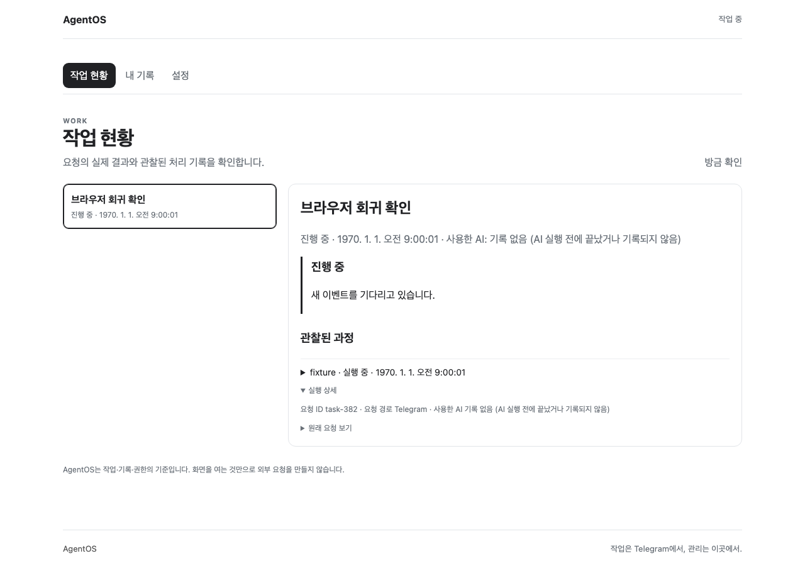
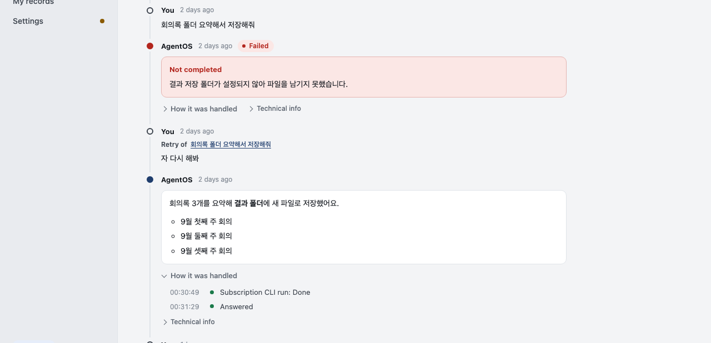
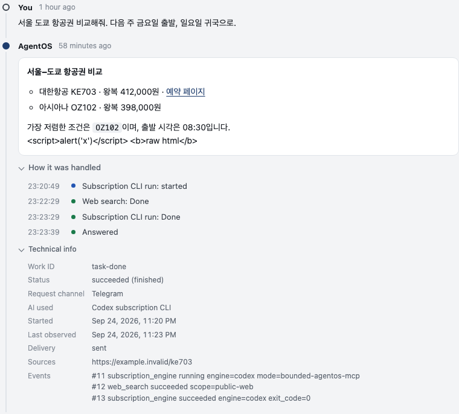
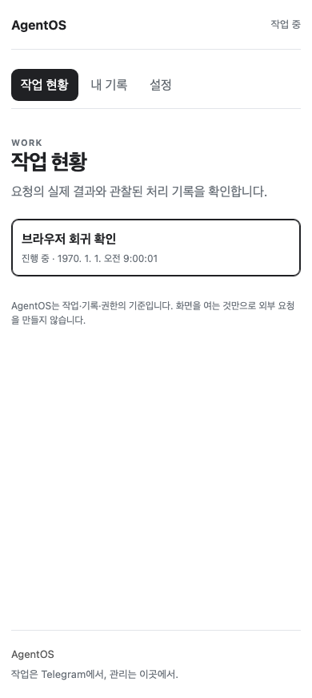
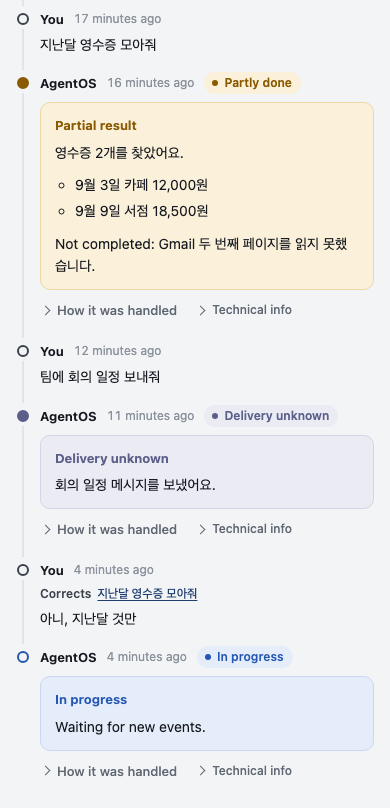
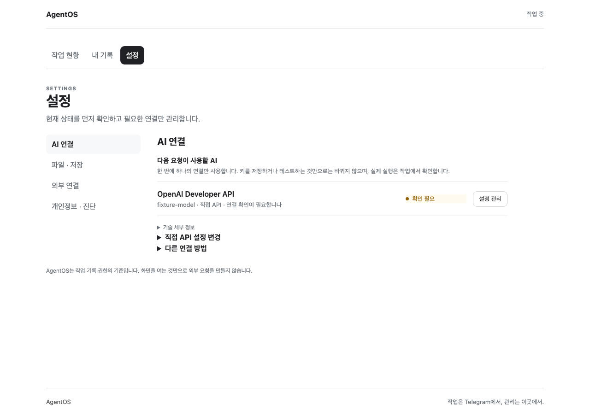
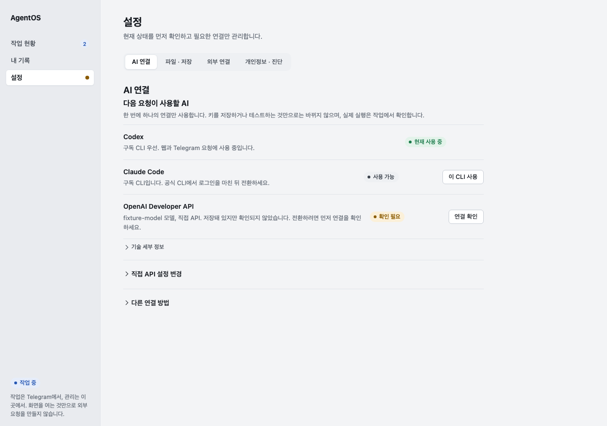
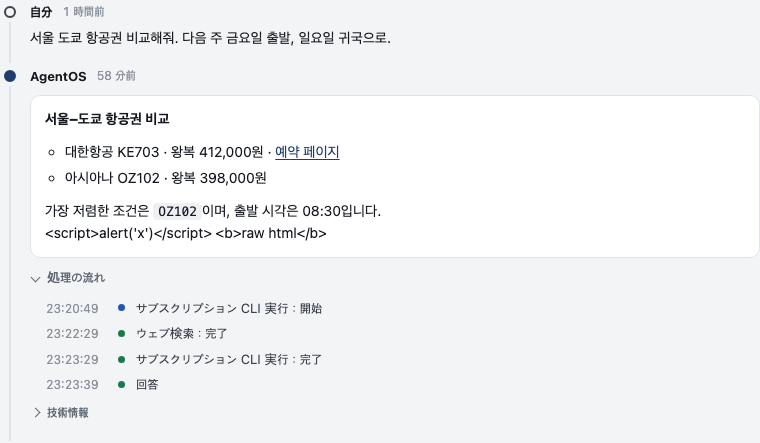
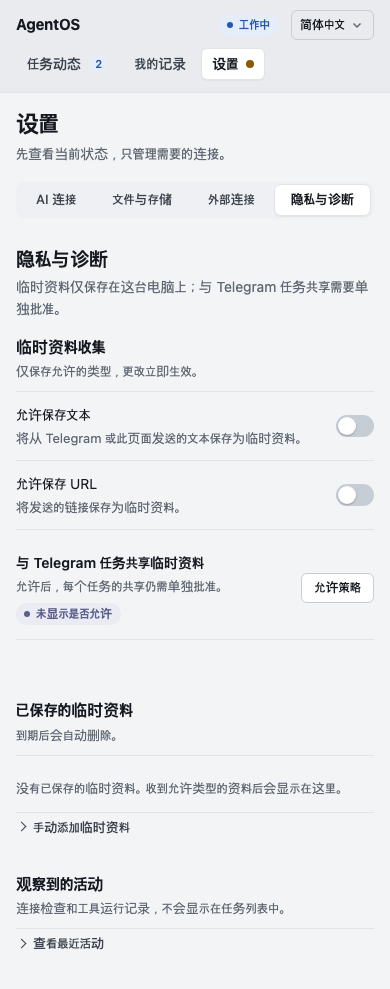
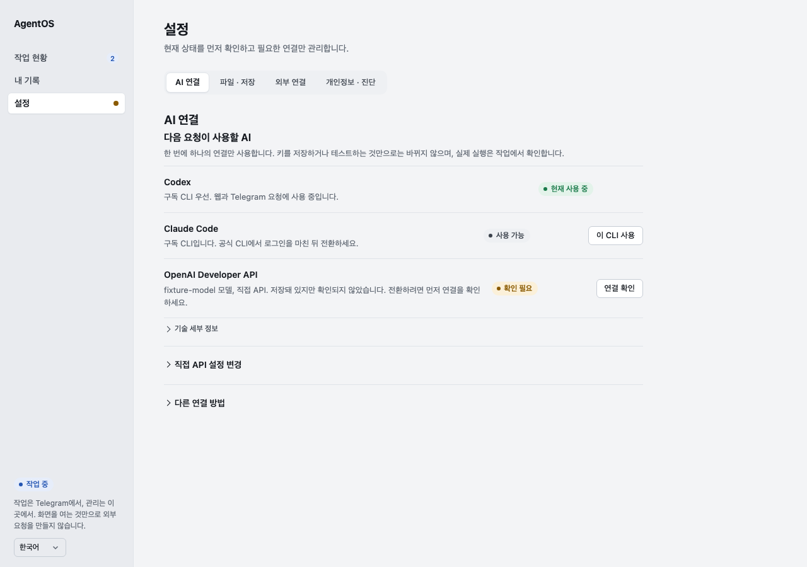

# UI-QUALITY-01 design direction (#558)

Status: the owner approved the first direction on 2026-09-24 after a 작업 현황
prototype. The owner then set two product directions the same day. #559 makes
작업 현황 a chronological conversation trace. #562 removes the generic 내 기록
destination. This document records the direction as implemented in the #558
pull request.

The pass is presentation only. It makes no API, payload, validation, Grant,
connector or runtime change. It uses vanilla HTML/CSS/JS with no build step and no
runtime dependency. The pinned review aids `.claude/skills/frontend-design/` and
`.claude/skills/web-interface-guidelines/` shaped it. `src/personal_agent/web/AGENTS.md`
and the [Presence Experience Contract](../presence-experience-contract.en.md) win
over both.

## 1. Subject, audience, job

- Subject: the owner-local management utility of one person's AgentOS. It shows
  what the owner asked, what AgentOS answered, what it may touch, and what needs
  the owner's decision. It is not a chat client, a dashboard or a storage browser.
- Audience: one owner on a Mac, reading English by default or Korean, Chinese or
  Japanese by choice, usually checking a result after a Telegram request or
  inspecting a connection.
- Primary job: answer three questions at a glance. What happened, in order. Is
  anything wrong or waiting on me. Which connection is actually in use.

## 2. Concept: conversation order first

The memorable element is the **conversation trace** in 작업 현황 (#559):

> Conversation order first. Relationships second. Execution trace on demand.
> Raw Work/Tool/Evidence only one level deeper.

- Each Work is shown as the owner's turn (나) followed by AgentOS's turn, oldest
  at the top. A thin spine with one node per turn carries the order. The node's
  colour is the outcome tone.
- A relation is drawn only when the task API reports one. Since #557 the API
  returns `relation: {kind, work_id}` for retry, reference, cancel and correction.
  The turn then shows "다시 시도한 요청" or "이전 요청을 정정" and a link that
  jumps to the earlier turn. Nothing is inferred from wording. A request whose
  text equals the previous one with no recorded relation says only
  "바로 앞과 같은 내용", which is a fact about the text, not a relation.
- A plain successful answer carries no badge. Failed, partial, cancelled,
  running and unknown-delivery answers keep a badge, a titled outcome and a
  toned body. Prose never makes an unsuccessful turn look successful.
- Under each answer, **어떻게 처리했는지** lists observed steps with clock times.
  A tool's start reads "시작". Consecutive start→finish transitions of one tool
  collapse into one line. The closing line is the observed Work outcome, and a
  running Work gets none. **기술 정보** holds Work id, status, route, relation
  ids, raw events and Evidence references.

The status badge language from the first direction stays as the secondary
system. It is used in Settings rows, the nav rail and non-success turns.

Reviewed against the generic defaults the frontend-design skill warns about:

| Default tell | Decision |
| --- | --- |
| ALL-CAPS eyebrow above headings (`WORK`, `RECORDS`, `SETTINGS`, `OWNER-LOCAL`) | Removed. The rail already names the destination. |
| Middle-dot meta strings | Replaced by labelled `.meta` rows, badges and `<time>`. Dots remain only inside owner content such as folder names. |
| Identical rounded cards with one shadow | One trace spine. Answer bodies are the only surfaces. Two radii, no shadows. |
| Dashboard or task board | Removed from 작업 현황. It is one linear trace on desktop and mobile. |
| Warm cream + terracotta, or near-black + acid accent | Cool neutral canvas `#f3f4f6`, ink `#161a20`, one ledger-blue accent `#1f3d6d`. State tones are the only other saturated colours. |
| Monospace data labels, `→` on buttons | Not used. Monospace only for inline `code` inside a result. |

## 3. Tokens (`style.css` `:root`)

| Token | Value | Use |
| --- | --- | --- |
| `--canvas` / `--rail` | `#f3f4f6` / `#e9ebef` | page and navigation rail |
| `--surface` / `--surface-2` / `--surface-3` | `#fff` / `#f7f8fa` / `#eef0f3` | answer bodies, panels, neutral badge |
| `--ink` / `--ink-2` / `--muted` / `--faint` | `#161a20` / `#3b424c` / `#5f6772` / `#8a919b` | text hierarchy |
| `--line` / `--line-strong` | `#e0e4e9` / `#c7cdd5` | separators, trace spine, control borders |
| `--accent` / `--accent-soft` / `--focus` | `#1f3d6d` / `#e6ecf6` / `#2f6bd6` | primary button, selection, AgentOS node, focus ring |
| `--ok` | `#1a7a4a` on `#e3f3ea` | 완료, 연결됨, 현재 사용 중 |
| `--attn` | `#8a5a00` on `#fbf0d9` | 확인 필요, 일부 완료, 승인 필요 |
| `--danger` | `#b3261e` on `#fbe7e5` | 실패, destructive actions, errors |
| `--run` | `#2456b3` on `#e6edfa` | 진행 중, 실행 중 |
| `--unknown` | `#5b5f8a` on `#ebebf4` | 전달 여부 알 수 없음, 연결 끊김, 허용 여부 표시 안 됨 |

Type: the system sans with Korean, Chinese and Japanese fallbacks (`-apple-system`,
`"Apple SD Gothic Neo"`, `"PingFang SC"`, `"Hiragino Sans"`, Noto Sans KR/SC/JP). There is no web font, so page entry makes no network request.
Scale 12 / 13 / 14 (base) / 16 / 19 / 23. Line height 1.55. Result text is
capped at 70ch. Times use `tabular-nums`.

Spacing 4 / 8 / 12 / 16 / 24 / 32 / 48. Radius 6 for controls, 10 for surfaces,
pill for badges. Control height 36, row action 30.

## 4. Layout

Desktop has a 212px rail and a left-aligned content column of at most 960px. The
rail holds the brand, destinations, runtime state and a one-line boundary note.
The trace column is at most 760px. Settings add a segmented tab bar above a
760px pane. On mobile (≤620px) the rail becomes a top bar and the trace stays one
column with the same order.

```
┌ rail ───────┐┌ content ─────────────────────────────────────┐
│ AgentOS     ││ 작업 현황                            방금 확인 │
│ ▸ 작업 현황 2││ ○ 나  그저께                                 │
│   내 기록   ││ │ 회의록 폴더 요약해서 저장해줘                │
│   설정    ● ││ ● AgentOS 그저께 [실패]                      │
│             ││ │ ┌ 완료하지 못함 ─────────────────────┐     │
│             ││ │ └────────────────────────────────────┘     │
│             ││ │ › 어떻게 처리했는지   › 기술 정보           │
│             ││ ○ 나  그저께                                 │
│ [작업 중]   ││ │ 다시 시도한 요청 <회의록 폴더 요약…>        │
│ boundary    ││ │ 자 다시 해봐                                 │
└─────────────┘└──────────────────────────────────────────────┘
```

The rail shows only state the page already fetched. That is the count of running
tasks and a dot when a Settings row needs attention. When the server is
unreachable, the runtime badge says 연결 끊김 and the count clears.

## 5. Component rules

- **Buttons.** Primary is solid accent, one per surface. Secondary is white with
  a border. Destructive is white with red text and turns solid red only in its
  confirm step. Quiet text buttons are for 로그아웃, 목록으로 and 닫기. Labels
  are verbs, and one action keeps its name through a flow (제거 → 제거 확인).
- **Inputs and selects.** 36px with a 2px focus ring. Every field has a label and
  a `name`. Non-credential fields use `autocomplete="off"`. Placeholders show an
  example and end with `…`.
- **Toggle vs checkbox.** A switch (`role="switch"`) saves on change and reports
  that it saved. A checkbox stays inside a form that is submitted later. A state
  is never drawn as a button.
- **Rows.** Title, description, state badge in a fixed column, one action.
  Internal ids stay under 기술 세부 정보 or 기술 정보.
- **Badges.** One state per badge. An unknown or unmapped state shows as
  unknown, never guessed as connected or allowed.
- **Dates.** `Intl.RelativeTimeFormat` in the chosen language for the last 7 days, otherwise an
  `Intl.DateTimeFormat` date. Trace steps use a 24-hour clock. The absolute time
  is in `<time title>` and `datetime`.
- **Results.** Parsed into paragraphs, lists, headings, bold, inline code and
  http(s) links, and built from DOM nodes only. Raw HTML in a result stays
  visible as text.
- **Empty, loading, error.** Empty is one sentence with the next action. Loading
  ends with `…`. `setError` marks the node red and `setFeedback` clears it, so
  errors and successes never share a colour. Network failure is one owner
  sentence in a top banner, never the browser's `TypeError` text.
- **Destructive confirmation.** Two steps in place, with a cancel and a one-line
  consequence. Nothing is sent before the second press.
- **Disclosure.** One chevron size everywhere. A trace answer's two disclosures
  share one line and each takes the full width when opened.
- **Polling.** Server text is rewritten only when it changes. Owner-started
  prompts, errors and fresh pair links live in their own nodes, so the 2-second
  poll cannot erase them. Open disclosures and keyboard focus survive re-renders.

## 6. Scope boundaries with #559 and #562

- **#559 (trace).** This pass projects fields the task API already returns:
  order, status, outcome text, events, route, and the #557 `relation`. It does
  not add read models, turn ids, supersession edges or Evidence mapping. Those
  belong to #559, and #559 is not completed by this pass.
- **#562 (no generic records destination).** Removing 내 기록 from navigation
  and adding exact-item deep links belongs to #562. That change also updates the
  Local Web Management Contract and adds browser tests for data preservation.
  This pass stops designing the records browser. It keeps only shared components
  and correctness fixes there (delete confirm, focus, error colour, no empty
  sections), because those carry over to exact-item views.

## 7. Before / after (fixture-only evidence)

The data comes from `tests/web_management_browser_fixture.py` with the
`/control/rich-tasks` control. It is not live AgentOS operation. After images are
in the English default unless noted. Request and answer text stays in its
original language, because it is owner content, not UI.

| | Before | After |
| --- | --- | --- |
| 작업 현황 |  |  |
| One answer, both disclosures open | |  |
| Mobile: partial, unknown delivery, correction |  |  |
| 설정 · AI 연결 |  |  |
| Other languages (Japanese trace, Chinese mobile privacy, Korean AI settings) | |    |

## 8. Not changed

Task, record and settings API calls and payloads stay the same, and so do these
rules:

- the exact-draft test/apply guard;
- exactly one current AI route;
- revision-guarded, serialized folder saves;
- draft, focus, search and selection preservation across polling;
- distinct record types and actions;
- no provider call on page entry.

## 9. Functional review: the owner's questions

The owner's rule for this pass is "기능이 곧 UX". What a screen does is the
experience.

| Owner question | Cause in code | Presentation fix | Backend follow-up |
| --- | --- | --- | --- |
| Why does "Failed to fetch" appear? | `api()` rethrew the browser's `TypeError` text when the local server was unreachable. | One owner sentence in a top banner with the last successful check time. The runtime badge shows 연결 끊김. A boot failure shows the sign-in surface with the reason and retries, instead of a blank page. | none |
| Why are Codex / Claude Code missing? | Rows come from `subscription_engines.available()`. The screenshot fixture returned none. | Verb actions ("이 CLI 사용"). An uninstalled CLI says it appears once installed. The rich fixture now shows both engines. | none |
| Why does "추가" not open a folder picker? | #551 chose text path entry. A browser cannot give a page the real path of a picked folder. | Hint keeps the Finder shortcut. Role and path sit on two lines. | Native folder picker |
| Why is there no Google button? | Rows and the connect link come from `connector_connections()`, which is empty without a connector registry. | The empty state says why and when rows appear. | Connector registry per install |

## 10. Independent UX review and what changed

A separate reviewer walked every flow in code and in fixture screenshots. It
found no blockers and 13 majors. All presentation majors are fixed:

- A blank page on boot failure. The sign-in surface now shows the reason and retries.
- Poll chatter, meaning live regions on whole panes and a status line announced
  twice per cycle. Those regions were removed.
- Focus was dropped on re-render. It is now restored by key.
- Error text shared the success colour. It is now red with a next step.
- Model shortcuts changed a collapsed form invisibly. They now open it and focus 테스트.
- The Telegram prompt, errors and pair link were erased by polling. They now live in their own nodes.
- A stale "작업 중" showed while offline. The badge now says 연결 끊김.
- The same-request marker was on the wrong row. The trace now marks rows by
  conversation order.

One major needs a backend field. The Telegram sharing-policy row cannot show
whether a standing policy exists, because `ContextInbox.status()` does not
report it. The row now says "허용 여부 표시 안 됨" instead of guessing, and it
shows "허용함 (이번 접속)" only after a success it observed itself.

## 11. Languages

On 2026-09-24 the owner asked for English as the default UI language, with a
choice of Korean, Simplified Chinese and Japanese.

- **How it works.** `app.js` holds one catalog keyed by the Korean source
  string, and `t()` translates at render time. Static markup is translated in
  place on load, before either surface is shown. The choice is stored in
  `localStorage` (`agentos-language`) and applied by reloading the page, so text
  and `Intl` dates, relative times and clocks switch together. With no stored
  choice the UI is English. The selector sits in the rail and on the sign-in
  screen, and each option is written in its own language.
- **Why inside `app.js`.** The local server serves only `index.html`, `app.js`
  and `style.css`. A separate catalog file would need a backend route, which is
  out of scope.
- **What is not translated.** Text written by the server is shown as sent unless
  it is a known fixed phrase: errors, task titles, answers, folder-validation
  messages and connector descriptions. Those strings come from the backend in
  Korean. Translating them needs a backend follow-up.
- **English style.** English copy uses sentence case, following the
  frontend-design skill and the existing Korean style. It does not use the Title
  Case rule in the pinned web-interface-guidelines, which the skill's wrapper
  lists as English-only.
- **Guards.** `tests/test_ui_quality.py` fails if any UI string lacks an
  English, Chinese or Japanese entry, if a translation drops a `{placeholder}`,
  or if English output contains Korean.

## 12. Second independent review (PR #563) and what changed

A second reviewer, independent of the implementation, reviewed the full PR head.
It confirmed the hard boundaries and invariants held and requested changes for
one merge conflict and four majors. All are fixed, and each fix has a
regression test in `tests/test_ui_quality.py` (`ReviewRegressions`).

| Finding | Fix |
| --- | --- |
| `delivery-plan.yaml` conflicted with GOV-REVIEW-01 on main | Rebased; main's concurrency rule is kept and only the #558 entry is re-added |
| The runtime badge said "Ready" (green) with no AI connected | "Ready" only when `home.model_connected`; otherwise "AI not connected". An unknown state is shown as unknown, never green |
| "Allowed (this session)" was not tied to the model the policy covers | The row shows "Allowed" only while the current model (provider, endpoint, model) equals the one approved, matching the backend's model-scoped policy |
| An open disclosure rebuilt the trace every poll and dropped text selection | Open state is no longer part of the render fingerprint, and a toggle fills its own content. A browser probe measured 0 rebuilds in 6.5 s with disclosures open (27 before), and the selection survived |
| The Japanese removal confirm read "confirm deletion" | 「外すことを確定」, the same verb as the first step |
| Minor: "Answered" without an answer; closing line on waiting Works; cancelled badge and body in two tones; Korean artifact kind in English; settings dot during an in-place confirm; trailing punctuation inside bare links; running badges while offline | All fixed; running badges are dimmed while offline |
