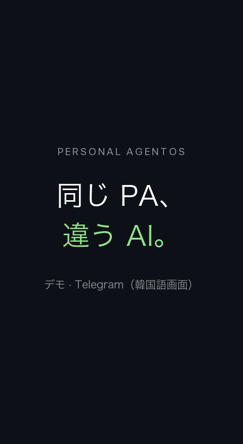

<div align="center">

<pre>
          P E R S O N A L           
                                    
   ___                __  ____  ____
  / _ |___ ____ ___  / /_/ __ \/ __/
 / __ / _ `/ -_) _ \/ __/ /_/ /\ \  
/_/ |_\_, /\__/_//_/\__/\____/___/  
     /___/                          
</pre>

**自分のコンピューターで動く、自分のパーソナルエージェント。<br>下で働く AI を替えても、記憶と進行中の仕事と権限はそのまま残ります。**

[](https://github.com/Jongtae/agentos/actions/workflows/validate.yml) [](https://github.com/Jongtae/agentos/actions/workflows/full-validate.yml) [](https://github.com/Jongtae/agentos/releases) [](../../pyproject.toml) [](../../docs/QUICKSTART.md) [](../../LICENSE)

[English](../../README.md) | [한국어](README.ko.md) | [简体中文](README.zh-CN.md) | [日本語](README.ja.md)

[クイックスタート](#クイックスタート) · [自分に残るもの](#自分に残るもの) · [仕組み](#仕組み) · [ドキュメント](#ドキュメント)

</div>

<!-- readme-parity:v1 -->
<!-- readme-section:hero -->

## 頭脳を所有していなくても、自分の J.A.R.V.I.S. を持てる？

**頭脳は借りられる。アシスタントは自分のものであるべきだ。**

トニー・スタークには J.A.R.V.I.S. がいました。自分の文脈を理解し、いつでも話しかけられ、コンピューターやシステムを通じて実際に行動する個人アシスタントです。しかもトニーは、その背後にある技術まで所有していました。しかし私たちの多くは、使う最も高性能な AI の頭脳を所有していません。モデルの性能や価格、ポリシー、利用条件は提供元によって変わる可能性があります。

だから問いは、*自分の Jarvis を作れるか* だけではありません。**その知性を借りながらも、本当に自分のものと言える個人アシスタントを持ち、記憶や文脈、終わっていない仕事、任せた権限を保てるでしょうか。** より良いモデルが現れるたびに、アシスタントとの積み重ねまで手放さなければならないのでしょうか。

Personal AgentOS は、その必要はないという可能性を探ります。自分でインストールし管理するオープンソース環境で、一つのパーソナルエージェント（PA）が文脈・進行中の仕事・権限を保ち、実際に働く AI は替えられるようにします。

<p align="center">
  
</p>
<p align="center"><sub>デモ · Telegram（韓国語画面）、日本語字幕付き。待ち時間は短縮し、個人情報はぼかしています。 · <a href="../../docs/assets/readme/demo/demo-v2.ja.gif">フルサイズで表示</a></sub></p>

**主な特長**

- **契約中の AI をそのまま。** ChatGPT のプランは Codex で、Claude のプランは Claude Code で接続し、実際の仕事を任せます。そのほかの接続方法は [QUICKSTART](../../docs/QUICKSTART.md#other-model-connections) にあります。
- **会話が変わっても同じ PA。** 記憶、保存した結果、未完の仕事の状態は次の会話や再起動後も残ります。中断された実行は黙って再実行せず、中断として報告します。
- **境界は自分で決める。** アクセスは自分が接続したフォルダー・アカウント・ツールから始まります。対応している支払いフローは行動ごとの承認を求め、[現在のブラウザー上の制限](https://github.com/Jongtae/agentos/issues/758)も公開しています。[秘密情報](../../.github/SECURITY.md)はモデルのプロンプト・ログ・Evidenceに入りません。
- **隠さずに知らせる。** AI が何かを記憶するとそれを知らせ、正確に取り消せるようにします。任せた仕事ごとに、どの情報を使いどこへ送ったかを記録します。
- **いつもの場所で会話。** スマートフォンの Telegram、または macOS・Linux のブラウザーで話せます。Windows は[現在制限のある WSL2](../../docs/QUICKSTART.md#windows-wsl2)で動作します。

<!-- readme-section:principles -->

## Personal AgentOS の五つの柱

これは特定の AI モデルの機能ではありません。私たちが作るアシスタントを評価するための基準です。

- **Presence:** 毎回別のアプリを開いて依頼するのではなく、普段コミュニケーションする場所で寄り添い続けるアシスタント。
- **Portable Memory:** 記憶と文脈が一つの AI サービスに閉じ込められないこと。
- **Model Independence:** AI モデルを替えても、アシスタントとの継続性や関係を失わないこと。
- **Execution:** 質問に答えるだけでなく、実際のサービスやコンピューター上で行動できること。
- **Owner Control:** データ、権限、実行結果を自分で管理できること。

これらは指針であり、すべての場面がすでに動くという主張ではありません。[製品の状況](../../docs/product-status.en.md)、上の実際のデモ、[現在のブラウザー上の制限](https://github.com/Jongtae/agentos/issues/758)で、観測済みのことと今後の課題を区別しています。

<!-- readme-section:try-today -->

## クイックスタート

macOS、Linux、Windows（WSL2）で、コマンド一つでインストールしてそのまま起動します。Homebrew、Python、Docker は不要です。

```sh
curl -LsSf https://raw.githubusercontent.com/Jongtae/agentos/94776134546ed400ab1573d171c0bca2975a5f22/scripts/install.sh | sh
```

この URL はインストーラー自体も特定のコミットに固定します。実行前に[固定されたスクリプトを確認](https://github.com/Jongtae/agentos/blob/94776134546ed400ab1573d171c0bca2975a5f22/scripts/install.sh)でき、スクリプトは公開済み AgentOS アーカイブと、ダウンロードする uv インストーラーのチェックサムを検証します。

Windows では PowerShell で `wsl --install` を実行して再起動し、Ubuntu を開いて最初のコマンドを実行してください。Windows の手順、インストーラーの動作、ソースからの実行、すべての設定は [QUICKSTART](../../docs/QUICKSTART.md) にあります。会話中は `agentos start` を起動したままにしてください。

macOS で [Homebrew](https://brew.sh) を使っている場合：

```sh
brew install jongtae/agentos/agentos
agentos start
```

1. ブラウザで [http://127.0.0.1:8787](http://127.0.0.1:8787/) が開きます。画面は英語が既定で、左下で日本語、韓国語、簡体字中国語に切り替えられます。Telegram の一部の定型ステータス・進捗表示と、接続時の一部の検証エラーはまだ韓国語です。
2. 契約中の AI を接続します。ChatGPT は Codex（`codex login`）、Claude は Claude Code（`claude setup-token`）で。[そのほかの接続](../../docs/QUICKSTART.md#other-model-connections)
3. Telegram を接続します。@BotFather でボットを作り、**設定 → 外部接続**にトークンを入力してペアリングリンクを開きます。
4. 必要なことを聞いてみてください。**「最近、猫がごはんをあまり食べない。どうしたらいい？」** 数日後に **「5万円以下のロボット掃除機を選んで。」** と言うだけで、Still が猫のことを自分で覚えて反映します。

**リリース状況：** どちらのインストール方法でも、タグを付けた main コミットの **v1.3.0**（2026-10-10）が入ります。デモと日常利用の画面は実際の利用セッションにもとづくもので、この版の一連の動作を検証したものではありません。構成図は製品の方向性を示す例です。[release manifest](../../docs/release-manifest.json) は各リリースの範囲を記録し、[製品の状況](../../docs/product-status.en.md) は提供中の機能・テストの根拠・方向性を区別しています。

<!-- readme-section:ownership -->

## 自分に残るもの

| 替えられるもの | 自分に残るもの |
| --- | --- |
| モデルと提供元 | 自分についての記憶と文脈 |
| 仕事をする CLI エージェントや API | 進行中の仕事と次の一歩 |
| ツールとコネクター | 権限と承認 |
| | 実際に実行されたことの記録 |

より良い AI が現れたら、替えるのはエージェントではなく働く AI です。[誰のエージェントか](../../docs/whitepapers/whose-agent.ko.md)（韓国語の白書）がこの問いをさらに掘り下げます。

ローカルファースト（local-first）はローカル限定（local-only）ではありません。サブスクリプションの AI は OpenAI や Anthropic 側で動くため、リクエストに使う文脈はその提供元へ送られます。

<!-- readme-section:presence -->

## 仕組み

<picture>
  <source media="(max-width: 600px)" srcset="../../docs/assets/readme/presence-overview.ja.narrow.svg">
  
</picture>

- **PA** は自分が話すエージェント、**AgentOS** はその文脈・残る仕事・権限・根拠を保つ環境です。
- **判断層** がリクエストごとに AI とツールを選び、指示を書き、結果を確かめ、足りなければ任せ直します。
- **オントロジー** は出典のある対象（会議や口座残高など）を、その周りの仕事・役割・権限と結び付けます。下書きを送信と、招待を承諾と取り違えません。

図は設計の方向性であり、観測された実行ではありません。詳しくは [アーキテクチャとオントロジー](../../docs/personal-agentos-architecture.en.md) · [Presence](../../docs/presence-experience-contract.en.md)。

<!-- readme-section:ai-switch -->

## AI を替えても続く会話

<p align="center">
  
</p>
<p align="center"><sub>実際の会話から抜き出した画面です（Telegram、韓国語 UI）。ログインリンクは切り取り、名前はぼかしています。 · <a href="../../docs/assets/readme/ai-switch/ai-switch-conversation.png">原寸で見る</a></sub></p>

① **Claude Code に切り替え。** 「昨日スパムは結局入れた？抜いた？」という質問に、前の買い物の会話を引き継ぎます。

② **今のカートを確認。** もう一度ログインしたあと、スパム クラシック 200g が 1 個カートにあると答えます。

③ **Codex に切り替えて次の行動を依頼。** 「スパムを抜いて」。同じ会話の中で、削除の結果と残り 22 点の商品を伝えます。

<!-- readme-section:conversation -->

## 日常での使い方

*PA と実際に交わした会話を要約して描き直した画面です。実際の Telegram では、カードではなくテキストとリンクで返信します。*

<picture>
  <source media="(max-width: 600px)" srcset="../../docs/assets/readme/owner-pilot-conversation.ja.png">
  
</picture>

帰り道では、店を提案する前に現在地を尋ねます。写真のベルトに似た商品は比較したうえで、カートの段階の前にログインを求めます。レストランの写真を送ると、今いる場所から次にすることを提案します。**話したことや見せたもの → 出典と時刻のある許可された文脈 → 必要な質問やツール → 行動の境界 → 確認された結果。** カートへの追加と支払いは別の行動です。

**次の目標：** 数時間たっても「それ」や「同じの」が何を指すかを追えること。ワークフローを組み立てず、会話を続けるだけで済むようにします。

> 「コーヒーがほとんどない。」 · *数時間後* · 「出かけるついでに買える所ある？」 · *その後* · 「時間ない。前と同じので。」

<!-- readme-section:more -->

## ドキュメント

| ドキュメント | 内容 |
| --- | --- |
| [QUICKSTART](../../docs/QUICKSTART.md) | インストール、モデル接続、ファイル、Telegram、ソースからの実行 |
| [製品の状況](../../docs/product-status.en.md) | できること、まだ不便なこと、領域ごとの根拠 |
| [なぜ作るのか](../../docs/VISION.md) | プロジェクトの動機 |
| [アーキテクチャとオントロジー](../../docs/personal-agentos-architecture.en.md) | カーネルの基本概念、パッケージ、ランタイム、オーナーによる管理 |
| [ドキュメントマップ](../../docs/README.md) | 現在の契約とガイドの一覧 |
| [謝辞と参考文献](../../docs/acknowledgements.en.md) | 設計に影響を与えた研究とプロジェクト |

**コントリビュート。** Issue と Pull Request を歓迎します。まず [CONTRIBUTING](../../.github/CONTRIBUTING.md) を、開発の流れは [AGENTS.md](../../AGENTS.md) をご覧ください。試したら、[フィードバックフォーム](https://github.com/Jongtae/agentos/issues/new?template=feedback.yml) か [Discussions](https://github.com/Jongtae/agentos/discussions) で、よかった点と困った点を教えてください。

<!-- readme-section:license -->

## ライセンス

[AGPL-3.0-only](../../LICENSE)。Personal AgentOS の名称とロゴは [商標について](../../docs/TRADEMARKS.md) に従います。
