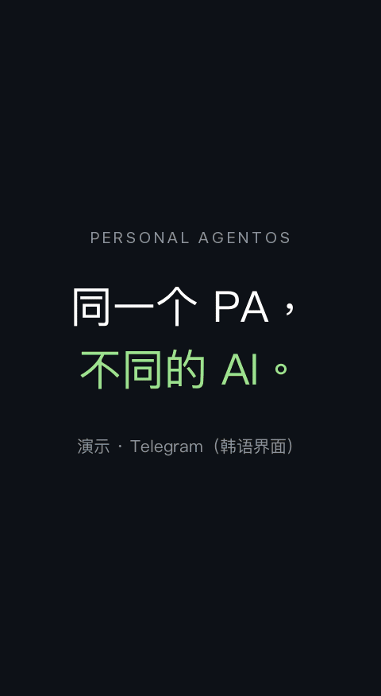

<div align="center">

<pre>
          P E R S O N A L           
                                    
   ___                __  ____  ____
  / _ |___ ____ ___  / /_/ __ \/ __/
 / __ / _ `/ -_) _ \/ __/ /_/ /\ \  
/_/ |_\_, /\__/_//_/\__/\____/___/  
     /___/                          
</pre>

**在你自己电脑上运行的个人智能体。<br>底层 AI 可以更换，记忆、进行中的工作和权限都会保留。**

[](https://github.com/Jongtae/agentos/actions/workflows/validate.yml) [](https://github.com/Jongtae/agentos/actions/workflows/full-validate.yml) [](https://github.com/Jongtae/agentos/releases) [](../../pyproject.toml) [](../../docs/QUICKSTART.md) [](../../LICENSE)

[English](../../README.md) | [한국어](README.ko.md) | [简体中文](README.zh-CN.md) | [日本語](README.ja.md)

[快速开始](#快速开始) · [留给你的东西](#留给你的东西) · [工作原理](#工作原理) · [文档](#文档)

</div>

<!-- readme-parity:v1 -->
<!-- readme-section:hero -->

## 不拥有它的“大脑”，也能拥有自己的 J.A.R.V.I.S. 吗？

**大脑可以借用。助手应该仍然属于你。**

托尼·斯塔克拥有 J.A.R.V.I.S.：它理解他的上下文，随时可以对话，还能通过他的电脑和系统实际行动。而且托尼连背后的技术也拥有。但我们大多数人并不拥有自己使用的最强 AI 大脑。模型的能力、价格、政策和可用性，都可能随着提供方而变化。

所以问题不只是*我们能不能造出自己的贾维斯*。**借用 AI 的智能时，我们能不能仍然拥有真正属于自己的个人助手，并保留它的记忆、上下文、尚未完成的工作和我们交付的权限？** 每当出现更好的模型，我们是否都必须放弃与助手一起积累的一切？

Personal AgentOS 探索的答案是：*不必*。在一个由你安装和掌控的开源环境里，一个个人智能体（PA）保管你的上下文、进行中的工作和权限，而真正干活的 AI 可以更换。

<p align="center">
  
</p>
<p align="center"><sub>演示 · Telegram（韩语界面），附中文字幕。等待时间已缩短，个人信息已模糊处理。 · <a href="../../docs/assets/readme/demo/demo-v2.zh-CN.gif">查看完整尺寸</a></sub></p>

**主要特点**

- **接入你选择的 AI。** 本地 Ollama 模型、OpenAI 兼容或 Anthropic API，或 Codex、Claude Code 订阅来完成实际工作。
- **换了对话，还是同一个 PA。** 记忆、已保存的结果和未完工作的状态会跨对话、跨重启保留。中断的执行会如实报告，不会悄悄重放。
- **边界由你决定。** 访问从你连接的文件夹、账户和工具开始。支持的付款流程会要求逐次批准；[当前浏览器限制](https://github.com/Jongtae/agentos/issues/758)已公开说明。[密钥](../../.github/SECURITY.md)不会进入模型提示词、日志或 Evidence。
- **告诉你，而不是瞒着你。** AI 记住某件事时会告诉你，并提供精确的撤销。每项委托工作都会记录用了你的哪些信息、发送到了哪里。
- **在你常用的地方对话。** 用手机上的 Telegram，或在 macOS、Linux 的浏览器中对话。Windows 可通过[目前仍有限制的 WSL2](../../docs/QUICKSTART.md#windows-wsl2)运行。

<!-- readme-section:principles -->

## Personal AgentOS 的五大支柱

这不是某个特定 AI 模型的功能清单，而是我们评价正在构建的助手的标准。

- **Presence（陪伴）：** 助手持续存在于你平时沟通的地方，而不是每次要办事都让你打开一个单独的应用。
- **Portable Memory（可迁移记忆）：** 你的记忆和上下文不会被锁定在某一个 AI 服务里。
- **Model Independence（模型独立）：** 更换 AI 模型时，不会失去助手的连续性以及你们之间的关系。
- **Execution（执行）：** 不只是回答问题，还能在真实服务和计算机上采取行动。
- **Owner Control（所有者控制）：** 数据、权限和执行结果始终由你掌控。

这些是指导原则，并不表示所有场景今天都已经可用。[产品状态](../../docs/product-status.en.md)、上面的真实演示和[当前浏览器限制](https://github.com/Jongtae/agentos/issues/758)会区分已经观察到的行为与仍在完善的部分。

<!-- readme-section:try-today -->

## 快速开始

在 macOS 或 Linux 上，一条命令即可安装并启动，无需 Homebrew、Python 或 Docker：

```sh
curl -LsSf https://raw.githubusercontent.com/Jongtae/agentos/137681f2617bf6350ba0b24316d8766921d084f7/scripts/install.sh | sh
```

该 URL 也把安装脚本本身固定到一个明确提交。运行前可以[检查固定版本的脚本](https://github.com/Jongtae/agentos/blob/137681f2617bf6350ba0b24316d8766921d084f7/scripts/install.sh)；脚本会校验公开的 AgentOS 归档和它下载的 uv 安装程序。

如果你在 macOS 上使用 [Homebrew](https://brew.sh)：

```sh
brew install jongtae/agentos/agentos
agentos start
```

1. 设置页面会在 [http://127.0.0.1:8787](http://127.0.0.1:8787/) 打开。点击 **바로 시작하기**（立即开始）；设置界面目前为韩语。
2. 连接你的 AI：支持工具调用的 Ollama 模型，OpenAI、OpenAI 兼容或 Anthropic 的 API 密钥，或 Codex、Claude Code 订阅。
3. 可选：在 **설정 → 외부 연결**（设置 → 外部连接）中填入你自己的 Telegram 机器人令牌，然后打开配对链接。
4. 试着说：**“这周要完成一份提案，帮我把接下来的事拆成几步。”**

在 Windows 上，请在 PowerShell 中运行 `wsl --install` 并重启，然后打开 Ubuntu 运行第一条命令。Windows 说明、安装脚本做了什么、从源码运行以及所有设置，请见 [QUICKSTART](../../docs/QUICKSTART.md)。对话期间请保持 `agentos start` 运行。

**发布状态：** 两种安装方式安装的都是从已打标签的 main 提交构建的 **v1.3.0**（2026-10-10）。演示和日常使用画面来自真实使用会话，并非该发行版本的端到端验证；架构图属于产品方向。[release manifest](../../docs/release-manifest.json) 记录每个版本的覆盖范围，[产品状态](../../docs/product-status.en.md) 区分已提供的功能、测试依据和发展方向。

<!-- readme-section:ownership -->

## 留给你的东西

| 可以更换的 | 始终属于你的 |
| --- | --- |
| 模型及其提供方 | 关于你的记忆和上下文 |
| 干活的 CLI 智能体或 API | 进行中的工作及下一步 |
| 工具和连接器 | 权限与批准 |
| | 实际执行过的记录 |

出现更好的 AI 时，你更换的是干活的 AI，而不是智能体本身。[《谁的智能体？》](../../docs/whitepapers/whose-agent.ko.md)（韩语白皮书）对这个问题有更深入的探讨。

本地优先（local-first）不等于只在本地（local-only）：你可以选择本地模型或托管模型；使用托管模型时，请求所用的上下文会发送给该提供方。

<!-- readme-section:presence -->

## 工作原理

<picture>
  <source media="(max-width: 600px)" srcset="../../docs/assets/readme/presence-overview.zh-CN.narrow.svg">
  
</picture>

- **PA** 是你对话的智能体，**AgentOS** 是保管它的上下文、未完成工作、权限和证据的环境。
- **判断层** 为每个请求选择 AI 和工具，撰写任务说明，检查结果，不达标时重新委派。
- **本体** 把一个有来源的对象（如一场会议或账户余额）与其周围的工作、角色和权限联系起来，不会把草稿当成已发送，也不会把邀请当成已接受。

此图是设计方向，并非已观测的运行。详情：[架构与本体](../../docs/personal-agentos-architecture.en.md) · [Presence](../../docs/presence-experience-contract.en.md)

<!-- readme-section:ai-switch -->

## 换了 AI，对话照样继续

<p align="center">
  
</p>
<p align="center"><sub>截取自真实对话（Telegram，韩语界面）。登录链接已裁掉，姓名已模糊处理。 · <a href="../../docs/assets/readme/ai-switch/ai-switch-conversation.png">查看大图</a></sub></p>

① **切换到 Claude Code。** 问“昨天的午餐肉最后放进去了还是拿出来了？”，PA 接上之前的购物对话。

② **查看当前购物车。** 重新登录后，回答购物车里有 1 罐 200g 经典午餐肉（SPAM）。

③ **切换到 Codex，请它做下一步。** “把午餐肉拿掉。”在同一段对话里，它告知已删除，其余 22 件商品仍在。

<!-- readme-section:conversation -->

## 日常使用

*这是根据与 PA 的真实对话浓缩后重新绘制的画面。在实际的 Telegram 中，回复是文字和链接，而不是卡片。*

<picture>
  <source media="(max-width: 600px)" srcset="../../docs/assets/readme/owner-pilot-conversation.zh-CN.png">
  
</picture>

回家路上，PA 会先询问你的当前位置，再推荐吃饭的地方。对于和照片里相似的腰带，它会先比较，再在加入购物车之前请你登录。收到餐厅照片后，它会从你所在的地方接着推荐接下来做什么。**你说的或展示的 → 带来源和时间的已授权上下文 → 有用的提问或工具 → 行动边界 → 确认的结果。** 加入购物车和付款是两种不同的行动。

**下一步目标：** 即使隔了几个小时，也能理解“那个”和“上次那个”指什么，让你只需继续对话，而不必拼装工作流。

> “咖啡快没了。” · *几小时后* · “出门路上有地方买吗？” · *之后* · “没时间了，买上次那个。”

<!-- readme-section:more -->

## 文档

| 文档 | 内容 |
| --- | --- |
| [QUICKSTART](../../docs/QUICKSTART.md) | 安装、连接模型、文件、Telegram、从源码运行 |
| [产品状态](../../docs/product-status.en.md) | 能做什么、还有哪些不便，以及各部分的依据 |
| [为什么做这个项目](../../docs/VISION.md) | 项目的动机 |
| [架构与本体](../../docs/personal-agentos-architecture.en.md) | 内核基本概念、软件包、运行时和所有者控制 |
| [文档地图](../../docs/README.md) | 当前全部契约和指南 |
| [致谢与参考](../../docs/acknowledgements.en.md) | 影响设计的研究与项目 |

**参与贡献。** 欢迎提交 Issue 和 Pull Request。请先阅读 [CONTRIBUTING](../../.github/CONTRIBUTING.md)；开发流程见 [AGENTS.md](../../AGENTS.md)。用过之后，欢迎通过[反馈表单](https://github.com/Jongtae/agentos/issues/new?template=feedback.yml)或 [Discussions](https://github.com/Jongtae/agentos/discussions) 告诉我们哪些好用、哪些不好用。

<!-- readme-section:license -->

## 许可证

[AGPL-3.0-only](../../LICENSE)。Personal AgentOS 的名称和标志遵循[商标说明](../../docs/TRADEMARKS.md)。
